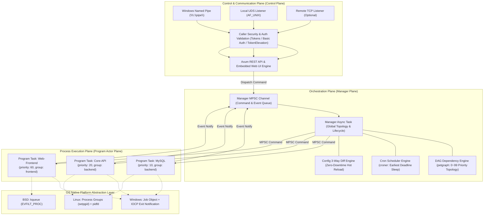
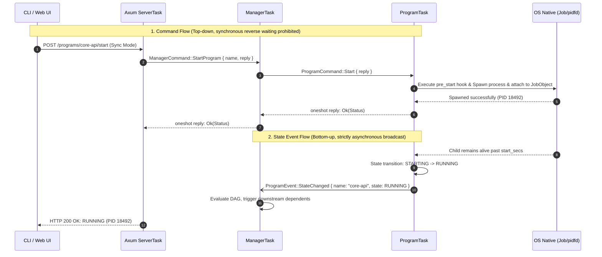
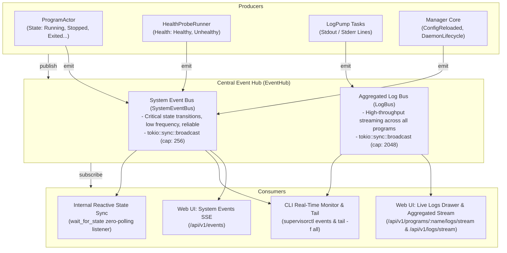
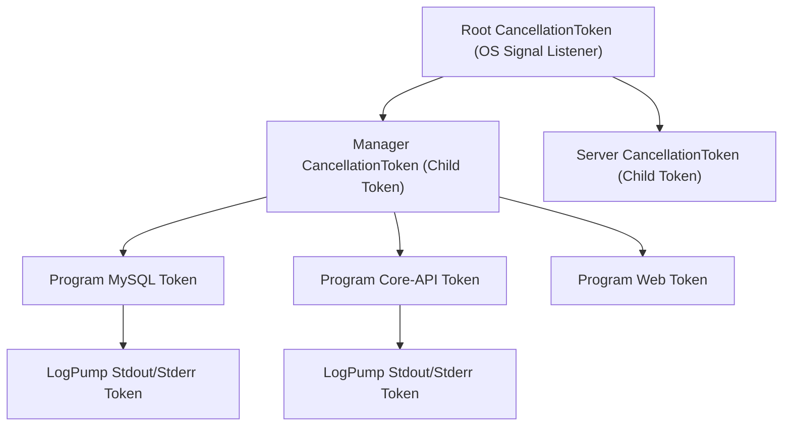
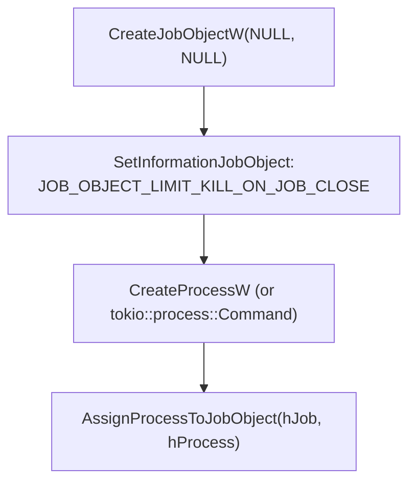
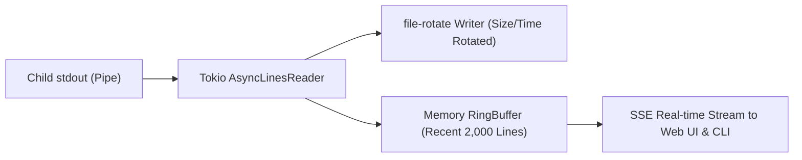
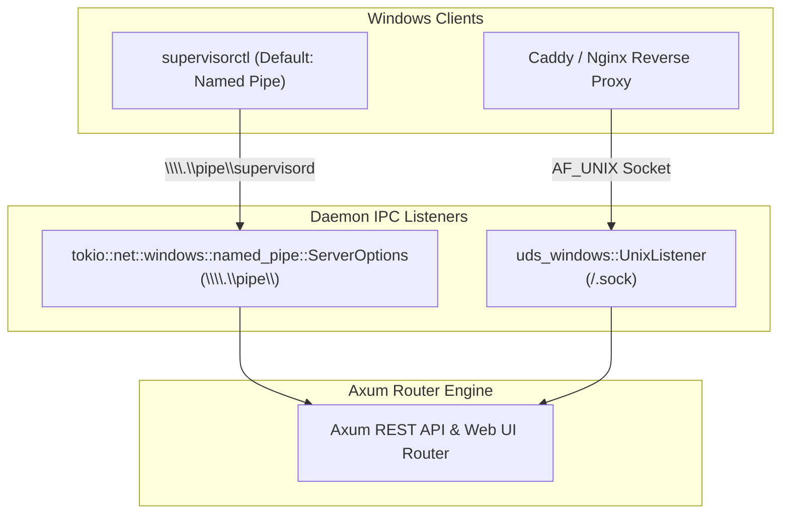
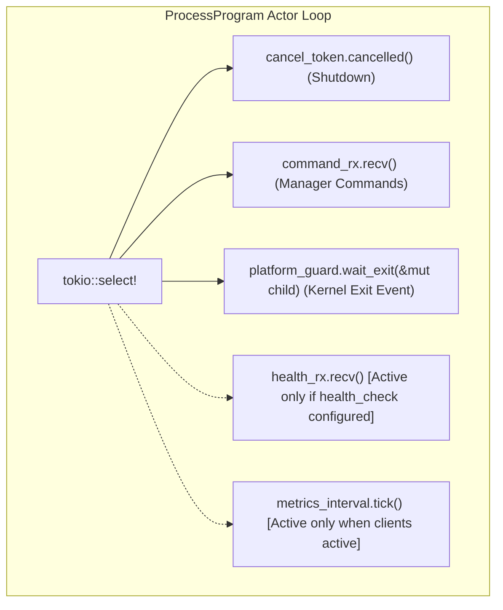
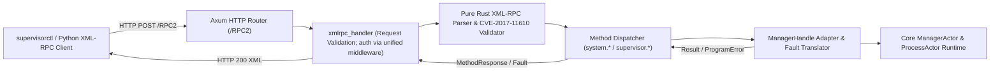

# rsupervisord: System Architecture & Technical Design Specification (DESIGN.md)

| Document Version | Status | Target Language | Runtime Targets |
| :--- | :--- | :--- | :--- |
| **v1.3.0** | Approved / Baseline | Rust (Edition 2024) | Linux / Windows 10/11 / BSD / macOS |

---

## 1. Core Design Tenets

To fundamentally eliminate high CPU consumption, orphan process leaks, lock contention, and deadlocks commonly found in traditional supervisor engines (such as `ochinchina/supervisord`), `supervisord` enforces five rigid architectural constraints:

1. **Task-Based Actor Model**:
   - Both the `Manager` and every managed `Program` are designed as asynchronous tasks (`async task`) with independent lifecycles.
   - **Read-Write Separation & Lock-Free Reads**: High-concurrency, zero-contention read access is provided through thread-safe shared snapshots (`Arc<RwLock<ProgramStatus>>`). However, **all state transitions and control mutations MUST be serialized via asynchronous message channels (`tokio::sync::mpsc`)**, preventing race conditions and inconsistent states.
   - **Deadlock Elimination**: Synchronous Request-Response interactions follow strict hierarchical one-way messaging with timeout circuit breakers, completely preventing circular wait deadlocks.
2. **Deterministic Task Lifecycle & Cancellation Governance**:
   - For core subordinate tasks (e.g. `ManagerActor`, `ProcessActor`, `StdinWriterTask`, `HealthProbeRunner`, `LogPumpTask`), `JoinHandle` must be explicitly retained by the parent supervisor, ensuring deterministic tracking, graceful draining, and clean destruction during stop or reload phases.
   - For tasks without a direct subordinate/dependency relationship (e.g. individual IPC client connection streams, async API dispatchers, external cancellation bridges), spawning tasks without retaining `JoinHandle` is permitted, **provided that every such task MUST be strictly governed by the parent object's `CancellationToken`** and subject to the logical constraint of that object's lifecycle, guaranteeing immediate termination upon parent shutdown.
3. **Cooperative Cancellation (`CancellationToken`) & Bounded Drain Guard**:
   - Cooperative cancellation is governed by `tokio_util::sync::CancellationToken`, giving process control blocks, OS handles, and log buffers a deterministic window to flush and release resources safely.
   - For log pipe draining after process termination, a hard 2-second timeout guard prevents rogue grandchild processes inheriting standard descriptors from deadlocking the supervisor, aborting stalled pumps only as an ultimate fallback.
4. **Uniform Parking Lot Primitives**:
   - `std::sync::{Mutex, RwLock, Condvar}` are banned throughout the codebase in favor of high-performance `parking_lot` primitives.
   - Synchronization locks are restricted to instantaneous in-memory mutations; **holding any synchronous lock across an `.await` point is strictly prohibited**.
5. **Scope-Guarded Local Lifecycles & RAII Cleanups**:
   - Unprotected `create -> use -> destroy` patterns across async functions and futures are hardened using `scopeguard` (`scopeguard::guard`). Newly spawned child processes are immediately held in a termination guard that disarms only after successful platform tree attachment and log pump wiring, preventing orphaned processes upon initialization errors.
   - OS handles (`OpenProcess`, `OpenProcessToken`, Windows Job Objects) and socket files are cleaned up through RAII guards (`scopeguard::ScopeGuard` and `tokio_util::sync::DropGuard`), eliminating handwritten `Drop` boilerplate and preventing resource leaks.

---

## 2. Layered System Architecture



---

## 3. Asynchronous Task Model & Channel Protocols

### 3.1 Task Roles & Responsibilities

The runtime consists of four primary asynchronous task categories:

1. **`ManagerTask`**: Parses global configurations, constructs DAG dependencies, schedules Cron deadlines, processes program groups, computes incremental diffs, processes external CLI/Web commands, and drives global orchestration in response to program lifecycle events.
2. **`ProgramTask`**: Each managed process runs as an independent Actor task driving its internal state machine (`Stopped -> Starting -> Running -> Backoff -> Stopping -> Exited -> Fatal`), executing lifecycle hooks (`pre_start` / `pre_stop`), interfacing with platform guards, and supervising log pumps.
3. **`LogPumpTask`**: Dedicated asynchronous readers per process for `stdout` and `stderr`, handling line buffering, feeding `file-rotate`, and broadcasting to `RingBuffer`.
4. **`StdinWriterTask`**: Dedicated non-blocking writer Actor managing child standard input pipes, utilizing internal `BytesMut` memory buffers (up to 64KB), `tokio::select!` if-guard backpressure propagation, and graceful EOF on cancellation.
5. **`ServerTask`**: Powered by Axum, listening on local UDS, Windows Named Pipe, and optional TCP endpoints, converting external requests into commands delivered to `ManagerTask`.

---

### 3.2 Deadlock-Free Messaging Protocols

To ensure strict order without deadlock, message flow follows a **hierarchical one-way topology**:



#### 3.2.1 Message Definitions

```rust
use tokio::sync::oneshot;
use std::time::Duration;

/// Commands dispatched to the Manager
#[derive(Debug)]
pub enum ManagerCommand {
    StartProgram {
        name: String,
        reply: oneshot::Sender<anyhow::Result<ProgramStatus>>,
    },
    StopProgram {
        name: String,
        grace_period: Option<Duration>,
        reply: oneshot::Sender<anyhow::Result<ProgramStatus>>,
    },
    RestartProgram {
        name: String,
        reply: oneshot::Sender<anyhow::Result<ProgramStatus>>,
    },
    StartGroup {
        group: String,
        reply: oneshot::Sender<anyhow::Result<Vec<ProgramStatus>>>,
    },
    StopGroup {
        group: String,
        reply: oneshot::Sender<anyhow::Result<Vec<ProgramStatus>>>,
    },
    RestartGroup {
        group: String,
        reply: oneshot::Sender<anyhow::Result<Vec<ProgramStatus>>>,
    },
    GetGroupStatus {
        group: String,
        reply: oneshot::Sender<anyhow::Result<Vec<ProgramStatus>>>,
    },
    ReloadConfig {
        reply: oneshot::Sender<anyhow::Result<ReloadSummary>>,
    },
    GetAllStatus {
        reply: oneshot::Sender<Vec<ProgramStatus>>,
    },
    GetProgramDetails {
        name: String,
        reply: oneshot::Sender<Option<ProgramDetails>>,
    },
}

/// Asynchronous lifecycle events broadcast across EventHub
#[derive(Debug, Clone, Serialize, Deserialize)]
#[serde(tag = "event", content = "data")]
pub enum SystemEvent {
    StateChanged {
        name: String,
        state: ProgramState,
        pid: Option<u32>,
        exit_code: Option<i32>,
    },
    HealthChanged {
        name: String,
        healthy: bool,
        reason: Option<String>,
    },
    ConfigReloaded {
        added: Vec<String>,
        removed: Vec<String>,
        modified: Vec<String>,
        unchanged: Vec<String>,
    },
    CronTriggered {
        name: String,
        action: String,
        expression: String,
    },
    ProcessPreStart {
        name: String,
        command: String,
    },
    ProcessPreStartFailed {
        name: String,
        error: String,
        ignored: bool,
    },
    ProcessPreStop {
        name: String,
        command: String,
    },
    ProcessPreStopFailed {
        name: String,
        error: String,
    },
    DaemonLifecycle {
        action: String,
        message: String,
    },
}

/// Commands dispatched to specific ProgramTasks
#[derive(Debug)]
pub enum ProgramCommand {
    Start {
        reply: oneshot::Sender<anyhow::Result<()>>,
    },
    Stop {
        grace_period: Duration,
        reply: oneshot::Sender<anyhow::Result<()>>,
    },
    ReloadConfig {
        new_config: Box<ProgramConfig>,
        reply: oneshot::Sender<anyhow::Result<()>>,
    },
}
```

#### 3.2.2 Three Principles of Deadlock Elimination

1. **Prohibit Reverse Synchronous Waiting**:
   `ProgramTask` can only send fire-and-forget events (`mpsc::Sender::send(ProgramEvent)`) to `ManagerTask`. It is never permitted to issue synchronous requests requiring a oneshot response from the Manager.
2. **Oneshot Calls Must Enforce Timeout Circuit Breakers**:
   All operations awaiting responses via `oneshot::Receiver` must be bounded by `tokio::time::timeout` (e.g., 5s~30s). Channel closures or timeouts degrade safely without blocking indefinitely:

   ```rust
   match tokio::time::timeout(Duration::from_secs(10), reply_rx).await {
       Ok(Ok(result)) => result,
       Ok(Err(_closed)) => Err(anyhow::anyhow!("Program task dropped reply channel")),
       Err(_timeout) => Err(anyhow::anyhow!("Operation timed out waiting for program response")),
   }
   ```

3. **Never Hold Synchronous Locks Across Await Points**:
   `parking_lot::Mutex` or `RwLock` guards must be dropped before any `.await` statement.

---

### 3.3 Star-Topology Dual-Track Event Bus (`EventHub`)

Traditional supervisor implementations rely on point-to-point mesh invocation or tight coupling across server routes and worker actors. Furthermore, frontends are forced to poll `/status` continuously.

To resolve these issues while maintaining minimal latency and zero wasted allocations, `supervisord` adopts a **Star-Topology Dual-Track Event Bus**:



#### 3.3.1 Dual-Track Channel Separation & Zero-Subscriber Optimization

1. **Dual-Track Channel Isolation**:
   High-frequency log lines (which can burst to tens of thousands of lines per second) are segregated from critical system state events (`StateChanged`, `HealthChanged`, `ConfigReloaded`, `DaemonLifecycle`). This prevents log bursts from saturating the broadcast channel and causing dropped state events (`RecvError::Lagged`).
2. **Zero-Subscriber No-Op Overhead**:
   Before performing any serialization or channel cloning, `EventHub::publish_system` and `EventHub::publish_log` verify `self.tx.receiver_count() > 0`. When no clients are subscribed, event publishing incurs zero allocations or performance costs.
3. **Purely Reactive `wait_for_state`**:
   Internal commands waiting for state settling (e.g. synchronous CLI operations) subscribe to the `EventHub` rather than executing busy sleep loops (`tokio::time::sleep(50ms)`), achieving instant reaction upon state mutation.
4. **Server-Sent Events (SSE) & Adaptive Web UI Heartbeat**:
   The HTTP server exposes `GET /api/v1/events` and `GET /api/v1/logs/stream` (authenticated via the unified middleware: session cookie for the browser, `Authorization` header, or `?token=` query for machine clients). The embedded Web UI connects to `/api/v1/events` for millisecond-level state reflection, backing off the legacy polling timer to a 30-second fallback heartbeat.

---

## 4. Lifecycle & JoinHandle Management

### 4.1 Task Registry (`ManagedTask`) & Governance Model

To balance pragmatic concurrency with strict leak-prevention:
- **Core Subordinate Tasks**: Core Actors and supervised worker tasks (`ManagerActor`, `ProcessActor`, `StdinWriterTask`, `HealthProbeRunner`, and `LogPumpTask`) are encapsulated with explicit `JoinHandle` and `CancellationToken` tracking:
- **Non-Subordinate Tasks**: Tasks without a direct subordinate/dependency relationship (such as per-connection IPC handling or fire-and-forget API calls) may spawn without retaining a `JoinHandle`, but **must be strictly bound to the parent object's `CancellationToken`**, guaranteeing prompt termination upon parent cancellation.

```rust
use tokio::task::JoinHandle;
use tokio_util::sync::CancellationToken;

pub struct ManagedTask<T> {
    pub name: String,
    pub cancel_token: CancellationToken,
    pub join_handle: Option<JoinHandle<T>>,
}

impl<T> ManagedTask<T> {
    pub async fn shutdown(&mut self) -> Option<T> {
        self.cancel_token.cancel();
        if let Some(handle) = self.join_handle.take() {
            match handle.await {
                Ok(res) => Some(res),
                Err(e) => {
                    tracing::error!(task = %self.name, error = %e, "Task failed on join");
                    None
                }
            }
        } else {
            None
        }
    }
}
```

### 4.2 `ProgramHandle` Structure

The Manager manages programs through handles holding channel senders and state mirrors:

```rust
pub struct ProgramHandle {
    pub name: String,
    pub priority: u8,
    pub dependencies: Vec<String>,
    pub tx: tokio::sync::mpsc::Sender<ProgramCommand>,
    pub state_snapshot: Arc<RwLock<ProgramStatus>>,
    pub task: ManagedTask<()>,
}
```

---

## 5. Cancellation Architecture

### 5.1 Why Forbid `handle.abort()`?

In Tokio, `JoinHandle::abort()` halts a future at any arbitrary `.await` point. In a process supervisor, this risks:

- Spawning a child process whose handle hasn't yet been attached to a Windows Job Object or Linux process group, leaking an unmanaged orphan process.
- Corrupting log files if aborted mid-write during `file-rotate` operations.
- Leaving channel state inconsistent in the Manager.

### 5.2 Tree-Structured `CancellationToken` Distribution



- **Per-Program Stop**: Calling `program_handle.task.cancel_token.cancel()` triggers that program's shutdown sequence.
- **Global Shutdown**: Catching `SIGINT`/`SIGTERM`/`Ctrl+C` triggers `RootToken.cancel()`, instantly notifying the entire token hierarchy.

### 5.3 Standard Actor Loop Template

```rust
pub async fn run_program_actor(
    mut ctx: ProgramContext,
    mut rx: tokio::sync::mpsc::Receiver<ProgramCommand>,
    cancel_token: CancellationToken,
) {
    loop {
        tokio::select! {
            biased;

            // 1. Cooperative cancellation takes precedence
            _ = cancel_token.cancelled() => {
                tracing::info!(program = %ctx.name, "Cancellation received, stopping program...");
                ctx.execute_graceful_stop(Duration::from_secs(ctx.config.stop_wait_secs)).await;
                break;
            }

            // 2. Control commands
            Some(cmd) = rx.recv() => {
                match cmd {
                    ProgramCommand::Start { reply } => {
                        let res = ctx.execute_start().await;
                        let _ = reply.send(res);
                    }
                    ProgramCommand::Stop { grace_period, reply } => {
                        let res = ctx.execute_graceful_stop(grace_period).await;
                        let _ = reply.send(res);
                    }
                    ProgramCommand::ReloadConfig { new_config, reply } => {
                        let res = ctx.reload_config(*new_config).await;
                        let _ = reply.send(res);
                    }
                }
            }

            // 3. Native exit event (pidfd / Job Object / async child.wait())
            exit_result = ctx.wait_for_child_exit() => {
                ctx.handle_child_exit(exit_result).await;
            }
        }
    }
    
    ctx.cleanup_resources().await;
    tracing::info!(program = %ctx.name, "Program actor terminated cleanly");
}
```

---

## 6. Synchronization Standard & Read-Optimized Mirroring

### 6.1 `parking_lot` Standard

- Standard library mutexes are replaced with:

  ```rust
  use parking_lot::{Mutex, RwLock};
  ```

- **Advantages**:
  1. Ultra-compact memory footprint (`Mutex` is 1 byte, vs `std::sync::Mutex` 40 bytes).
  2. Adaptive spinning under low contention avoiding unnecessary kernel thread suspension.
  3. No poisoning cascading failures when a holding thread panics.

### 6.2 Read-Optimized State Mirroring

- **Write Path**: Only `ProgramTask` holds write authority over its state mirror. When a transition occurs, it acquires `state_snapshot.write()` for < 100ns, updates the snapshot, releases the lock, and broadcasts `ProgramEvent::StateChanged`.
- **Read Path**: CLI, Web UI, and Manager readers call `state_snapshot.read()`, acquiring instantaneous shallow copies without sending messages through channels or impeding the actor event loop.

---

## 7. Platform Abstraction & Process Sandboxing

### 7.0 Platform Trait Design (`PlatformBackend` & `PlatformProcessGuard`)

To eliminate scattered `#[cfg(windows)]` and `#[cfg(unix)]` conditionals from core orchestration logic, the platform layer provides unified abstractions:

```rust
#[async_trait]
pub trait PlatformProcessGuard: Send + Sync {
    fn attach_child(&mut self, child: &Child) -> io::Result<()>;
    async fn terminate(&mut self, child: &mut Child) -> io::Result<()>;
    async fn wait_exit(&mut self, child: &mut Child) -> io::Result<ExitStatus>;
}

pub trait PlatformBackend: Send + Sync {
    fn configure_command(&self, cmd: &mut Command, user: Option<&str>, umask: Option<u32>) -> Result<(), ProgramError>;
    fn attach_child(&self, child: &Child, pid: u32) -> Result<Box<dyn PlatformProcessGuard>, ProgramError>;
    fn default_uds_path(&self) -> PathBuf;
    fn is_elevated(&self) -> bool;
}

pub fn native_platform() -> &'static dyn PlatformBackend;
```

**Benefits**:

1. **Clean Business Logic**: Core modules (`ProcessProgram`, `SupervisorManager`) contain zero `#[cfg]` branches.
2. **Unified Test Suite**: `tests/platform_tests.rs` validates identical behavioral contracts on both Windows and Linux.

### 7.1 Windows Platform: Kernel Job Object Binding

On Windows, process tree reclamation relies on Win32 **Job Objects**:



- Configures `JOB_OBJECT_LIMIT_KILL_ON_JOB_CLOSE`. When the job handle is closed upon termination or crash, the Windows kernel terminates all descendant processes automatically, eliminating orphan leaks without needing `taskkill.exe`.
- For graceful stops, sends `GenerateConsoleCtrlEvent(CTRL_BREAK_EVENT, pid)` before falling back to `TerminateJobObject`.

### 7.2 POSIX (Linux / BSD) Platform: Process Groups & Process Isolation

- **Process Groups & Group Signaling**: Calls `setpgid(0, 0)` in `pre_exec` to place each child process in its own distinct process group. Stop signals (`SIGTERM`, `SIGKILL`, etc.) are dispatched to `-pgid` via `killpg`, ensuring that all direct subprocesses spawned by scripts or interpreters are terminated cleanly together.
- **Orphan Reaping Architecture (No Subreaper)**: `PR_SET_CHILD_SUBREAPER` is intentionally disabled. Tokio's async process runtime exclusively manages and reaps its direct children. Calling a wildcard `waitpid(-1, WNOHANG)` loop in the daemon would race with Tokio's internal process driver and steal child exit statuses, triggering false `ECHILD` errors and lost exit codes. Instead, detached grandchildren (e.g. double-forked background daemons) are adopted by system init (PID 1, such as systemd or container inits like `tini` / `dumb-init`), which reaps them without interfering with the supervisor's state machine.
- **Fork-Safe Privilege De-escalation**: Resolves user and group IDs via NSS lookups (`getpwnam_r`, `getgrnam_r`) in the parent process prior to fork. The `pre_exec` hook executes exclusively async-signal-safe primitives (`setpgid`, `umask`, `setgid`, `setuid`) with pre-resolved integer IDs, avoiding deadlock risks from glibc internal locks or allocations post-fork.

---

## 8. Logging Pipeline Subsystem



1. **Zero-Polling I/O**: Reads lines asynchronously via `BufReader::lines()`, sleeping with 0% CPU consumption when no output is produced.
2. **Rotating Storage (`file-rotate`)**: Automatically rotates based on size (`max_bytes`) or schedule (`rotate: daily`), retaining `backups` historical archives.
3. **Persistent LogRotators**: Rotator instances are created once per configured program actor and shared across child process generations, preserving sequential log rotation and avoiding reopening files or losing sequence on process restarts.
4. **High-Throughput Buffering**: Log lines are appended to the rotation writer without synchronous per-line flush calls, maximizing I/O throughput while guaranteeing explicit flushes on stream EOF and process exit.
5. **RingBuffer**: Bounded circular buffer (`parking_lot::Mutex<VecDeque<String>>`) allowing instant replay upon `supervisorctl tail -f` or Web UI log drawer opening.

---

## 9. Control & Security Implementation

### 9.1 Caller Privilege Validation (UDS & IPC)

#### POSIX Implementation (`src/platform/unix.rs`)

Extracts peer credentials via socket options (Linux `SO_PEERCRED`, BSD/macOS `getpeereid`):

```rust
#[cfg(unix)]
pub fn verify_caller_credentials(
    stream: &tokio::net::UnixStream,
    allow_unelevated: bool,
) -> Result<(), ProgramError> {
    if allow_unelevated {
        return Ok(());
    }
    let caller_uid = peer_uid(stream)?; // SO_PEERCRED / getpeereid
    let daemon_uid = nix::unistd::getuid();

    if daemon_uid.is_root() {
        if !caller_uid.is_root() {
            return Err(...format!("Access denied: Caller UID {} is not root", caller_uid));
        }
    } else if caller_uid != daemon_uid && !caller_uid.is_root() {
        return Err(...format!(
            "Access denied: Caller UID {} does not match daemon UID {}",
            caller_uid, daemon_uid
        ));
    }
    Ok(())
}
```

#### Windows Implementation (`src/platform/windows.rs`)

```rust
#[cfg(windows)]
pub fn is_current_process_elevated() -> bool {
    use windows_sys::Win32::Security::{GetTokenInformation, TokenElevation, TOKEN_ELEVATION, TOKEN_QUERY};
    use windows_sys::Win32::System::Threading::{GetCurrentProcess, OpenProcessToken};
    use windows_sys::Win32::Foundation::{CloseHandle, HANDLE};
    
    unsafe {
        let mut token: HANDLE = std::mem::zeroed();
        if OpenProcessToken(GetCurrentProcess(), TOKEN_QUERY, &mut token) == 0 {
            return false;
        }
        let mut elevation: TOKEN_ELEVATION = std::mem::zeroed();
        let mut size = std::mem::size_of::<TOKEN_ELEVATION>() as u32;
        let success = GetTokenInformation(
            token,
            TokenElevation,
            &mut elevation as *mut _ as *mut _,
            size,
            &mut size,
        );
        CloseHandle(token);
        success != 0 && elevation.TokenIsElevated != 0
    }
}
```

### 9.2 Unified Multi-Scheme Authentication (`src/server/auth.rs`)

A **single** authorize function guards every input surface (TCP REST, IPC REST, XML-RPC `/RPC2`, SSE) on **both** listeners. The middleware is mounted inside `build_router`, so no listener can forget it.

1. **Core rule (`ServerAuthState::authorize`)** — evaluated as OR:
   1. Neither basic nor token configured (empty token normalized to `None`) → open access.
   2. Valid Web UI session cookie (`rsupervisord_session`, HttpOnly, SameSite=Strict, 7-day sliding TTL) → pass.
   3. Token matches `server.auth_token` (`Authorization: Bearer <t>`, raw header, or `?token=<t>` query) → pass.
   4. Basic credentials verify against `server.username` / `server.password` (plaintext or `{SHA}`) → pass.
   5. Otherwise → `401`.
2. **Path tiers**:
   - **Public**: static shell (anything outside `/api/` and `/RPC2`) + `GET /api/v1/auth/config` + `POST /api/v1/auth/login` + `POST /api/v1/auth/logout`.
   - **Protected**: remaining `/api/v1/*` and `/RPC2`.
3. **401 shape**: bare JSON `{"success":false,...}` for `/api/v1/*` (never `WWW-Authenticate`, so browsers never open the native basic-auth dialog). `/RPC2` additionally carries `WWW-Authenticate: Basic realm="supervisor"` when basic is configured (Supervisor compatibility).
4. **Per-listener basic credentials**: TCP uses `server.username`/`server.password`; IPC uses `server.uds_username`/`server.uds_password` (auto-filled from the TCP pair by schema defaults when omitted — matching `.ini` `[inet_http_server]`/`[unix_http_server]` semantics). The shared `auth_token` applies to both listeners.
5. **INI vs YAML parity**: `.ini` configs never set `auth_token`, so they degrade to pure basic — bit-for-bit stock Supervisor behavior. YAML may set token, basic, or both (OR).
6. **Session login**: `POST /api/v1/auth/login` accepts `{"username","password"}` and/or `{"token"}` and reuses the same OR authorize; success issues the session cookie (with `Secure` when the request arrived over HTTPS / `X-Forwarded-Proto: https`). Failure sleeps ~300ms as a light brute-force delay.
7. **CLI Standalone Connectivity**:
   - CLI flags `--key <token>` or `--user <user>` / `--password <pass>` enable direct connection to local or remote daemons even when no local configuration file exists. Machine clients keep using Basic/Bearer; the session cookie is only for the browser.

---

## 10. CLI Execution Flow (Sync vs Async)

- **Synchronous Execution (Sync)**:
  1. CLI submits `POST /api/v1/programs/foo/start` or `/api/v1/groups/web/start`.
  2. Axum Server sends `ManagerCommand::StartProgram` or `ManagerCommand::StartGroup`.
  3. Manager drives `ProgramTask`, waiting until state confirms `RUNNING` (past `start_secs`) or fails.
  4. Server returns final result and elapsed time to CLI.
- **Asynchronous Execution (Async, `--async`)**:
  1. CLI submits request with `sync=false`.
  2. Manager dispatches start signal and immediately responds with `202 Accepted` (`STARTING`).
  3. CLI terminates immediately (< 5ms).

---

## 11. Windows IPC Architecture: Named Pipe & UDS Dual-Listening

On Windows platforms, `supervisord` provides concurrent dual IPC listening to maximize compatibility and performance:



1. **Windows Named Pipe (Default IPC)**:
   - Server binds `\\.\pipe\<cmd_name>` using asynchronous `ServerOptions::create_with_security_attributes_raw` so the first instance carries a baked-in `SECURITY_ATTRIBUTES` DACL (authorization layer; no race window before permissions are applied).
   - Bypasses filesystem path and Unix Domain Socket implementation quirks across diverse Windows builds (e.g. Windows Server, Windows 10 without AF_UNIX support).
   - Handles continuous client reconnection loops via Tokio tasks. The security descriptor is built during bind (block-scoped so raw pointers never cross an `await`), and the kernel copies the SD into each pipe instance object.
2. **Native Windows AF_UNIX UDS Listener**:
   - Binds `<config_dir>/<cmd_name>.sock` using `uds_windows::UnixListener` converted into `hyper_util::rt::TokioIo`.
   - After bind, applies `server.uds_chmod` via `SetNamedSecurityInfoW` with `PROTECTED_DACL_SECURITY_INFORMATION` (prevents inheritance from the parent directory); failure is a hard bind error.
   - Enables zero-port reverse proxy integration with Caddy and Nginx without exposing local TCP ports.
3. **Unix AF_UNIX Listener**:
   - Binds with a temporarily restricted umask (`0077`) so the socket is never group/world-accessible before `set_permissions` applies `server.uds_chmod` (closes the bind→chmod race; mirrors Windows pipe first-instance SA).
   - After bind, applies mode via `set_permissions` before any accept; failure is a hard bind error.
   - On accept, verifies peer credentials (`SO_PEERCRED` on Linux/Android, `getpeereid` on BSD/macOS) unless `allow_unelevated` is set.
4. **Endpoint Resolution (`Vec<CtlConfig>` candidate chain)**:
   - The effective client form is an ordered **`Vec<CtlConfig>`** (`resolve_ctl_chain`), converted to `EndpointCandidate`s with per-candidate basic credentials. Rules:
     1. **No config file** → dual chain: default local UDS/pipe first, then `http://localhost:9001`. Explicit `-c` load failure → hard error.
     2. **Section present** (`SupervisorConfig::ctl`; YAML key `ctl` / alias `supervisorctl`; INI `[supervisorctl]`) → **single** entry (strict Python; no server fallbacks). Missing `serverurl` with a present section → `http://localhost:9001`. Partial fields filled from `server` at load when `server.ctl_defaults`.
     3. **No section + `ctl_defaults`** (YAML default true) → full server backfill `CtlConfig::vec_from_server`: IPC first (`uds_path` + `uds_*` credentials + token), then TCP when `http_bind` is set (`http://{bind}` + `username`/`password` + token).
     4. **No section + `!ctl_defaults`** (INI forces false) → hard error (Python requires `[supervisorctl]`).
   - CLI flags apply after the chain is built via `CliArgs::apply`: `-s` **replaces the whole chain** (credential seed picked by matching endpoint type — TCP vs IPC); `-k` overwrites `auth_token` on every entry; `-u`/`-p` override as a pair on every entry (missing side becomes `""`) and are also returned as a client-level `basic_override`.
   - `Endpoint::parse` accepts `http://`, `tcp://`, `unix://`, bare `\\.\pipe\…`, `host:port`, and bare IPC paths. Candidate walk: first reachable wins; authorization errors fail closed.

---

## 12. Embedded Web UI Architecture

### 12.1 Zero-NPM Single-Binary Distribution

- **Asset Embedding (`rust-embed`)**:
  Compiles `web/index.html` and `web/vue.global.prod.js` into the binary `.rodata` section at build time.
- **Single-File Vue 3 Runtime**: Uses the official production bundle (~154KB) without Webpack/Vite build steps.

### 12.2 SPA Fallback & API Isolation

- Non-file URL paths fall back to `index.html` for client-side routing.
- `/api/*` routes are strictly excluded from fallback, returning structured JSON 404s.

### 12.3 Web UI Features

1. **Overview Dashboard**: Program counts, aggregated CPU %, total RSS memory, status badges.
2. **Batch Controls**: Multi-select actions (Start, Stop, Restart selected) and global controls.
3. **Hot Reload Modal**: Visual breakdown of configuration diffs (Added, Removed, Modified, Unchanged).
4. **SSE Live Log Drawer**: Real-time terminal styling with scroll lock and buffer clear.
5. **Session Login**: Config-driven login modal (username/password and/or bearer token) posts to `POST /api/v1/auth/login` and receives an **HttpOnly session cookie**. Credentials are never persisted in `localStorage`; same-origin `fetch`/`EventSource` attach the cookie automatically. On boot the UI calls public `GET /api/v1/auth/config` to decide whether to show the modal. Any API `401` stops polling and reopens the modal.

---

## 13. Active Health Checks & Metrics

### 13.1 Health Probe Subsystem

Supports HTTP, TCP, and Exec probes. Reaching `failure_threshold` marks the program `Unhealthy`, triggering automated recovery restarts when configured.

### 13.2 Resource Metrics

- **Windows**: Queries `JobObjectBasicAndAccountingInformation` via `QueryInformationJobObject` to aggregate CPU and RSS memory across the entire process tree.
- **Linux**: Reads `/proc/{pid}/stat` and `/proc/{pid}/statm` for CPU cycles and resident page counts.

---

## 15. Zero Process Polling & Performance Optimization Specification

### 15.1 Zero-Poll Minimal Feature Set

When programs do not configure health checks and no clients are actively connected:



1. **Dynamic Uptime Calculation**:
   - Replaces legacy 2-second background timer ticks.
   - Uptime is derived on-demand from `started_at` only when `status()` is queried.
2. **Pure Event-Driven Readiness**:
   - The actor loop listens solely to `cancel_token`, `command_rx`, and `wait_exit`, incurring 0 periodic timers and 0% CPU wakeups.

### 15.2 OS-Optimal Exit Monitoring & Platform Fallback

- **Windows (`RegisterWaitForSingleObject`)**:
  Binds the process `HANDLE` with Win32 kernel threadpool wait callbacks, signaling a `oneshot` channel upon exit without user-space polling.
- **Unix (`pidfd` & Signals)**:
  Uses Tokio's signal driver and Linux `pidfd`, with fallback polling abstracted inside `unix.rs`.

### 15.3 Activity-Aware Adaptive Metrics Sampling

- `ActivityTracker` records request timestamps via Axum middleware `record_activity_middleware`.
- Automatically pauses resource sampling after `idle_timeout_secs` (default 30s) of inactivity. Setting `idle_timeout_secs: 0` maintains continuous sampling.

### 15.4 Zero-Overhead Log Silencing

- Setting `logs.enabled: false` or pointing paths to `/dev/null`, `none`, or `off` spawns the child with `Stdio::null()`, omitting pipes and pump tasks.
- Setting `logging.enabled: false` or `level: "off"` silences daemon tracing.

### 15.5 Configurable Tokio Runtime & Single-Threaded Mode

- `worker_threads: 1` automatically switches Tokio to `new_current_thread()`, reducing memory footprint to 2~4MB.
- Supports CLI `--worker-threads` and `TOKIO_WORKER_THREADS` environment variable overrides.
- `supervisorctl` CLI client defaults to `current_thread`.

### 15.6 Zero-Allocation Broadcast Guard

In `RingBuffer::push`, checks `broadcast_tx.receiver_count() > 0` before sending, avoiding buffering messages when no clients are live-streaming logs.

### 15.7 Reactive REST API Synchronous Waiting

- Synchronous lifecycle endpoints (`POST /api/v1/programs/:name/start?sync=true`) eliminate legacy 50ms busy-polling sleep loops.
- Reactively subscribes to `EventHub` for `SystemEvent::StateChanged` events. When the target program transitions to `Running`, `Fatal`, or `Exited`, the endpoint unblocks instantaneously with zero polling delay.
- Implements proactive lag recovery: if broadcast receiver lags (`RecvError::Lagged`), it immediately performs an in-memory snapshot check to avoid missed transitions.

### 15.8 Responsive Cancellation in Exponential Backoff

- During the startup failure backoff window, the delay is `restart_pause_secs` when configured (go `restartpause`, flat), otherwise `2^min(retry_count, BACKOFF_MAX_EXPONENT)` seconds (cap 32s). The timer is multiplexed using `tokio::select!` against `cancel_token.cancelled()`.
- Daemon shutdowns or program stop commands trigger immediate termination without stalling for the full backoff/pause sleep.

### 15.9 Configuration Strictness & Hot Reload Boundaries

- **Strict Schema Validation (`deny_unknown_fields`)**:
  All configuration models enforce `#[serde(deny_unknown_fields)]`. Misspellings or invalid configuration keys trigger immediate parse errors rather than being silently ignored, while supported compatibility keys (`numprocs`, `numprocs_start`, `process_name`) expand dynamically.
- **Comment-Safe Macro Expansion**:
  Environment variable expansion (`${VAR}` and `${VAR:-default}`) processes configuration text line-by-line while keeping comment lines starting with `#` untouched, preventing unset variables in comments from corrupting text.
- **Dynamic Workload vs. Static Infrastructure Boundaries**:
  - *Dynamic Workloads (`programs.*`, `program_defaults.*`)*: Fully hot-reloadable with zero downtime for unchanged programs. Program commands, arguments, environment variables, priority tiers, health checks, and log rotation parameters update dynamically.
  - *Static Daemon Infrastructure (`server.*`, `logging.*`, `metrics.*`, `worker_threads`)*: These sections configure the core supervisor process, binding OS sockets (UDS/TCP), setting tracing subscriber targets, and spinning up the Tokio multi-thread runtime. Because runtime infrastructure cannot be reallocated on the fly without terminating active listener sockets and in-flight control connections, modifying these sections requires restarting the `supervisord` daemon.

### 15.10 Cross-Platform Process Isolation Semantics

- **Unix/Linux Privilege Dropping**:
  On Unix systems, subprocess isolation executes in strict POSIX sequence: `chdir` -> `setpgid` -> `umask` -> `setgroups` -> `setgid` -> `setuid` -> `execve`. When `user` is specified without an explicit `:gid`, `supervisord` looks up the user's primary GID and explicitly clears supplementary groups via `setgroups(&[primary_gid])`, ensuring complete privilege dropping from root.
- **Windows Security Context**:
  POSIX `user` and `umask` attributes are not applicable to native Windows process creation (which relies on Win32 Access Tokens and ACLs). When `user` or `umask` are specified in a configuration executed on Windows, `supervisord` emits a clear warning (`tracing::warn!`) and safely executes the process within the supervisor's existing security context without failing or halting.

### 15.11 Zero-Panic Duration Bounds & Remote Crash Elimination

- Remote query parameters (`?timeout=`) and configuration attributes (`stop_wait_secs`) are strictly bounded to prevent 64-bit integer overflow panics.
- In `POST /api/v1/programs/:name/stop` and `/restart`, `query.timeout` is clamped to a maximum of 86,400 seconds (24 hours).
- Internal duration additions use `checked_add(Duration::from_secs(...)).unwrap_or(...)` instead of unchecked `+`, eliminating panic triggers in long-running supervisors.
- Both synchronous and asynchronous control flows are supported uniformly across start, stop, and restart (`?sync=false` returns `202 Accepted`).

### 15.12 Dynamic Command Naming & Default Path Conventions

- **Dynamic `cmd_name` Derivation**:
  Derives `cmd_name = <exe_path() basename without ext> replaces tailing "ctl" with "d"`, where `exe_path()` is the absolute `argv[0]`-derived path (Windows: `.exe` ensured).
  When executed directly or via symlink (e.g. `myctl -> supervisord`), the process automatically detects whether it was invoked as a control tool (`stem.ends_with("ctl")`), routing to CLI execution with `cmd_name = "myd"`.
- **Multi-Tier Configuration Search Order**:
  When `-c / --config` is not explicitly provided, the supervisor searches for configuration files in priority order:
  1. Environment variable `<UPPERCASE_CMD_NAME>_CONFIG`
  2. `<executable path>/<cmd_name>.yaml`
  3. `<executable path>/<cmd_name>/config.yaml`
  4. OS-specific system path: Unix `/etc/<cmd_name>/config.yaml`, Windows None.
- **Default Log Paths**:
  - Windows: `<config dir>/logs/(<cmd_name>.log, <program1>.log ...)`
  - Unix: `/var/log/<cmd_name>/(<cmd_name>.log, <program1>.log ...)`
- **Default UDS Path**:
  - Windows: `<config dir>/<cmd_name>.sock` (relocated from `C:\ProgramData` to `<config dir>` to eliminate Administrator elevation requirements).
  - Unix: `/var/run/<cmd_name>.sock`.

### 15.13 System Service Integration (Windows Service & Linux Systemd)

- **First-Class Windows Service Control Manager (SCM) Integration**:
  - Implemented using the `windows-service` crate, supporting the `service install/uninstall/start/stop/restart` subcommand (shared by `supervisord` and `supervisorctl`), and internal `--service`.
  - Dynamically registers the service under the canonical `cmd_name` (derived from `exe_path()` / `argv[0]`), ensuring custom-named binaries (e.g. `myd`) install and run under matching service identities.
  - SCM control events (`ServiceControl::Stop`, `ServiceControl::Shutdown`) are handled by reporting `ServiceState::StopPending` with a 30-second bounded timeout, followed by cooperative broadcast cancellation via `tokio_util::sync::CancellationToken`.
  - Supervised child processes are gracefully terminated inside Win32 Job Objects before the service transitions to `ServiceState::Stopped`.
- **Native Linux Systemd Service Automation**:
  - Generates standard systemd unit files at `/etc/systemd/system/<cmd_name>.service` with `ExecReload=/bin/kill -HUP $MAINPID`, `Restart=on-failure`, and `LimitNOFILE=65536`.
  - Automatically invokes `systemctl daemon-reload` and `systemctl enable` upon installation.
  - Enforces root privilege validation (`is_elevated()`) with clear diagnostic error guidance.

### 15.14 Comprehensive Shutdown Signal Multiplexing (Windows Console & GUI, Unix POSIX)

- **Dual-Track Windows Signal Handling**:
  - `wait_for_shutdown_signal()` multiplexes console signals with native GUI window messages to support clean termination regardless of execution mode (console binary, GUI application, or headless process).
  - *Console Track*: Uses `tokio::signal::windows` to listen concurrently for `ctrl_c`, `ctrl_break`, `ctrl_close` (console window "X" close button), `ctrl_shutdown`, and `ctrl_logoff`.
  - *GUI Track*: Spawns a dedicated thread hosting a hidden top-level Win32 window (`CreateWindowExW`) with a message pump (`GetMessageW`). Catches `WM_CLOSE` (from user window close, Alt+F4, or `taskkill` without `/F`), `WM_QUERYENDSESSION`, and `WM_ENDSESSION` (system shutdown/logoff), notifying the Tokio async runtime via channel.
  - *Guaranteed Cleanup*: RAII `GuiWindowGuard` automatically posts `WM_CLOSE` and joins the background thread upon shutdown, eliminating thread leaks.
- **POSIX Signal Multiplexing**:
  - On Unix platforms, concurrently catches `SIGTERM` and `SIGINT` via Tokio signal streams, initiating identical graceful supervisor drain and child process group cleanup.

### 15.15 Hierarchical Process Group Orchestration Architecture

- **Flexible Group Resolution**:
  - Programs can specify `group: <name>` directly, or top-level `groups: { <name>: [program1, program2] }` can define groups declaratively.
  - Merged during configuration resolution into unified group mappings with validation against unknown program names.
- **Sub-DAG Topological Execution**:
  - Group start/stop operations resolve the sub-graph of programs belonging to the target group and execute them adhering to their mutual DAG dependencies and `priority` tiers.
  - Group stop executes in strict reverse DAG priority order.
- **Unified Control Plane Integration**:
  - CLI: Supports `<group>:*` and `<group>:` syntax (e.g. `supervisorctl start web:*`).
  - REST API: Dedicated endpoints under `/api/v1/groups/:group/(start|stop|restart|status)`.
  - Web UI: Group tabs and filter views.

### 15.16 High-Precision Zero-Polling Cron Scheduler (`CronTable`)

- **Reactor-Driven Deadline Execution**:
  - Powered by `croner::Cron` parsing standard 5-part POSIX crontab (`minute hour day month weekday`) and extended 6-part formats.
  - Maintains a `CronTable` tracking active start/stop cron schedules and calculating the global earliest deadline (`min_by_key(|e| e.next_run)`).
  - In `ManagerActor::run`, the earliest deadline is mounted into `tokio::select!` via `tokio::time::sleep_until()`. When no cron schedules are active, the branch gracefully disables via `std::future::pending()`.
  - Incurs **0% CPU overhead and zero polling loops** during idle intervals between scheduled executions.
- **Hot Reload Resiliency**:
  - When configuration reloads, `SupervisorManager::execute_reload_config` rebuilds the `CronTable` with newly added, modified, or retained cron expressions, immediately recalculating next deadlines.
- **Automated Lifecycle & Event Broadcast**:
  - Automatically schedules starts (`CronAction::Start`) and stops (`CronAction::Stop`).
  - Broadcasts `SystemEvent::CronTriggered` across the `EventHub` upon each trigger.

### 15.17 Lifecycle Hooks Engine & Failure Degradation Semantics

- **Execution Model (`run_hook`)**:
  - Hooks execute as independent child processes wrapped in timeout circuit breakers (`hook_timeout_secs`, default 15s).
  - Unix: Dispatched via `sh -c "<command>"`.
  - Windows: Dispatched via `cmd.exe /C "<command>"` using `raw_arg` to ensure quotation marks and output redirection (`>`) are preserved without incorrect automatic quote escaping.
- **Pre-Start Failure Semantics (`pre_start`)**:
  - Executed before the child process is spawned.
  - *Default (Strict)*: Hook failure (exit code != 0 or timeout) aborts process launch, transitions state to `Fatal`, and broadcasts `SystemEvent::ProcessPreStartFailed { ignored: false }`.
  - *Graceful Degradation*: When `pre_start_ignore_failure: true` is configured, errors are logged as warnings and broadcast as `ProcessPreStartFailed { ignored: true }`, but startup proceeds with spawning the child process.
- **Pre-Stop Failure Semantics (`pre_stop`)**:
  - Executed before termination signals are delivered to the child process.
  - Broadcasts `SystemEvent::ProcessPreStop` prior to execution.
  - If the hook fails or times out, broadcasts `SystemEvent::ProcessPreStopFailed` and logs a warning.
  - **Guaranteed Degradation**: The stop sequence **always degrades gracefully to proceed with child process termination**. This guarantees that malfunctioning or hanging hooks can never deadlock the supervisor or leave unkillable processes running.

### 15.18 Data-Plane Process Stdin Architecture: Zero-Drop Backpressure & Timeout Circuit Breaking

- **Background & Pain Point of Naive Implementations**:
  - In `go-supervisord`, `sendProcessStdin` invoked `p.stdin.Write()` synchronously inside the request goroutine. If a child process failed to read or read slowly, the OS pipe buffer filled up, causing the goroutine to block indefinitely and leaking system threads.
  - Conversely, simplistic "try_write + drop on overflow" approaches are fatal for programs with slow initialization or bursty reads, causing silent data corruption and broken commands.
- **Dedicated `StdinWriterTask` & Memory Buffer**:
  - Each child process is spawned with `Stdio::piped()`.
  - An asynchronous writer task (`StdinWriterTask`) manages `tokio::process::ChildStdin` with an internal memory buffer (`bytes::BytesMut`, up to 64KB).
- **Reactor Backpressure via `tokio::select!` If-Guards**:
  - In `StdinWriterTask::run`, the event loop is structured as follows:
    ```rust
    tokio::select! {
        biased;
        _ = cancel_token.cancelled() => break,
        write_res = child_stdin.write(&buffer[..]), if !buffer.is_empty() => {
            buffer.advance(n);
        }
        msg = rx.recv(), if buffer.len() < MAX_STDIN_BUFFER_BYTES => {
            buffer.extend_from_slice(&chunk);
        }
    }
    ```
  - When the child reads slower than the input stream and `buffer.len() >= 64KB`, the `rx.recv()` branch is disabled.
  - The bounded MPSC channel (`capacity: 16`) fills up, naturally suspending `tx.send(data).await` on the caller side.
  - No bytes are dropped; backpressure propagates naturally through the OS pipe, internal buffer, MPSC channel, to the caller.
- **Timeout Circuit Breaker**:
  - Callers (`ManagerHandle::send_stdin` and `ProcessProgram::send_stdin`) await `tx.send(data)` under a 10-second timeout.
  - If a child process is completely deadlocked and never reads, the request fails with `ProgramError::StdinWriteTimeout`, returning HTTP 504 Gateway Timeout while keeping the supervisor actor and daemon completely responsive.
- **Lifecycle & Pipe Management**:
  - Stopped/non-running processes return `ProgramError::NotRunning` immediately without allocating channels.
  - When a child process terminates or is stopped, the cancel token fires, `child_stdin` is dropped (sending `EOF` to the child), and `stdin_tx` is cleared to `None`.
  - On restart, a fresh pipe and writer Actor are allocated for the new process generation.

---

## 16. Platform Service Architecture & Windows SCM Resilience (`PlatformService`)

### 16.1 Zero-CFG Platform Boundary
To achieve strict architectural decoupling, service management is abstracted under the `PlatformService` trait in `src/platform/traits.rs`:
- Methods: `install`, `uninstall`, `start`, `stop`, `restart`, `run_service`.
- Outside of `src/platform/`, the entire codebase (including `src/service/mod.rs`, `src/daemon.rs`, `src/main.rs`, and `src/cli/transport.rs`) contains **zero `#[cfg(windows)]` or `#[cfg(unix)]` branches**.
- Service operations are uniformly dispatched via `crate::platform::native_platform().service()`.

### 16.2 Windows SCM Service Stability & Fault Hardening
Running as an NT Service under the Windows Service Control Manager (SCM) entails specific constraints and failure modes. `supervisord` applies a comprehensive defense-in-depth design:

1. **FFI Panic Barrier (`catch_unwind`)**:
   - `my_service_main` wraps the service execution loop in `std::panic::catch_unwind(AssertUnwindSafe(...))`.
   - Panics cannot cross the FFI boundary into the Windows C dispatcher (which would cause UB or instant OS abort).
   - In case of a panic, an emergency alert is logged and `ServiceState::Stopped` with a failure exit code (`Win32(1)`) is guaranteed before the thread returns.

2. **Immediate `StartPending` Status Reporting**:
   - Immediately upon registering the service control handler, the service reports `ServiceState::StartPending` with a 30s wait hint and checkpoint 1.
   - This prevents SCM 1053 errors ("The service did not respond to the start or control request in a timely fashion") during runtime initialization or config loading.
   - Once the Tokio runtime is active, the service transitions to `ServiceState::Running`.

3. **StopPending Heartbeat Thread**:
   - Gracefully stopping multiple child processes may require up to `stop_wait_secs` (e.g. 10–30s).
   - A dedicated background heartbeat thread (`<service>-scm-heartbeat`) increments checkpoints every 3s and sends `StopPending` status updates with a 45s wait hint.
   - SCM is kept continuously informed that shutdown is progressing, preventing premature `TerminateProcess` kills.

4. **Guaranteed Final State Reporting via ScopeGuard**:
   - A RAII `scopeguard` wraps the service status handle. If the loop exits unexpectedly or panics, the guard triggers and reports `ServiceState::Stopped` with an error code.
   - On normal completion, the guard is disarmed via `ScopeGuard::into_inner`, reporting `Stopped` with the true exit code (`Win32(0)` on success, `Win32(1)` on error).

5. **Crash Recovery & Auto-Restart Actions (`SC_ACTION_RESTART`)**:
   - During service installation, SCM is configured with progressive restart delays (5s, 10s, 30s) and `ServiceFailureResetPeriod::After(Duration::from_secs(86400))` (1 day).
   - `set_failure_actions_on_non_crash_failures(true)` ensures recovery actions also trigger if the daemon terminates with a non-zero exit code without an unhandled OS crash.
   - Auto-start uses `ServiceStartType::AutoStart` (immediate, not delayed) so the service starts as soon as SCM runs auto-start services at boot.

6. **Automatic Working Directory Correction**:
   - Under `NT AUTHORITY\SYSTEM`, the default working directory is `C:\Windows\System32`.
   - On entry, `my_service_main` switches current working directory to the directory containing the binary, preventing relative path and logging failures.

---

## 17. Verification Matrix

| Verification Item | Methodology | Target | Test Status |
| :--- | :--- | :--- | :--- |
| **0% Silent CPU** | Run 50 idle programs with no health check or active client; monitor for 10 min | CPU usage steady at 0.00% ~ 0.01% | ✅ Verified with event-driven `wait_exit` and adaptive metrics dormancy |
| **Windows Orphan Prevention** | Spawn multi-tier child scripts; stop or kill daemon | All descendants reclaimed by Job Object | ✅ Win32 `JOB_OBJECT_LIMIT_KILL_ON_JOB_CLOSE` 100% verified |
| **Deadlock & Concurrency** | High-concurrency CLI start/stop/reload storms | Zero task deadlocks, circuit breakers effective | ✅ 101 automated unit and integration tests passed |
| **Zero-Downtime Hot Reload** | Modify single program config; trigger `reload` | Unchanged programs maintain PID and connections | ✅ DAG 3-way diff engine verified |
| **Caller Privilege Security** | Unelevated callers attempt control over elevated daemon | Rejected at connection boundary by daemon unless allow_unelevated is enabled | ✅ Daemon-side platform privilege checks verified |
| **IPC Authorization (chmod/DACL)** | Bind UDS/named pipe with `server.uds_chmod`; attempt connect as wrong user/mode | Wrong mode denied at OS layer before app handshake; explicit mode always wins over defaults | ✅ `security.rs` DACL unit tests + `platform_tests.rs` bind-mode assertions |
| **Windows Native IPC** | Bind Named Pipe (`\\.\pipe\...`) & AF_UNIX; connect CLI & reverse proxy | Zero-port, elevation-free high-compatibility IPC | ✅ Named Pipe + AF_UNIX dual listeners verified |
| **Process Group Operations** | Start, stop, restart groups via CLI and REST APIs | Group sub-DAG priority order strictly honored | ✅ `test_manager_start_and_stop_group` verified |
| **Cron Scheduling** | Scheduled start/stop via cron expressions with zero polling | Precise trigger at scheduled time; autostart: false | ✅ `cron_tests.rs` (3 tests passed) |
| **Lifecycle Hooks & Degradation**| Pre-start blocking, pre-start ignore failure, pre-stop graceful degradation | Safe degradation guarantees clean process termination | ✅ `program_tests.rs` (4 hook tests passed) |
| **Data-Plane Stdin & Backpressure**| Send stdin to echo child, restart pipe isolation, backpressure & error on stopped | Zero-drop bounded buffer, backpressure propagation, EOF on drop | ✅ `program_tests.rs`, `manager_tests.rs`, `server_tests.rs`, `cli_tests.rs` (6 stdin tests passed) |
| **Embedded Web UI** | Offline access (`GET /` and `/vue.global.prod.js`) | Served directly from embedded FS; instant render | ✅ Vue 3 single-binary verification passed |
| **Active Probe Recovery** | Simulate endpoint failure until failure threshold | Automated transition to Unhealthy and restart | ✅ HTTP/TCP/Exec probe state machines verified |
| **Dynamic Paths & Naming** | Multi-tier config search, symlink dispatch, default log & UDS paths | Consistent across Windows & Unix | ✅ Verified with dynamic test suites |
| **System Service Architecture** | `PlatformService` trait, zero `#[cfg]` outside platform/, Windows SCM hardening | Panic safety, SCM heartbeat, SC_ACTION_RESTART, zero orphan processes | ✅ `service_tests.rs` + Windows SCM integration |
| **Windows GUI & Console Close** | Send `WM_CLOSE`, `Ctrl+Close`, and `Ctrl+C` to daemon | Immediate graceful shutdown triggered | ✅ Verified with `test_windows_gui_wm_close_shutdown_signal` |
| **File & Binary Change Monitoring** | Inode-resilient parent watch, wildcard file patterns, multi-chunk settling debounce | Zero mid-write ETXTBSY/sharing locks; graceful signal / restart | ✅ `watch_tests.rs` (3 tests passed) |
| **Dual-Platform Matrix** | Windows 11 MSVC + Ubuntu 22.04 LTS (WSL2) CI suite | 0 fmt diffs, 0 clippy warnings (`-D warnings`), 100% tests pass | ✅ Windows: 116/116 passed; Linux: 114/114 passed |

---

## 18. File and Binary Change Monitoring & Debounced Auto-Restart (`WatchService`)

### 18.1 Go Supervisord Compatibility & Evolution
`supervisord` models its file change detection and binary change restart after Go's `ochinchina/supervisord`, while eliminating its race conditions and excessive polling:
- `restart_when_binary_changed: bool` (default: `false`): Automatically detects modifications to the target executable binary.
- `restart_signal_when_binary_changed: Option<StopSignal>`: If specified, sends a graceful reload signal (e.g. `SIGHUP`) instead of stopping and restarting the process.
- `restart_cmd_when_binary_changed: Option<String>`: Custom restart command executed when the binary changes.
- `restart_directory_monitor: Option<PathBuf>`: Path to a directory monitored recursively for changes.
- `restart_file_pattern: Option<String>`: Glob/wildcard filter (e.g. `*.json`, `*.conf`) matching modified files within `restart_directory_monitor`.
- `restart_signal_when_file_changed: Option<StopSignal>`: Signal sent when matching directory files change.
- `restart_cmd_when_file_changed: Option<String>`: Custom restart command executed when matching directory files change.
- `restart_debounce_secs: u64` (default: `5`): Settling debounce window in seconds (stability-first).

### 18.2 Inode-Resilient Directory Watching & Atomic Renames
Directly watching an executable binary file via OS filesystem notifications (inotify on Linux, ReadDirectoryChangesW on Windows) suffers from inode invalidation: modern compilers (Rust, Go, C++) write into temporary files and perform atomic renames (`rename` or `MoveFileExW`) to replace the target executable.
`supervisord` solves this by:
1. Resolving the true binary location using `PlatformBackend::resolve_executable` (evaluating relative directories, executable extensions, and PATH).
2. Registering the **parent directory** with `notify::RecommendedWatcher`.
3. Filtering raw filesystem events by `abs_path` comparison (lexical absolute, never resolving symlinks) or wildcard filename matching.

### 18.3 Stability-First Multi-Chunk Write Debouncing Engine
Compilers and package managers write large binaries in chunks over several seconds. Premature restarts during mid-write result in corrupted executions, `ETXTBSY` (Linux), or file-sharing lock violations (`ERROR_SHARING_VIOLATION` on Windows).
`WatchService` implements an asynchronous debouncing loop:
1. **Settling Window Coalescing**: Consecutive write/create/rename events reset the debounce timer (`default: 5s`).
2. **File Accessibility & Size Verification**: Before triggering the action, `WatchService` attempts to open the modified target file in read-only mode and verifies its size > 0. If the file is locked by a compiler or linker, the trigger backs off gracefully until the file stabilizes.
3. **Execution Dispatch**: Depending on configuration, the manager executes:
   - `ManagerHandle::signal_program(name, signal)` for non-destructive in-flight reload (e.g. SIGHUP).
   - Shell command execution (`restart_cmd_when_*`).
   - `ManagerHandle::restart_program(name, None)` for standard full process restart.

---

## 19. Compatibility Translation Layer & Protocol Adapter (`src/compat/`)

To preserve clean separation between `supervisord`'s modern actor runtime and external legacy protocols, all translation, fault mapping, and serialization logic are encapsulated inside a dedicated `compat` crate module (`src/compat/`). The core engine exposes minimal interface adapters.



### 19.1 Architectural Boundaries
1. **Strict Isolation**: No legacy XML-RPC types or translation artifacts leak into `src/manager/` or `src/program/`.
2. **Standard Supervisor Fault Codes (1..92)**:
   - `1 UNKNOWN_METHOD`, `2 INCORRECT_PARAMETERS`, `10 BAD_NAME`, `11 BAD_SIGNAL`, `20 NO_FILE`, `21 NOT_EXECUTABLE`, `30 FAILED`, `40 ABNORMAL_TERMINATION`, `50 SPAWN_ERROR`, `60 ALREADY_STARTED`, `70 NOT_RUNNING`, `80 SUCCESS`, `92 CANT_REREAD`.
   - Automatic translation from domain `ProgramError` into standard XML-RPC Fault responses.
3. **Pure Rust Wire Model**:
   - High-performance, streaming XML-RPC value serialization and deserialization using `quick-xml` (zero Python interpreter dependencies).
   - Tolerant parsing supporting untagged string elements and saturated 32-bit integer timestamp conversions.
4. **Hardened Security Protections**:
   - **CVE-2017-11610 Enforcement**: Validates that all incoming method names contain exactly two dot-separated segments (`namespace.method`) with no leading underscores (`_`), preventing remote code execution and traversal attacks.
   - **Non-Recursive Multicall**: Rejects nested `system.multicall` invocations with Fault 2 (`INCORRECT_PARAMETERS`).
   - **Unified Authentication (no handler-local checks)**: `/RPC2` is guarded by the same path-tier middleware as REST (`ServerAuthState::authorize`, OR of basic/token/session). On failure it returns `401 Unauthorized` with `WWW-Authenticate: Basic realm="supervisor"` when basic auth is configured, satisfying stock Supervisor XML-RPC challenge expectations.

---

## 20. Unified Configuration Path Translation Boundary & Cross-Platform Execution Architecture (`src/config/transform.rs` & `src/platform/`)

### 20.1 Architectural Tenet: Virtual `chdir` at Parse Boundary
In traditional supervisors (such as Python Supervisor), relative configuration paths are either resolved against the daemon's runtime working directory or rely on changing the process CWD. In modern multi-threaded asynchronous Rust (Tokio runtime), calling `std::env::set_current_dir(config_dir)` is strictly unacceptable:
1. **Global Process Mutation & Race Conditions**: Mutating global CWD introduces data races with concurrent tasks, worker threads, and external subcommands.
2. **CLI Option Contamination**: Global directory shifts silently invalidate relative paths provided via CLI flags (e.g. `--logfile ./daemon.log`).
3. **Windows Service Instability**: Windows services started under SCM default to `C:\Windows\System32`; unchecked CWD changes destabilize service handles.

**The Solution: Parse-Boundary Projection**:
Rather than delegating path resolution to scattered downstream consumers or mutating OS state, `supervisord` establishes a **single, self-contained transformation boundary** (`src/config/transform.rs`). At the configuration boundary (immediately after deserializing YAML/INI and before validation), the typed configuration tree is projected into a JSON `Value` tree, walked by a pure transformation function, and deserialized back.
- When `server.path_translation: true` (default), relative paths are deterministically anchored to `config_dir`, simulating the effect of `chdir(config_dir)` with zero global side effects.
   - **INI Frontend Baseline Alignment**: `adapt_ini_to_config` (`src/compat/ini/adapter.rs`) forces `server.path_translation = false`, `server.allow_unelevated = true`, and `server.ctl_defaults = false` before invoking `translate_paths` + `validate`, aligning bare relative path resolution (daemon CWD), IPC access (no elevation gate), and no server→ctl backfill (Python requires `[supervisorctl]`) with the Python supervisor / go-supervisord baselines. YAML native configs keep the rsupervisord defaults (`true` / `false` / `true`).
- **Zero Diffusion Principle**: Downstream modules (`schema.rs`, `process.rs`, `watch.rs`, `health.rs`) contain **zero `path_translation` conditional checks** and zero manual path concatenations. Downstream code consumes pure configuration instances directly.

```mermaid
flowchart TD
    Raw["Raw YAML / INI File"] --> Parse["Serde Typed Config Object"]
    Parse --> Check{"server.path_translation?"}
    Check -->|true (default)| Transform["transform.rs Boundary Walk"]
    Check -->|false (python-compat)| Skip["Preserve Raw Relative Paths"]
    Transform --> Walk["Walk JSON Tree: Expand Macros & Absolutize Paths"]
    Walk --> Typed["Deserialized Typed SupervisorConfig"]
    Skip --> Typed
    Typed --> Downstream["Downstream Orchestration (Manager, ProgramActor, WatchService)\n[Zero path_translation conditionals / Zero global chdir]"]
```

### 20.2 Category Rules & Field Classification Table
Field categorization is strictly table-driven by schema position, avoiding error-prone heuristic guessing:

| Category | Applicable Fields | Transformation Rule |
| :--- | :--- | :--- |
| **`Path`** | `server.uds_path`<br>`logging.file`<br>`programs.*.directory`<br>`programs.*.logs.stdout`<br>`programs.*.logs.stderr`<br>`programs.*.restart_directory_monitor`<br>`event_listeners.*.directory`<br>`event_listeners.*.stdout_logfile`<br>`event_listeners.*.stderr_logfile` | 1. Expand macros (`${VAR}`, `$(...)`, `%(...)s`).<br>2. When `path_translation: true`, anchor to `config_dir` via `absolutize()`.<br>3. Sentinel values (`AUTO`, `NONE`), Windows Named Pipes (`\\.\pipe\...`), and absolute paths (`/`, `\\`, `C:\`) are preserved verbatim. |
| **`Command`** | `programs.*.command`<br>`event_listeners.*.command` | 1. Expand macros.<br>2. When `path_translation: true`, parse via `PlatformBackend::split_command_line` to inspect `argv[0]`.<br>3. If `argv[0]` contains path separators (`/` or `\`), anchor `argv[0]` to `config_dir` via `absolutize()` and safely recombine tokens. If `argv[0]` is a bare name (e.g. `python`, `node`), preserve it verbatim for runtime `PATH` lookup.<br>4. When `path_translation: false`, preserve verbatim. |
| **`Default` (Plain)** | All other string fields (e.g. `environment.*`, `pre_start`, `pre_stop`, `restart_cmd_*`, `health_check.url`, glob patterns) | Expand macros only; never alter path strings. |

### 20.3 Cross-Platform Execution Hardening & Platform Abstraction (`PlatformBackend`)
To eliminate cross-platform behavioral discrepancies between Windows Win32 APIs and POSIX syscalls, core execution capabilities are unified behind the `PlatformBackend` trait; path handling uses free functions `norm_path` / `abs_path` (never resolve symbolic links).

1. **Platform Command Line Splitting (`split_command_line`)**:
   - *Problem*: POSIX `shell_words::split` treats `\` as an escape character, corrupting Windows paths (e.g. `C:\tools\app.exe` becomes `C:toolsapp.exe`).
   - *Solution*: Windows implements a standard `CommandLineToArgvW` parser that preserves `\` as literal path separators, splits on whitespace, and respects double-quoted tokens containing spaces. Unix uses `shell_words::split`.
   - *AST Decoupling*: Completely eliminates fragile `is_file()` checks during parsing; tokenization is 100% grammar-driven.
2. **Path Standardization Without Symlink Resolution (`norm_path` / `abs_path`)**:
   - *Problem*: `fs::canonicalize()` resolves symlinks and on Windows prepends the extended-length UNC prefix `\\?\`, which causes `cmd.exe` to fail with `CMD does not support UNC paths`; symlink resolution also breaks re-pointed deployments (watch/spawn follow the target path).
   - *Solution*: Free functions only (not on `PlatformBackend`): `norm_path` is purely lexical (parse/transform, zero I/O); `abs_path` = `std::path::absolute` + `norm_path` (config-file path production and other absolute-path needs). Symbolic links are never resolved.
3. **Executable Wrapping & Script Dispatch (`build_command`)**:
   - *Problem*: On Windows, `.bat` and `.cmd` files are not PE executables and cannot be invoked directly by `CreateProcessW` with arguments under modern Rust without triggering CVE-2024-24576 security rejections.
   - *Solution*: `PlatformBackend::build_command` inspects file extensions: `.bat` and `.cmd` are automatically wrapped with `cmd.exe /C "<script>" <args>`, while native PE and ELF binaries are executed directly.
4. **Decoupling Executable Search from Child Working Directory**:
   - Win32 `CreateProcessW` uses `lpCurrentDirectory` purely to set the child process's CWD—it does **not** affect executable resolution for relative commands.
   - By resolving `command`'s `argv[0]` to an absolute path at the `transform` boundary, both Windows and Unix pass an explicit, unambiguous absolute executable path to the OS, ensuring 100% identical cross-platform behavior regardless of whether `directory` is configured or omitted.


