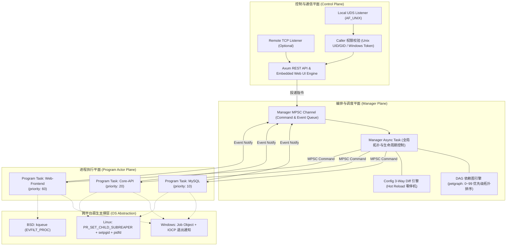
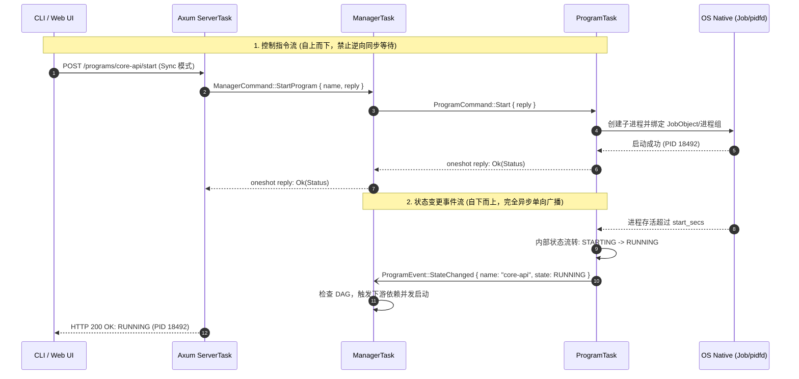
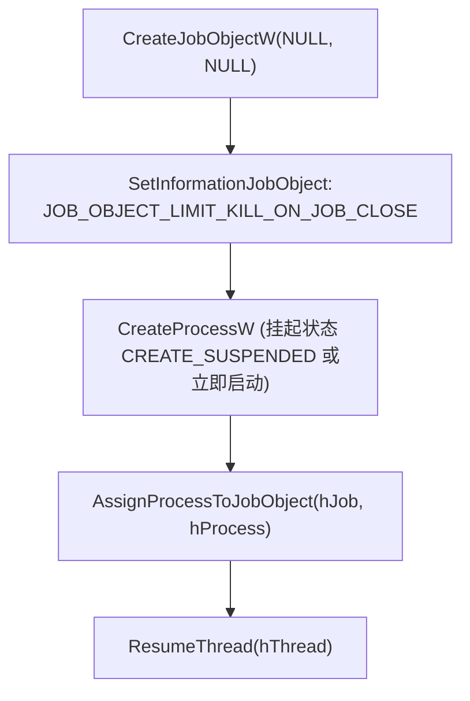
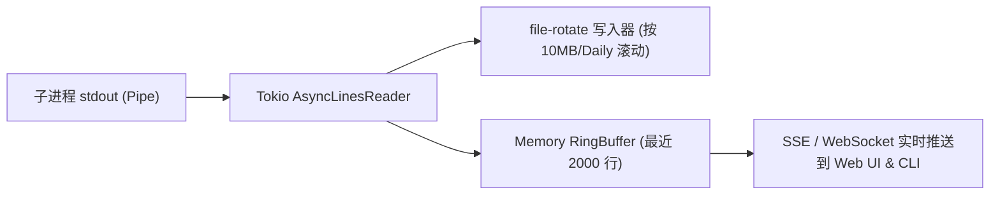

# rsupervisord: 系统架构与详细设计规范 (DESIGN.md)

| 文档版本 | 状态 | 目标语言 | 运行时环境 |
| :--- | :--- | :--- | :--- |
| **v1.0.0** | 待评审 / 实施基准 | Rust (Edition 2024) | Linux / Windows 10/11 / BSD / macOS |

---

## 1. 架构设计哲学与核心约束 (Core Design Tenets)

为了从根本上杜绝传统守护引擎（如 `ochinchina/supervisord`）的高 CPU 占用、孤儿进程泄漏、锁争用与死锁等缺陷，`rsupervisord` 确立了以下四项底层设计刚性约束：

1. **Task 化与完全的消息驱动 (Task-based Actor Model)**：
   - `Manager` 与每个被托管的 `Program` 在逻辑上均被设计为拥有独立生命周期的异步任务 (`async task`)。
   - **读写分离与无锁读取**：允许通过线程安全的共享数据（如 `Arc<ParkingLotRwLock<StateSnapshot>>` 或原子变量）提供瞬时无竞争的高并发只读访问；但**任何状态修改和控制指令必须通过异步消息通道 (`tokio::sync::mpsc`) 进行串行化传递**，杜绝锁竞争与共享状态混乱。
   - **严禁环路死锁**：针对包含同步等待（Request-Response）的消息交互，采用单向分层通信与超时熔断设计，彻底消灭循环等待死锁。
2. **完整生命周期追踪 (Explicit JoinHandle Management)**：
   - 严禁派生“游离（Detached）”的异步任务。所有 `tokio::spawn` 产生的后台任务必须由管理者显式持有其 `JoinHandle`，确保在停止或热重载时能够精确监控、排队等待并安全释放。
3. **安全取消与零 Abort 准则 (Zero-Abort & CancellationToken)**：
   - **绝对不允许调用 `JoinHandle::abort()`**。强制采用 `tokio_util::sync::CancellationToken` 实现协作式安全取消，确保进程控制块、OS 句柄（如 Windows Job Objects、Unix 管道）、日志缓冲区等底层资源在退出时拥有确定性的清理时机，避免资源句柄泄漏和日志丢失。
4. **统一同步原语 (Parking Lot Primitives)**：
   - 全局禁止使用 `std::sync::{Mutex, RwLock, Condvar}`，统一采用高性能的 `parking_lot` 同步原语。
   - 同步锁仅限于极短耗时的内存数据读写，**严禁持有同步锁跨越 `.await` 挂起点**。

---

## 2. 系统整体分层架构 (Layered Architecture)



---

## 3. 异步任务模型与消息通道设计 (Task & Channel Design)

### 3.1 角色划分与职责
整个系统运行时由四类核心异步任务构成：
1. **`ManagerTask`**：负责读取全局配置、构建 DAG 依赖、执行增量 Diff、响应外部 CLI/Web 指令、监听来自各 `ProgramTask` 的生命周期事件汇报并推进全局编排。
2. **`ProgramTask`**：每个被托管的进程实例化为一个独立的 Actor Task。负责驱动单一进程的状态机（`Stopped -> Starting -> Running -> Backoff -> Stopping -> Exited -> Fatal`）、与 OS 底层交互、派生日志泵任务。
3. **`LogPumpTask`**：为每个被托管进程分配独立的 stdout/stderr 异步读取任务，执行行缓冲、写入 `file-rotate`、广播至内存 `RingBuffer`。
4. **`ServerTask`**：由 Axum 驱动，监听本地 UDS 和可选的 TCP，接收外部请求并将其转化为消息递交给 `ManagerTask`。

---

### 3.2 消息通道协议与死锁防范 (Deadlock-Free Messaging)

为了确保状态严格可控且绝不死锁，消息流动遵循**严格的单向分层拓扑**：



#### 3.2.1 消息枚举定义

```rust
use tokio::sync::oneshot;
use std::time::Duration;

/// 发送给 Manager 的控制命令
#[derive(Debug)]
pub enum ManagerCommand {
    StartProgram {
        name: String,
        reply: oneshot::Sender<anyhow::Result<ProgramStatus>>,
    },
    StopProgram {
        name: String,
        grace_period: Option<Duration>,
        reply: oneshot::Sender<anyhow::Result<ProgramStatus>>,
    },
    RestartProgram {
        name: String,
        reply: oneshot::Sender<anyhow::Result<ProgramStatus>>,
    },
    ReloadConfig {
        reply: oneshot::Sender<anyhow::Result<ReloadSummary>>,
    },
    GetAllStatus {
        reply: oneshot::Sender<Vec<ProgramStatus>>,
    },
}

/// 由 Program 汇报给 Manager 的异步生命周期事件
#[derive(Debug, Clone)]
pub enum ProgramEvent {
    StateChanged {
        name: String,
        old_state: ProgramState,
        new_state: ProgramState,
        pid: Option<u32>,
    },
    Exited {
        name: String,
        exit_code: Option<i32>,
        expected: bool,
    },
    HealthChanged {
        name: String,
        healthy: bool,
        reason: Option<String>,
    },
}

/// 发送给具体 ProgramTask 的控制指令
#[derive(Debug)]
pub enum ProgramCommand {
    Start {
        reply: oneshot::Sender<anyhow::Result<()>>,
    },
    Stop {
        grace_period: Duration,
        reply: oneshot::Sender<anyhow::Result<()>>,
    },
    ReloadConfig {
        new_config: Box<ProgramConfig>,
        reply: oneshot::Sender<anyhow::Result<()>>,
    },
}
```

#### 3.2.2 死锁消除三大原则
1. **严禁逆向同步请求**：
   `ProgramTask` 只能向 `ManagerTask` 发送无需应答的事件通知（`mpsc::Sender::send(ProgramEvent)`），绝对不允许发起需要 `ManagerTask` 同步返回 oneshot reply 的请求。
2. **Oneshot 必须包裹超时熔断**：
   所有通过 `oneshot::Receiver` 等待回应的调用处，必须强制使用 `tokio::time::timeout` 限制等待时间（如 5s~30s）。若通道意外断开（`RecvError`）或超时，发起端必须安全降级报错，绝不永恒阻塞：
   ```rust
   match tokio::time::timeout(Duration::from_secs(10), reply_rx).await {
       Ok(Ok(result)) => result,
       Ok(Err(_closed)) => Err(anyhow::anyhow!("Program task unexpectedly dropped reply channel")),
       Err(_timeout) => Err(anyhow::anyhow!("Operation timed out waiting for program response")),
   }
   ```
3. **禁止持有同步锁执行异步等待**：
   在需要使用 `parking_lot::Mutex` 或 `RwLock` 时，作用域仅限于访问内存瞬时变量，必须在同一同步代码块结束前自动释放，绝对不允许在持有锁时调用 `.await`。

---

## 4. 生命周期管理与 JoinHandle 控制 (Lifecycle & JoinHandle)

### 4.1 任务注册中心 (TaskRegistry)
为了保证系统关机或热重载时能够有序销毁所有任务，严禁调用不可控的 `tokio::spawn`。所有的后台任务统一封装入带 `JoinHandle` 和 `CancellationToken` 的结构体中进行生命周期管理：

```rust
use tokio::task::JoinHandle;
use tokio_util::sync::CancellationToken;
use parking_lot::RwLock;
use std::sync::Arc;

pub struct ManagedTask<T> {
    pub name: String,
    pub cancel_token: CancellationToken,
    pub join_handle: Option<JoinHandle<T>>,
}

impl<T> ManagedTask<T> {
    /// 协作式停止并等待退出
    pub async fn shutdown(&mut self) -> Option<T> {
        self.cancel_token.cancel();
        if let Some(handle) = self.join_handle.take() {
            match handle.await {
                Ok(res) => Some(res),
                Err(e) => {
                    tracing::error!(task = %self.name, error = %e, "Task panicked or failed on join");
                    None
                }
            }
        } else {
            None
        }
    }
}
```

### 4.2 `ProgramHandle` 结构设计
Manager 并不直接操作底层进程，而是持有每个 Program 的包装句柄：

```rust
pub struct ProgramHandle {
    pub name: String,
    pub priority: u8,
    pub dependencies: Vec<String>,
    pub tx: tokio::sync::mpsc::Sender<ProgramCommand>,
    /// 无锁高并发读取的即时状态快照（只读视图）
    pub state_snapshot: Arc<RwLock<ProgramStatus>>,
    /// 任务生命周期追踪
    pub task: ManagedTask<()>,
}
```

---

## 5. 安全取消机制 (Cancellation Architecture)

### 5.1 为什么严格禁止 `handle.abort()`？
在 Rust Tokio 中，`JoinHandle::abort()` 会在 Future 当前正在暂停的任意 `.await` 挂起点强制终止。对于进程监控系统而言，这意味着：
- 子进程已经发出创建请求，但尚未将其句柄挂载到 Windows Job Object 或 Linux 进程组中，导致进程**永久脱离管控**成为孤儿。
- `file-rotate` 正在向磁盘写入标准输出数据，强制中断导致文件尾部损坏或未刷新磁盘缓冲区。
- 发送给 Manager 的状态更新通道卡在中间状态。

### 5.2 `CancellationToken` 的树状级联分发


- **单程序平滑停止**：调用 `program_handle.task.cancel_token.cancel()`，仅触发该程序的退出序列；其上游不受影响，其下游由 Manager 按依赖拓扑级联停止。
- **全局优雅停机**：捕获到 `SIGINT`/`SIGTERM`/`Ctrl+C` 时，触发 `RootToken.cancel()`，整棵 Token 树瞬间得到通知。

### 5.3 任务主循环模板 (Standard Actor Loop)

每个 `ProgramTask` 的主执行循环必须采用 `tokio::select!` 结构，并开启 `biased;` 确保优先响应取消信号：

```rust
pub async fn run_program_actor(
    mut ctx: ProgramContext,
    mut rx: tokio::sync::mpsc::Receiver<ProgramCommand>,
    cancel_token: CancellationToken,
) {
    loop {
        tokio::select! {
            biased;

            // 1. 优先响应取消信号（安全协作退出）
            _ = cancel_token.cancelled() => {
                tracing::info!(program = %ctx.name, "Cancellation received, stopping program...");
                ctx.execute_graceful_stop(Duration::from_secs(ctx.config.stop_wait_secs)).await;
                break;
            }

            // 2. 处理控制指令
            Some(cmd) = rx.recv() => {
                match cmd {
                    ProgramCommand::Start { reply } => {
                        let res = ctx.execute_start().await;
                        let _ = reply.send(res);
                    }
                    ProgramCommand::Stop { grace_period, reply } => {
                        let res = ctx.execute_graceful_stop(grace_period).await;
                        let _ = reply.send(res);
                    }
                    ProgramCommand::ReloadConfig { new_config, reply } => {
                        let res = ctx.reload_config(*new_config).await;
                        let _ = reply.send(res);
                    }
                }
            }

            // 3. 监听子进程原生退出事件 (基于 pidfd / Job Object 事件 / async child.wait())
            exit_result = ctx.wait_for_child_exit() => {
                ctx.handle_child_exit(exit_result).await;
            }
        }
    }
    
    // 退出循环后完成确定的清理工作
    ctx.cleanup_resources().await;
    tracing::info!(program = %ctx.name, "Program actor terminated cleanly");
}
```

---

## 6. 同步原语规范与读写分离模式 (Synchronization Standard)

### 6.1 `parking_lot` 替代标准库
- 代码中一律使用：
  ```rust
  use parking_lot::{Mutex, RwLock};
  ```
- **核心优势**：
  1. 空间占用极小（`Mutex` 仅占 1 字节，`std::sync::Mutex` 占 40 字节）。
  2. 极低竞争下使用自旋自适应优化，避免不必要的内核级线程挂起。
  3. 无锁中毒（Poisoning）机制：当某个持有锁的线程 panic 时，不会毒化锁导致后续操作雪崩。
  4. 支持调试模式下的死锁检测工具集成（`parking_lot::deadlock`）。

### 6.2 读写分离架构 (Read-Optimized State Mirroring)
- **写路径（更新状态）**：
  只有 `ProgramTask` 自身作为状态机的主人拥有写入权。当发生状态迁移时，`ProgramTask`：
  1. 获取自身内部 `state_snapshot.write()` 锁（耗时 < 100ns）。
  2. 更新状态字段（State, PID, Uptime, ExitCode）。
  3. 立即释放写锁。
  4. 向 Manager 发送异步 `ProgramEvent::StateChanged`。
- **读路径（查询状态）**：
  外部 Web UI、CLI、探针或 Manager 拓扑计算只需通过 `Arc<RwLock<ProgramStatus>>` 的 `read()` 方法复制一份浅拷贝，**完全无需通过 Channel 向 ProgramTask 发送请求即可实现毫秒级零延迟读取**，杜绝并发查询拖慢进程调度的可能。

---

## 7. 跨平台进程沙箱与抽象分层 (Platform Abstraction & Sandbox)

### 7.0 平台抽象层设计 (PlatformBackend & PlatformProcessGuard)

为杜绝在核心业务逻辑中充斥散落的 `#[cfg(windows)]` 和 `#[cfg(unix)]` 条件编译代码，`rsupervisord` 设计了完备的平台抽象 Trait 层：

```rust
pub trait PlatformProcessGuard: Send + Sync {
    /// 向子进程及其衍生的子孙进程发送优雅停止信号 (POSIX killpg / Windows CTRL_BREAK)
    fn send_stop_signal(&self, signal: StopSignal) -> Result<(), ProgramError>;
    /// 强行销毁整个子进程树 (POSIX SIGKILL 进程组 / Windows TerminateJobObject)
    fn force_kill(&self) -> Result<(), ProgramError>;
    /// 获取主进程 PID
    fn pid(&self) -> u32;
}

pub trait PlatformBackend: Send + Sync {
    /// 预先配置待执行的 Command (进程组/降权/umask)
    fn configure_command(&self, cmd: &mut Command, user: Option<&str>, umask: Option<u32>) -> Result<(), ProgramError>;
    /// 挂载并包装新派生的子进程句柄，返回 PlatformProcessGuard
    fn attach_child(&self, child: &Child, pid: u32) -> Result<Box<dyn PlatformProcessGuard>, ProgramError>;
    /// 获取平台默认 UDS 路径
    fn default_uds_path(&self) -> PathBuf;
    /// 校验当前运行权限是否为管理员 (Linux root / Windows TokenElevation)
    fn is_elevated(&self) -> bool;
}

/// 全局平台单例访问入口
pub fn native_platform() -> &'static dyn PlatformBackend;
```

**设计收益**：
1. **上层完全平台无关**：`ProcessProgram` 与 `SupervisorManager` 内部零 `#[cfg]`，所有 OS 差异被完全隔离在 `src/platform/` 模块内部。
2. **统一测试套件**：利用 `tests/platform_tests.rs` 统一接口在 Windows 与 Linux (WSL) 两套工具链上执行完全一致的行为契约校验。

### 7.1 Windows 平台：Job Object 深度绑定
在 Windows 平台上，必须依靠内核级 **Job Object** 达成 100% 进程树安全回收：



- **实现机制**：
  1. 每个 `ProcessProgram` 初始化时创建一个专属 Job 句柄，配置 `JOB_OBJECT_LIMIT_KILL_ON_JOB_CLOSE` 标志位。
  2. 在通过 `tokio::process::Command` 启动子进程后，立即将其句柄加入 Job。
  3. 当需要强杀时，调用 `TerminateJobObject(hJob, exit_code)`；当守护进程崩溃或 ProgramTask 被 Drop 时，Job 句柄随之关闭，**Windows 内核自动强行销毁整棵衍生进程树**，完全不需要依赖 `taskkill.exe`。
- **优雅停机 (Graceful Stop)**：
  Windows 原生缺乏 POSIX 信号。对于控制台应用，先通过 `GenerateConsoleCtrlEvent(CTRL_BREAK_EVENT, process_group_id)` 发送退出事件；在 `stop_wait_secs` 超时后，若仍未退出，再触发 `TerminateJobObject`。

### 7.2 POSIX (Linux / BSD) 平台：进程组与 Subreaper
- **独立进程组**：利用 `tokio::process::Command::pre_exec`，在 `fork` 后、`exec` 前调用 `nix::unistd::setpgid(Pid::from_raw(0), Pid::from_raw(0))`，确保子进程及其衍生的子孙进程处于全新的独立进程组。
- **优雅停机**：停止时调用 `nix::sys::signal::killpg(pgid, stopsignal)` 发送组信号。
- **孤儿防逃逸**：Linux 环境下守护进程启动时调用 `prctl(PR_SET_CHILD_SUBREAPER, 1)`，使所有因父进程先退出而孤立的孙子进程全部被 `rsupervisord` 接管，并在信号循环中调用 `waitpid(-1, WNOHANG)` 回收僵尸进程，彻底杜绝僵尸进程常驻。
- **权限降低 (User UID/GID)**：在 `pre_exec` 中调用 `setgid` 与 `setuid`，使进程以受限权限安全执行。

---

## 8. 日志管道与轮转子系统 (Logging Pipeline)



1. **零轮询 I/O**：通过 `tokio::io::BufReader::lines()` 异步接收输出，没有任何数据写入时，该任务挂起，占用 0% CPU。
2. **滚动归档 (`file-rotate`)**：根据配置的 `max_bytes`（例如 20MB）或 `rotate: daily` 自动完成文件切分与压缩，保留 `backups` 指定份数的历史文件。
3. **环形内存回放缓冲 (`RingBuffer`)**：采用定长固定容量环形队列（使用 `parking_lot::Mutex<VecDeque<String>>`），支持 CLI 在执行 `rsupervisorctl tail -f` 时瞬间回放历史并开启实时跟踪。

---

## 9. 控制通信与安全性检查实现 (Control & Security)

### 9.1 Caller 安全权限检查 (UDS & Local IPC)

#### POSIX 平台实现 (`src/platform/unix.rs`)
通过提取本地 Socket 凭证实现强安全校验：
```rust
#[cfg(unix)]
pub fn verify_caller_credentials(stream: &tokio::net::UnixStream) -> anyhow::Result<()> {
    use nix::sys::socket::{getsockopt, sockopt::PeerCredentials};
    let creds = getsockopt(stream, PeerCredentials)?;
    let daemon_uid = nix::unistd::getuid();
    
    // 规则：
    // 1. 若 Daemon 是 root (uid 0)，仅允许 root 调用
    // 2. 若 Daemon 是普通用户，仅允许同 UID 或 root 调用
    if daemon_uid.is_root() {
        if !creds.uid().is_root() {
            anyhow::bail!("Access denied: Caller UID {} is not root", creds.uid());
        }
    } else if creds.uid() != daemon_uid && !creds.uid().is_root() {
        anyhow::bail!("Access denied: Caller UID {} does not match daemon UID {}", creds.uid(), daemon_uid);
    }
    Ok(())
}
```

#### Windows 平台实现 (`src/platform/windows.rs`)
```rust
#[cfg(windows)]
pub fn is_current_process_elevated() -> bool {
    use windows_sys::Win32::Security::{GetTokenInformation, TokenElevation, TOKEN_ELEVATION, TOKEN_QUERY};
    use windows_sys::Win32::System::Threading::{GetCurrentProcess, OpenProcessToken};
    use windows_sys::Win32::Foundation::{CloseHandle, HANDLE};
    
    unsafe {
        let mut token: HANDLE = std::mem::zeroed();
        if OpenProcessToken(GetCurrentProcess(), TOKEN_QUERY, &mut token) == 0 {
            return false;
        }
        let mut elevation: TOKEN_ELEVATION = std::mem::zeroed();
        let mut size = std::mem::size_of::<TOKEN_ELEVATION>() as u32;
        let success = GetTokenInformation(
            token,
            TokenElevation,
            &mut elevation as *mut _ as *mut _,
            size,
            &mut size,
        );
        CloseHandle(token);
        success != 0 && elevation.TokenIsElevated != 0
    }
}
```
CLI 在启动时通过 `is_current_process_elevated()` 检查自身权限。若检测到目标守护进程为管理员/服务级别运行，而当前命令行未提权，则立即拦截并给出友好错误提示。

---

---

## 10. CLI 同步/异步操作执行流程

- **同步执行 (Sync)**：
  1. CLI 提交 `POST /api/v1/programs/foo/start`。
  2. Axum Server 接收指令，投递 `ManagerCommand::StartProgram`。
  3. Manager 驱动 `ProgramTask` 启动，并等待其状态迁移至 `RUNNING`（超过 `start_secs` 窗口期）或发生 `FATAL` 退出。
  4. Server 将最终结果和耗时打包返回给 CLI。
- **异步执行 (Async, `--async`)**：
  1. CLI 提交参数携带 `sync=false` 的请求。
  2. Manager 接收后立刻向 `ProgramTask` 发送启动信号，并直接向 CLI 返回 `202 Accepted`（当前状态 `STARTING`）。
  3. CLI 立即退出，耗时通常 < 5ms。

---

## 11. Windows 原生 UDS 与反向代理挂接 (Windows Native UDS & Caddy Integration)

为实现与 Caddy、Nginx 等反向代理在 Windows 上的高效零端口对接，`rsupervisord` 支持在 Windows 10 (17063+) 及 Windows 11 上直接监听 AF_UNIX 套接字文件：


1. **底层实现机制**：
   - 依赖 `uds_windows` 负责监听创建文件句柄。
   - 接收到客户端流时，通过 `into_raw_socket` 提取底层句柄并立即置为非阻塞模式 (`ioctlsocket(FIONBIO)` / `tokio::net::TcpStream::from_raw_socket`)。
   - 通过 `hyper_util::rt::TokioIo` 接管底层流，直接让 Axum 的 Router 处理 HTTP 流量。
2. **生产收益**：
   - **杜绝端口冲突**：无需在本地监听 127.0.0.1 端口，完全消除端口被占用的隐患。
   - **ACL 权限保障**：利用 Windows NTFS 原生文件访问控制列表 (ACL) 限制只有管理员和 Caddy 运行用户可读写该 `.sock` 文件，防止跨进程未授权访问。

---

## 12. 嵌入式 Web UI 架构设计 (Embedded Web UI Engine)

### 12.1 零 NPM 与单文件独立分发规范
为保持核心系统轻量、免构建、高可用并杜绝 node_modules 安全漏洞，Web UI 严格贯彻**零 NPM 构建依赖**：
- **静态资源嵌入 (`rust-embed`)**：
  ```rust
  #[derive(rust_embed::RustEmbed)]
  #[folder = "web/"]
  pub struct WebAssets;
  ```
  在编译阶段将 `web/index.html` 与 `web/vue.global.prod.js` 完全编译打包进二进制文件的 `.rodata` 段，实现真正意义上的单可执行文件分发。
- **独立生产运行时**：采用官方生产版单文件 Vue 3 (`web/vue.global.prod.js`, ~154KB)，无 Webpack/Vite 编译步骤，页面打开即刻水合挂载。

### 12.2 SPA 路由回落与 API 隔离
- **SPA Client-side 路由回落**：
  当用户访问非文件路径（如 `/programs/web-worker`）时，静态资源处理器自动回落并返回 `index.html`，交由前端接管视图渲染。
- **API 路径保护**：
  所有前缀为 `/api/` 的未匹配请求由静态处理器短路拦截，返回标准的结构化 JSON 404，绝不回落至 HTML，保障 API 调用方的健壮性：
  ```json
  {"success": false, "error": "Endpoint not found"}
  ```

### 12.3 Web UI 核心功能与交互规范
1. **进程拓扑看板与资源监控**：
   - 概况统计卡片：Total Programs、Running、Stopped、Degraded/Alert、Total CPU %、Total RSS Memory。
   - 进程表格：微发光状态指示徽章（绿/灰/黄/红）、PID、CPU %、RSS 内存占用（MB/GB）、格式化 Uptime、描述。
2. **批量与全量控制工具栏**：
   - 支持多选复选框，选中时动态浮现批量操作栏：`Start Selected`、`Stop Selected`、`Restart Selected`、`Clear`。
   - 全局一键控制：`Start All`、`Stop All`、`Restart All`。
3. **零停机配置热重载 (Hot Reload)**：
   - 点击 `Reload Config` 发送 `POST /api/v1/reload`。
   - 弹出对话框以高亮色彩分类展示配置差异（Added, Removed, Modified, Unchanged）。
4. **实时 SSE 终端日志抽屉 (Live Log Streaming)**：
   - 通过 `EventSource` 连接 `/api/v1/programs/{name}/logs/stream`，实时追加输出流。
   - 具备自动滚屏锁定、一键复制到剪贴板、清空缓冲区等运维控制。
5. **安全认证控制**：
   - 提供 Bearer Token 管理窗口，支持保存至浏览器 `localStorage` 并自动附带 `Authorization: Bearer <token>` 请求头。
   - 当 API 返回 `401 Unauthorized` 时自动拦截并引导输入 Token。

---

## 13. 主动健康检查与资源监控系统 (Health Checks & Metrics)

### 13.1 主动探针子系统
每个被托管程序支持独立配置三种类型的周期性健康检查探针：
1. **HTTP 探针**：向目标 URL（如 `http://127.0.0.1:8080/health`）发起 GET 请求，期望响应状态码在 `200..300` 之间。
2. **TCP 探针**：尝试与目标端口建立 TCP 连接，握手成功即为健康。
3. **Exec 探针**：在本地执行指定命令（如 `pg_isready -h localhost`），期望退出码为 0。

- **故障恢复机制**：连续失败次数达到 `failure_threshold` 后，程序健康状态变更为 `Unhealthy`；若配置了自动恢复策略，Manager 将触发平滑重启。

### 13.2 跨平台进程树资源监控 (Process Metrics)
- **Windows 平台**：通过 Win32 `QueryInformationJobObject` 查询 `JobObjectBasicAndAccountingInformation`，汇总整棵子进程树的内核与用户态 CPU 耗时，并在采样周期内计算精确的 `cpu_percent`；通过 Job 内存限制统计获取真实的 Resident Set Size (RSS)。
- **Linux 平台**：通过读取 `/proc/{pid}/stat` 与 `/proc/{pid}/statm`，精准解析进程树的时钟周期数与常驻内存页数。

---

## 14. 设计验证与测试矩阵 (Verification Matrix)

| 验证项 | 验证手段 | 预期目标 |
| :--- | :--- | :--- |
| **0% 静默 CPU** | 启动 50 个空闲进程，使用 `top` / Windows 性能监视器监控 10 分钟 | CPU 占用保持在 0.00% ~ 0.01%（无抖动） |
| **Windows 孤儿进程消灭** | 托管一个启动多层子进程的脚本，发送 `stop` 或直接杀死 `rsupervisord` | 孙子进程随 Job Object 彻底回收，进程管理器无残留 |
| **死锁防范与压力** | 模拟高并发 CLI `start`/`stop`/`reload` 交叉并发请求 | 无任何任务卡死，超时熔断有效，100% 成功或安全报错 |
| **热重载零停机** | 配置文件修改其中一个 Program，执行 `reload` | 未改动的服务 PID 绝不改变，网络连接不中断 |
| **权限隔离校验** | 普通用户在 Linux/Windows 尝试控制 root/Elevated 守护进程 | 明确拦截并输出标准权限不足提示，无越权风险 |
| **Windows UDS 挂接** | 通过 `uds_windows` 建立 UnixListener，Caddy 反向代理连入 | 成功代理 HTTP 请求，吞吐稳定且零端口监听 |
| **嵌入式 Web UI 离线** | 断网环境下访问 Web UI (`GET /` 与 `/vue.global.prod.js`) | 资源全部来自二进制内嵌 FS，秒级渲染，SPA 路由正常 |
| **主动探针自动重启** | 模拟托管服务端口宕机，健康检查连续达到失败阈值 | 状态机自动迁移至 Unhealthy 并触发自动重启恢复 |
