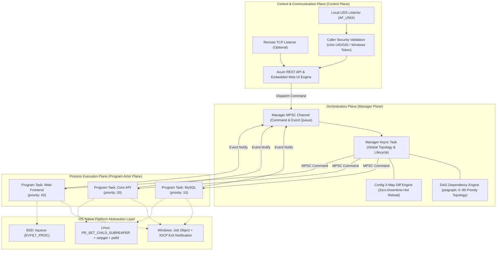
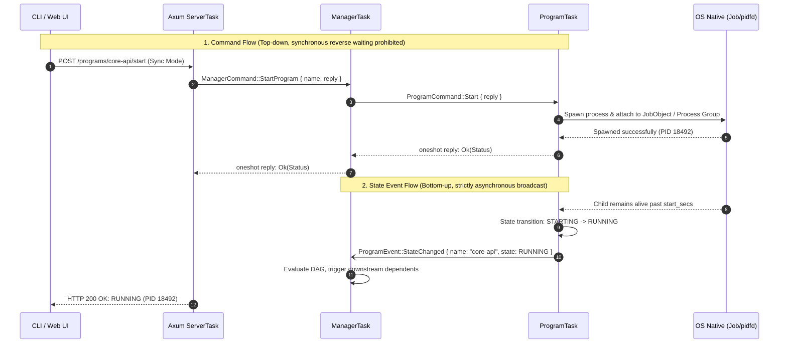
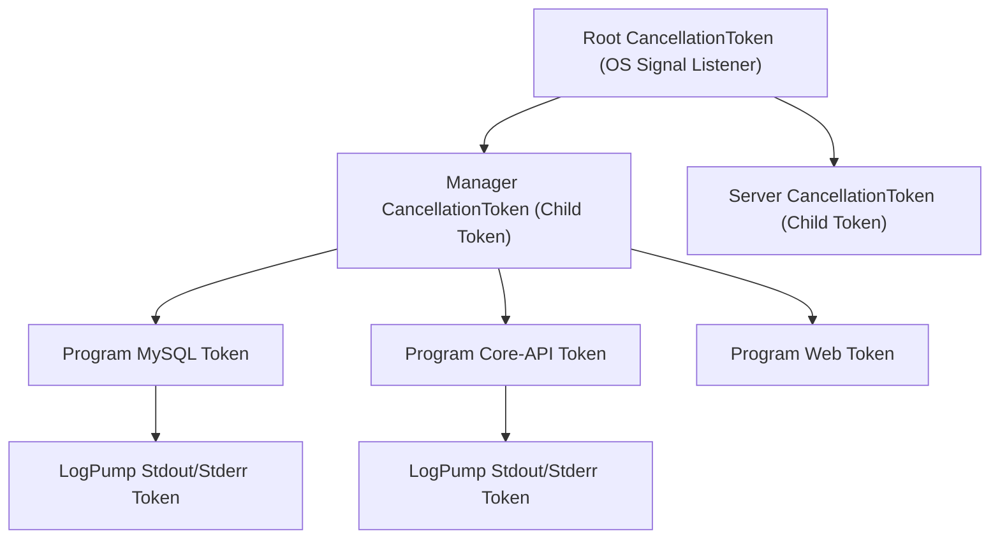
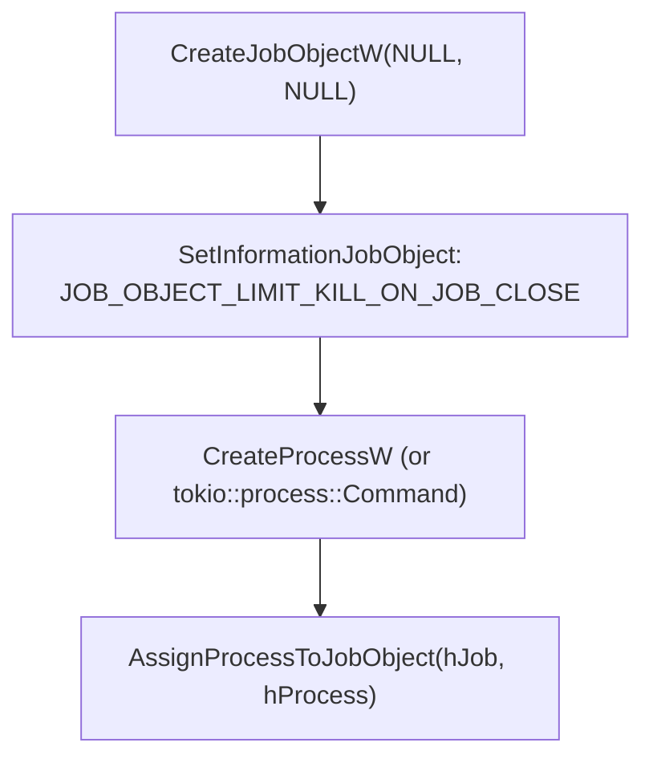
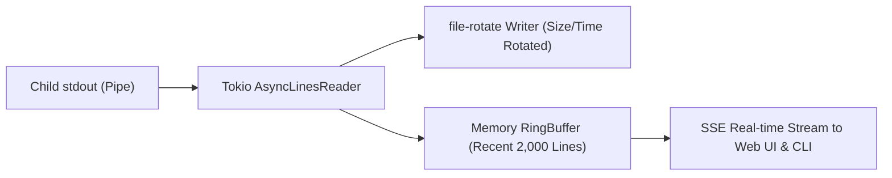
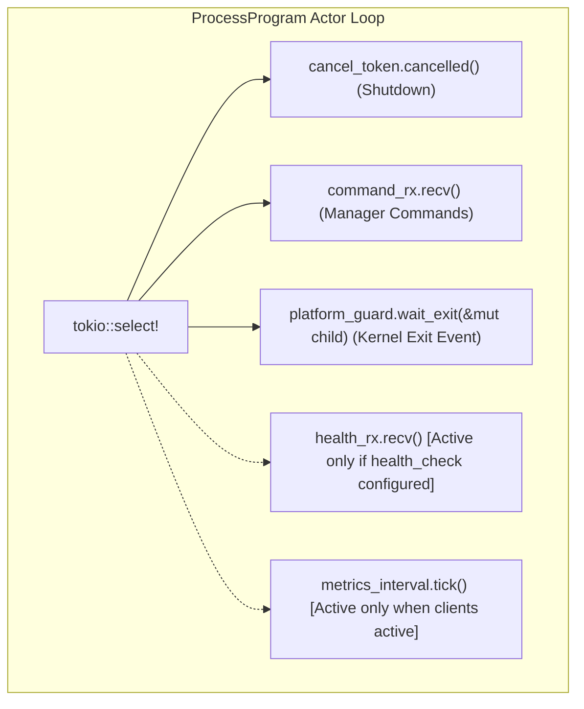

# rsupervisord: System Architecture & Technical Design Specification (DESIGN.md)

| Document Version | Status | Target Language | Runtime Targets |
| :--- | :--- | :--- | :--- |
| **v1.0.0** | Approved / Baseline | Rust (Edition 2024) | Linux / Windows 10/11 / BSD / macOS |

---

## 1. Core Design Tenets

To fundamentally eliminate high CPU consumption, orphan process leaks, lock contention, and deadlocks commonly found in traditional supervisor engines (such as `ochinchina/supervisord`), `rsupervisord` enforces five rigid architectural constraints:

1. **Task-Based Actor Model**:
   - Both the `Manager` and every managed `Program` are designed as asynchronous tasks (`async task`) with independent lifecycles.
   - **Read-Write Separation & Lock-Free Reads**: High-concurrency, zero-contention read access is provided through thread-safe shared snapshots (`Arc<RwLock<ProgramStatus>>`). However, **all state transitions and control mutations MUST be serialized via asynchronous message channels (`tokio::sync::mpsc`)**, preventing race conditions and inconsistent states.
   - **Deadlock Elimination**: Synchronous Request-Response interactions follow strict hierarchical one-way messaging with timeout circuit breakers, completely preventing circular wait deadlocks.
2. **Explicit JoinHandle Lifecycle Tracking**:
   - Detached asynchronous tasks are strictly forbidden. Every task spawned with `tokio::spawn` must have its `JoinHandle` explicitly retained by its supervisor, ensuring deterministic tracking, graceful draining, and clean destruction during stop or reload phases.
3. **Zero-Abort & Cooperative Cancellation (`CancellationToken`)**:
   - **Calling `JoinHandle::abort()` is strictly prohibited**. Cooperative cancellation is managed via `tokio_util::sync::CancellationToken`, giving process control blocks, OS handles (Windows Job Objects, Unix pipes), and log buffers a deterministic window to flush and release resources safely.
4. **Uniform Parking Lot Primitives**:
   - `std::sync::{Mutex, RwLock, Condvar}` are banned throughout the codebase in favor of high-performance `parking_lot` primitives.
   - Synchronization locks are restricted to instantaneous in-memory mutations; **holding any synchronous lock across an `.await` point is strictly prohibited**.
5. **Scope-Guarded Local Lifecycles & RAII Cleanups**:
   - Unprotected `create -> use -> destroy` patterns across async functions and futures are hardened using `scopeguard` (`scopeguard::guard`). Newly spawned child processes are immediately held in a termination guard that disarms only after successful platform tree attachment and log pump wiring, preventing orphaned processes upon initialization errors.
   - OS handles (`OpenProcess`, `OpenProcessToken`, Windows Job Objects) and socket files are cleaned up through RAII guards (`scopeguard::ScopeGuard` and `tokio_util::sync::DropGuard`), eliminating handwritten `Drop` boilerplate and preventing resource leaks.

---

## 2. Layered System Architecture



---

## 3. Asynchronous Task Model & Channel Protocols

### 3.1 Task Roles & Responsibilities

The runtime consists of four primary asynchronous task categories:

1. **`ManagerTask`**: Parses global configurations, constructs DAG dependencies, computes incremental diffs, processes external CLI/Web commands, and drives global orchestration in response to program lifecycle events.
2. **`ProgramTask`**: Each managed process runs as an independent Actor task driving its internal state machine (`Stopped -> Starting -> Running -> Backoff -> Stopping -> Exited -> Fatal`), interfacing with platform guards, and supervising log pumps.
3. **`LogPumpTask`**: Dedicated asynchronous readers per process for `stdout` and `stderr`, handling line buffering, feeding `file-rotate`, and broadcasting to `RingBuffer`.
4. **`ServerTask`**: Powered by Axum, listening on local UDS and optional TCP endpoints, converting external requests into commands delivered to `ManagerTask`.

---

### 3.2 Deadlock-Free Messaging Protocols

To ensure strict order without deadlock, message flow follows a **hierarchical one-way topology**:



#### 3.2.1 Message Definitions

```rust
use tokio::sync::oneshot;
use std::time::Duration;

/// Commands dispatched to the Manager
#[derive(Debug)]
pub enum ManagerCommand {
    StartProgram {
        name: String,
        reply: oneshot::Sender<anyhow::Result<ProgramStatus>>,
    },
    StopProgram {
        name: String,
        grace_period: Option<Duration>,
        reply: oneshot::Sender<anyhow::Result<ProgramStatus>>,
    },
    RestartProgram {
        name: String,
        reply: oneshot::Sender<anyhow::Result<ProgramStatus>>,
    },
    ReloadConfig {
        reply: oneshot::Sender<anyhow::Result<ReloadSummary>>,
    },
    GetAllStatus {
        reply: oneshot::Sender<Vec<ProgramStatus>>,
    },
}

/// Asynchronous lifecycle events reported by Programs to Manager
#[derive(Debug, Clone)]
pub enum ProgramEvent {
    StateChanged {
        name: String,
        old_state: ProgramState,
        new_state: ProgramState,
        pid: Option<u32>,
    },
    Exited {
        name: String,
        exit_code: Option<i32>,
        expected: bool,
    },
    HealthChanged {
        name: String,
        healthy: bool,
        reason: Option<String>,
    },
}

/// Commands dispatched to specific ProgramTasks
#[derive(Debug)]
pub enum ProgramCommand {
    Start {
        reply: oneshot::Sender<anyhow::Result<()>>,
    },
    Stop {
        grace_period: Duration,
        reply: oneshot::Sender<anyhow::Result<()>>,
    },
    ReloadConfig {
        new_config: Box<ProgramConfig>,
        reply: oneshot::Sender<anyhow::Result<()>>,
    },
}
```

#### 3.2.2 Three Principles of Deadlock Elimination

1. **Prohibit Reverse Synchronous Waiting**:
   `ProgramTask` can only send fire-and-forget events (`mpsc::Sender::send(ProgramEvent)`) to `ManagerTask`. It is never permitted to issue synchronous requests requiring a oneshot response from the Manager.
2. **Oneshot Calls Must Enforce Timeout Circuit Breakers**:
   All operations awaiting responses via `oneshot::Receiver` must be bounded by `tokio::time::timeout` (e.g., 5s~30s). Channel closures or timeouts degrade safely without blocking indefinitely:

   ```rust
   match tokio::time::timeout(Duration::from_secs(10), reply_rx).await {
       Ok(Ok(result)) => result,
       Ok(Err(_closed)) => Err(anyhow::anyhow!("Program task dropped reply channel")),
       Err(_timeout) => Err(anyhow::anyhow!("Operation timed out waiting for program response")),
   }
   ```

3. **Never Hold Synchronous Locks Across Await Points**:
   `parking_lot::Mutex` or `RwLock` guards must be dropped before any `.await` statement.

---

### 3.3 Star-Topology Dual-Track Event Bus (`EventHub`)

Traditional supervisor implementations rely on point-to-point mesh invocation or tight coupling across server routes and worker actors. Furthermore, frontends are forced to poll `/status` continuously.

To resolve these issues while maintaining minimal latency and zero wasted allocations, `rsupervisord` adopts a **Star-Topology Dual-Track Event Bus**:


#### 3.3.1 Dual-Track Channel Separation & Zero-Subscriber Optimization

1. **Dual-Track Channel Isolation**:
   High-frequency log lines (which can burst to tens of thousands of lines per second) are segregated from critical system state events (`StateChanged`, `HealthChanged`, `ConfigReloaded`, `DaemonLifecycle`). This prevents log bursts from saturating the broadcast channel and causing dropped state events (`RecvError::Lagged`).
2. **Zero-Subscriber No-Op Overhead**:
   Before performing any serialization or channel cloning, `EventHub::publish_system` and `EventHub::publish_log` verify `self.tx.receiver_count() > 0`. When no clients are subscribed, event publishing incurs zero allocations or performance costs.
3. **Purely Reactive `wait_for_state`**:
   Internal commands waiting for state settling (e.g. synchronous CLI operations) subscribe to the `EventHub` rather than executing busy sleep loops (`tokio::time::sleep(50ms)`), achieving instant reaction upon state mutation.
4. **Server-Sent Events (SSE) & Adaptive Web UI Heartbeat**:
   The HTTP server exposes `GET /api/v1/events` and `GET /api/v1/logs/stream` (with optional `?token=` query parameter authentication for browsers). The embedded Web UI connects to `/api/v1/events` for millisecond-level state reflection, backing off the legacy polling timer to a 30-second fallback heartbeat.

---

## 4. Lifecycle & JoinHandle Management

### 4.1 Task Registry (`ManagedTask`)

To ensure clean shutdown and hot reloading, untracked `tokio::spawn` calls are prohibited. Every background task is encapsulated with its `JoinHandle` and `CancellationToken`:

```rust
use tokio::task::JoinHandle;
use tokio_util::sync::CancellationToken;

pub struct ManagedTask<T> {
    pub name: String,
    pub cancel_token: CancellationToken,
    pub join_handle: Option<JoinHandle<T>>,
}

impl<T> ManagedTask<T> {
    pub async fn shutdown(&mut self) -> Option<T> {
        self.cancel_token.cancel();
        if let Some(handle) = self.join_handle.take() {
            match handle.await {
                Ok(res) => Some(res),
                Err(e) => {
                    tracing::error!(task = %self.name, error = %e, "Task failed on join");
                    None
                }
            }
        } else {
            None
        }
    }
}
```

### 4.2 `ProgramHandle` Structure

The Manager manages programs through handles holding channel senders and state mirrors:

```rust
pub struct ProgramHandle {
    pub name: String,
    pub priority: u8,
    pub dependencies: Vec<String>,
    pub tx: tokio::sync::mpsc::Sender<ProgramCommand>,
    pub state_snapshot: Arc<RwLock<ProgramStatus>>,
    pub task: ManagedTask<()>,
}
```

---

## 5. Cancellation Architecture

### 5.1 Why Forbid `handle.abort()`?

In Tokio, `JoinHandle::abort()` halts a future at any arbitrary `.await` point. In a process supervisor, this risks:

- Spawning a child process whose handle hasn't yet been attached to a Windows Job Object or Linux process group, leaking an unmanaged orphan process.
- Corrupting log files if aborted mid-write during `file-rotate` operations.
- Leaving channel state inconsistent in the Manager.

### 5.2 Tree-Structured `CancellationToken` Distribution



- **Per-Program Stop**: Calling `program_handle.task.cancel_token.cancel()` triggers that program's shutdown sequence.
- **Global Shutdown**: Catching `SIGINT`/`SIGTERM`/`Ctrl+C` triggers `RootToken.cancel()`, instantly notifying the entire token hierarchy.

### 5.3 Standard Actor Loop Template

```rust
pub async fn run_program_actor(
    mut ctx: ProgramContext,
    mut rx: tokio::sync::mpsc::Receiver<ProgramCommand>,
    cancel_token: CancellationToken,
) {
    loop {
        tokio::select! {
            biased;

            // 1. Cooperative cancellation takes precedence
            _ = cancel_token.cancelled() => {
                tracing::info!(program = %ctx.name, "Cancellation received, stopping program...");
                ctx.execute_graceful_stop(Duration::from_secs(ctx.config.stop_wait_secs)).await;
                break;
            }

            // 2. Control commands
            Some(cmd) = rx.recv() => {
                match cmd {
                    ProgramCommand::Start { reply } => {
                        let res = ctx.execute_start().await;
                        let _ = reply.send(res);
                    }
                    ProgramCommand::Stop { grace_period, reply } => {
                        let res = ctx.execute_graceful_stop(grace_period).await;
                        let _ = reply.send(res);
                    }
                    ProgramCommand::ReloadConfig { new_config, reply } => {
                        let res = ctx.reload_config(*new_config).await;
                        let _ = reply.send(res);
                    }
                }
            }

            // 3. Native exit event (pidfd / Job Object / async child.wait())
            exit_result = ctx.wait_for_child_exit() => {
                ctx.handle_child_exit(exit_result).await;
            }
        }
    }
    
    ctx.cleanup_resources().await;
    tracing::info!(program = %ctx.name, "Program actor terminated cleanly");
}
```

---

## 6. Synchronization Standard & Read-Optimized Mirroring

### 6.1 `parking_lot` Standard

- Standard library mutexes are replaced with:

  ```rust
  use parking_lot::{Mutex, RwLock};
  ```

- **Advantages**:
  1. Ultra-compact memory footprint (`Mutex` is 1 byte, vs `std::sync::Mutex` 40 bytes).
  2. Adaptive spinning under low contention avoiding unnecessary kernel thread suspension.
  3. No poisoning cascading failures when a holding thread panics.

### 6.2 Read-Optimized State Mirroring

- **Write Path**: Only `ProgramTask` holds write authority over its state mirror. When a transition occurs, it acquires `state_snapshot.write()` for < 100ns, updates the snapshot, releases the lock, and broadcasts `ProgramEvent::StateChanged`.
- **Read Path**: CLI, Web UI, and Manager readers call `state_snapshot.read()`, acquiring instantaneous shallow copies without sending messages through channels or impeding the actor event loop.

---

## 7. Platform Abstraction & Process Sandboxing

### 7.0 Platform Trait Design (`PlatformBackend` & `PlatformProcessGuard`)

To eliminate scattered `#[cfg(windows)]` and `#[cfg(unix)]` conditionals from core orchestration logic, the platform layer provides unified abstractions:

```rust
#[async_trait]
pub trait PlatformProcessGuard: Send + Sync {
    fn attach_child(&mut self, child: &Child) -> io::Result<()>;
    async fn terminate(&mut self, child: &mut Child) -> io::Result<()>;
    async fn wait_exit(&mut self, child: &mut Child) -> io::Result<ExitStatus>;
}

pub trait PlatformBackend: Send + Sync {
    fn configure_command(&self, cmd: &mut Command, user: Option<&str>, umask: Option<u32>) -> Result<(), ProgramError>;
    fn attach_child(&self, child: &Child, pid: u32) -> Result<Box<dyn PlatformProcessGuard>, ProgramError>;
    fn default_uds_path(&self) -> PathBuf;
    fn is_elevated(&self) -> bool;
}

pub fn native_platform() -> &'static dyn PlatformBackend;
```

**Benefits**:

1. **Clean Business Logic**: Core modules (`ProcessProgram`, `SupervisorManager`) contain zero `#[cfg]` branches.
2. **Unified Test Suite**: `tests/platform_tests.rs` validates identical behavioral contracts on both Windows and Linux.

### 7.1 Windows Platform: Kernel Job Object Binding

On Windows, process tree reclamation relies on Win32 **Job Objects**:



- Configures `JOB_OBJECT_LIMIT_KILL_ON_JOB_CLOSE`. When the job handle is closed upon termination or crash, the Windows kernel terminates all descendant processes automatically, eliminating orphan leaks without needing `taskkill.exe`.
- For graceful stops, sends `GenerateConsoleCtrlEvent(CTRL_BREAK_EVENT, pid)` before falling back to `TerminateJobObject`.

### 7.2 POSIX (Linux / BSD) Platform: Process Groups & Subreaper

- **Process Groups**: Calls `setpgid(0, 0)` in `pre_exec` to isolate child process groups, delivering signals via `killpg(pgid, signal)`.
- **Subreaper Support**: Activates `PR_SET_CHILD_SUBREAPER` on Linux so orphaned grandchildren are re-parented to `rsupervisord` and cleanly reaped in a `waitpid` loop.
- **De-escalation**: Invokes `setgid` and `setuid` in `pre_exec` before executing the target binary.

---

## 8. Logging Pipeline Subsystem



1. **Zero-Polling I/O**: Reads lines asynchronously via `BufReader::lines()`, sleeping with 0% CPU consumption when no output is produced.
2. **Rotating Storage (`file-rotate`)**: Automatically rotates based on size (`max_bytes`) or schedule (`rotate: daily`), retaining `backups` historical archives.
3. **RingBuffer**: Bounded circular buffer (`parking_lot::Mutex<VecDeque<String>>`) allowing instant replay upon `rsupervisorctl tail -f` or Web UI log drawer opening.

---

## 9. Control & Security Implementation

### 9.1 Caller Privilege Validation (UDS & IPC)

#### POSIX Implementation (`src/platform/unix.rs`)

Extracts peer credentials via socket options:

```rust
#[cfg(unix)]
pub fn verify_caller_credentials(stream: &tokio::net::UnixStream) -> anyhow::Result<()> {
    use nix::sys::socket::{getsockopt, sockopt::PeerCredentials};
    let creds = getsockopt(stream, PeerCredentials)?;
    let daemon_uid = nix::unistd::getuid();
    
    if daemon_uid.is_root() {
        if !creds.uid().is_root() {
            anyhow::bail!("Access denied: Caller UID {} is not root", creds.uid());
        }
    } else if creds.uid() != daemon_uid && !creds.uid().is_root() {
        anyhow::bail!("Access denied: Caller UID {} does not match daemon UID {}", creds.uid(), daemon_uid);
    }
    Ok(())
}
```

#### Windows Implementation (`src/platform/windows.rs`)

```rust
#[cfg(windows)]
pub fn is_current_process_elevated() -> bool {
    use windows_sys::Win32::Security::{GetTokenInformation, TokenElevation, TOKEN_ELEVATION, TOKEN_QUERY};
    use windows_sys::Win32::System::Threading::{GetCurrentProcess, OpenProcessToken};
    use windows_sys::Win32::Foundation::{CloseHandle, HANDLE};
    
    unsafe {
        let mut token: HANDLE = std::mem::zeroed();
        if OpenProcessToken(GetCurrentProcess(), TOKEN_QUERY, &mut token) == 0 {
            return false;
        }
        let mut elevation: TOKEN_ELEVATION = std::mem::zeroed();
        let mut size = std::mem::size_of::<TOKEN_ELEVATION>() as u32;
        let success = GetTokenInformation(
            token,
            TokenElevation,
            &mut elevation as *mut _ as *mut _,
            size,
            &mut size,
        );
        CloseHandle(token);
        success != 0 && elevation.TokenIsElevated != 0
    }
}
```

---

## 10. CLI Execution Flow (Sync vs Async)

- **Synchronous Execution (Sync)**:
  1. CLI submits `POST /api/v1/programs/foo/start`.
  2. Axum Server sends `ManagerCommand::StartProgram`.
  3. Manager drives `ProgramTask`, waiting until state confirms `RUNNING` (past `start_secs`) or fails.
  4. Server returns final result and elapsed time to CLI.
- **Asynchronous Execution (Async, `--async`)**:
  1. CLI submits request with `sync=false`.
  2. Manager dispatches start signal and immediately responds with `202 Accepted` (`STARTING`).
  3. CLI terminates immediately (< 5ms).

---

## 11. Windows Native UDS & Reverse Proxy Integration

Enables seamless zero-port reverse proxy integration with Caddy and Nginx on Windows 10 (17063+) and 11:


1. **Zero Port Conflicts**: Eliminates localhost TCP port allocation and collisions.
2. **NTFS ACL Protection**: Leverages filesystem permissions to restrict socket file access to administrator and proxy accounts.

---

## 12. Embedded Web UI Architecture

### 12.1 Zero-NPM Single-Binary Distribution

- **Asset Embedding (`rust-embed`)**:
  Compiles `web/index.html` and `web/vue.global.prod.js` into the binary `.rodata` section at build time.
- **Single-File Vue 3 Runtime**: Uses the official production bundle (~154KB) without Webpack/Vite build steps.

### 12.2 SPA Fallback & API Isolation

- Non-file URL paths fall back to `index.html` for client-side routing.
- `/api/*` routes are strictly excluded from fallback, returning structured JSON 404s.

### 12.3 Web UI Features

1. **Overview Dashboard**: Program counts, aggregated CPU %, total RSS memory, status badges.
2. **Batch Controls**: Multi-select actions (Start, Stop, Restart selected) and global controls.
3. **Hot Reload Modal**: Visual breakdown of configuration diffs (Added, Removed, Modified, Unchanged).
4. **SSE Live Log Drawer**: Real-time terminal styling with scroll lock and buffer clear.
5. **Token Auth**: Bearer token storage in browser `localStorage`.

---

## 13. Active Health Checks & Metrics

### 13.1 Health Probe Subsystem

Supports HTTP, TCP, and Exec probes. Reaching `failure_threshold` marks the program `Unhealthy`, triggering automated recovery restarts when configured.

### 13.2 Resource Metrics

- **Windows**: Queries `JobObjectBasicAndAccountingInformation` via `QueryInformationJobObject` to aggregate CPU and RSS memory across the entire process tree.
- **Linux**: Reads `/proc/{pid}/stat` and `/proc/{pid}/statm` for CPU cycles and resident page counts.

---

## 15. Zero Process Polling & Performance Optimization Specification

### 15.1 Zero-Poll Minimal Feature Set

When programs do not configure health checks and no clients are actively connected:



1. **Dynamic Uptime Calculation**:
   - Replaces legacy 2-second background timer ticks.
   - Uptime is derived on-demand from `started_at` only when `status()` is queried.
2. **Pure Event-Driven Readiness**:
   - The actor loop listens solely to `cancel_token`, `command_rx`, and `wait_exit`, incurring 0 periodic timers and 0% CPU wakeups.

### 15.2 OS-Optimal Exit Monitoring & Platform Fallback

- **Windows (`RegisterWaitForSingleObject`)**:
  Binds the process `HANDLE` with Win32 kernel threadpool wait callbacks, signaling a `oneshot` channel upon exit without user-space polling.
- **Unix (`pidfd` & Signals)**:
  Uses Tokio's signal driver and Linux `pidfd`, with fallback polling abstracted inside `unix.rs`.

### 15.3 Activity-Aware Adaptive Metrics Sampling

- `ActivityTracker` records request timestamps via Axum middleware `record_activity_middleware`.
- Automatically pauses resource sampling after `idle_timeout_secs` (default 30s) of inactivity. Setting `idle_timeout_secs: 0` maintains continuous sampling.

### 15.4 Zero-Overhead Log Silencing

- Setting `logs.enabled: false` or pointing paths to `/dev/null`, `none`, or `off` spawns the child with `Stdio::null()`, omitting pipes and pump tasks.
- Setting `logging.enabled: false` or `level: "off"` silences daemon tracing.

### 15.5 Configurable Tokio Runtime & Single-Threaded Mode

- `worker_threads: 1` automatically switches Tokio to `new_current_thread()`, reducing memory footprint to 2~4MB.
- Supports CLI `--worker-threads` and `TOKIO_WORKER_THREADS` environment variable overrides.
- `rsupervisorctl` CLI client defaults to `current_thread`.

### 15.6 Zero-Allocation Broadcast Guard

In `RingBuffer::push`, checks `broadcast_tx.receiver_count() > 0` before sending, avoiding buffering messages when no clients are live-streaming logs.

### 15.7 Reactive REST API Synchronous Waiting

- Synchronous lifecycle endpoints (`POST /api/v1/programs/:name/start?sync=true`) eliminate legacy 50ms busy-polling sleep loops.
- Reactively subscribes to `EventHub` for `SystemEvent::StateChanged` events. When the target program transitions to `Running`, `Fatal`, or `Exited`, the endpoint unblocks instantaneously with zero polling delay.
- Implements proactive lag recovery: if broadcast receiver lags (`RecvError::Lagged`), it immediately performs an in-memory snapshot check to avoid missed transitions.

### 15.8 Responsive Cancellation in Exponential Backoff

- During the startup failure backoff window (`2^retry_count` seconds), the backoff timer is multiplexed using `tokio::select!` against `cancel_token.cancelled()`.
- Daemon shutdowns or program stop commands trigger immediate termination without stalling for up to 32 seconds in backoff sleep.

---

## 16. Verification Matrix

| Verification Item | Methodology | Target | Test Status |
| :--- | :--- | :--- | :--- |
| **0% Silent CPU** | Run 50 idle programs with no health check or active client; monitor for 10 min | CPU usage steady at 0.00% ~ 0.01% | ✅ Verified with event-driven `wait_exit` and adaptive metrics dormancy |
| **Windows Orphan Prevention** | Spawn multi-tier child scripts; stop or kill daemon | All descendants reclaimed by Job Object | ✅ Win32 `JOB_OBJECT_LIMIT_KILL_ON_JOB_CLOSE` 100% verified |
| **Deadlock & Concurrency** | High-concurrency CLI start/stop/reload storms | Zero task deadlocks, circuit breakers effective | ✅ 49/49 automated unit and integration tests passed |
| **Zero-Downtime Hot Reload** | Modify single program config; trigger `reload` | Unchanged programs maintain PID and connections | ✅ DAG 3-way diff engine verified |
| **Caller Privilege Security** | Unelevated callers attempt control over elevated daemon | Intercepted with friendly error message | ✅ Platform privilege checks verified |
| **Windows Native UDS** | Bind `AF_UNIX` via `uds_windows`; proxy through Caddy | Transparent HTTP proxying with zero open ports | ✅ Windows 11 Native UDS verified |
| **Embedded Web UI** | Offline access (`GET /` and `/vue.global.prod.js`) | Served directly from embedded FS; instant render | ✅ Vue 3 single-binary verification passed |
| **Active Probe Recovery** | Simulate endpoint failure until failure threshold | Automated transition to Unhealthy and restart | ✅ HTTP/TCP/Exec probe state machines verified |
| **Dual-Platform Matrix** | Windows 11 MSVC + Ubuntu 22.04 LTS (WSL2) CI suite | 0 fmt diffs, 0 clippy warnings (`-D warnings`), 100% tests pass | ✅ Windows: 49/49 passed; Linux: 49/49 passed |
