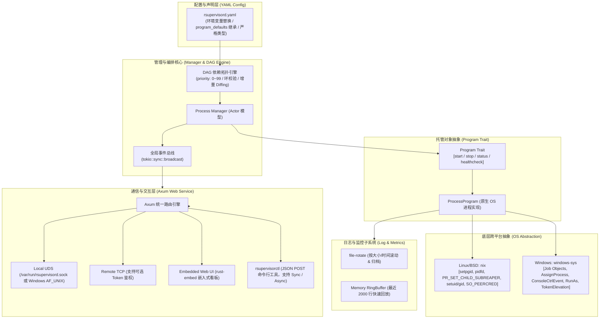

# rsupervisord: 现代跨平台进程编排与监控守护引擎 (PRD)

| 文档版本 | 状态 | 目标语言 | 运行时目标 |
| :--- | :--- | :--- | :--- |
| **v1.1.0** | 待评审 / 已修订 | Rust (Edition 2024) | Linux / Windows 10/11 / BSD / macOS |

---

## 1. 项目愿景与背景 (Vision & Background)

### 1.1 背景与痛点
在容器化、微服务以及各类边缘设备与 Windows 宿主机部署中，进程托管工具（如 Python 编写的 Supervisor、Go 实现的 `ochinchina/supervisord`）被广泛采用。然而现有工具存在明显的历史技术债务与性能痛点：
1. **高 CPU 开销与忙轮询 (Busy-Polling)**：`ochinchina/supervisord` 在静默监控时，由于频繁的 Ticker 轮询、管道非零拷贝读写及 GC 调度，CPU 消耗甚至堪比在线高并发服务（如 Caddy）。
2. **Windows 平台管理薄弱**：在 Windows 上无法优雅终结子孙进程树，常出现孤儿进程泄漏，或依赖 `taskkill.exe` 频繁派生外部进程导致系统抖动。
3. **协议与配置落后**：仍沿用 Python 2 时代的 XML-RPC 协议与陈旧的 INI 配置格式，集成复杂、通信沉重、缺乏现代可观测性。

### 1.2 项目定位
`rsupervisord` 是基于 **现代 Rust 技术栈 (Tokio + Axum + OS-Native Async)** 构建的下一代跨平台进程监控与编排引擎：
- **0% 静默 CPU 占用**：完全基于 OS 内核事件驱动（Linux `pidfd`/`epoll`、BSD `kqueue`、Windows `Job Object`/`IOCP`），杜绝任何 Ticker 忙轮询。
- **全平台一等公民支持**：抹平 POSIX 与 Windows 进程生命周期差异，利用 Windows 原生 Job Object 实现 100% 可靠的子孙进程树回收。
- **现代配置与接口**：原生采用 **YAML** 配置（支持全局 `program_defaults` 参数继承），抛弃 XML-RPC，统一采用 **UDS (Unix Domain Socket) / TCP + JSON REST API**。
- **单二进制自包含**：通过 `rust-embed` 内嵌现代 Web 管理面板与 CLI 控制台，开箱即用，零外部依赖。

---

## 2. 核心架构设计 (Architecture Principles)



---

## 3. 功能规范详述 (Functional Specifications)

### 3.1 进程与生命周期管理 (Process Management)

#### 3.1.1 状态机设计 (Finite State Machine)
每个托管程序遵循确定性状态迁移：
- `STOPPED`：程序处于停止状态（初态或已显式停止）。
- `STARTING`：触发启动，进入 `start_secs` 窗口期。
- `RUNNING`：存活超过 `start_secs`，被正式认定为健康运行。
- `BACKOFF`：在 `start_secs` 内异常崩溃，正在执行指数退避重试（Backoff）。
- `STOPPING`：正在接收优雅停止信号（`stopsignal`），等待退出。
- `EXITED`：正常退出（退出码匹配 `exit_codes`），不再拉起。
- `FATAL`：重试次数超过 `start_retries`，或遭遇致命初始化错误，停止重试。

#### 3.1.2 优先级与依赖图 (Priority & Dependencies DAG)
- **优先级范围限定**：`priority` 严格取值于 **`[0, 99]`**（数值类型 `u8`，默认值为 `50`）。
  - **数值越小，优先级越高**；
  - **启动顺序**：小优先级先启动（0 先于 10，10 先于 99）；
  - **关机顺序**：高优先级后关闭，低优先级先优雅关闭（99 先关，0 最后关）。
- **依赖声明**：支持 `depends_on: ["mysql", "redis"]`，必须在所依赖程序达到 `RUNNING` 状态后，本程序才触发启动。
- **拓扑校验**：Manager 在解析配置后自动构建 DAG，进行环依赖检测（Cycle Detection）。存在环路时守护进程拒绝启动并给出详细环链提示。
- **分层并发启动**：拓扑图中处于同一层级且没有依赖关系的进程，按照 Priority 分组进行并发拉起，显著缩短集群/批量任务启动总耗时。

#### 3.1.3 参数继承模型 (`program_defaults`)
为降低多进程配置冗余，系统引入 `program_defaults` 全局基础参数继承机制（继承自原工程 `[program-default]` 设计）：
- 支持继承的通用字段包括：`autostart`, `autorestart`, `start_secs`, `start_retries`, `stop_signal`, `stop_wait_secs`。
- **三层合并优先级**：
  $$\text{Program 私有配置} > \text{program\_defaults 全局默认值} > \text{引擎内核 Hardcoded 缺省值}$$

#### 3.1.4 权限与隔离支持 (User / UID / GID & CWD)
- **Unix / BSD**：支持配置 `user: "1001"`、`user: "www-data"` 或 `user: "1001:1001"`。
  - 在子进程派生前，调用 `nix::unistd::setgid` 与 `setuid` 执行安全降权。
  - 支持配置 `umask`。
- **Windows**：支持配置 `user: "Administrator"` 或指定目标服务账户凭据。
- **工作目录**：显式指定 `directory`，启动前校验存在性与权限。

#### 3.1.5 进程树清理与防泄漏 (Process Tree & Group Cleanup)
- **Windows 强力沙箱**：基于 Windows **Job Object**。
  - 创建带有 `JOB_OBJECT_LIMIT_KILL_ON_JOB_CLOSE` 的专属 Job 句柄。
  - 子进程创建后立刻 `AssignProcessToJobObject`。该进程不管衍生多少层孙子进程，在被停止或守护崩溃时由 Windows 内核保证整棵进程树 100% 回收，彻底消灭孤儿进程。
- **Linux / BSD 强力清理**：
  - 启动前在 `pre_exec` 中设置 `setpgid(0, 0)` 建立独立进程组。
  - 停止时直接向进程组发送信号：`kill(-pgid, signal)`。
  - Linux 开启 `PR_SET_CHILD_SUBREAPER`，防止双重 fork 脱离进程组的孤儿进程逃逸。

#### 3.1.6 热重载与差异增量更新 (Hot Reload & Diff Engine)
当执行 `rsupervisorctl reload` 或收到 `SIGHUP` 信号时，Manager 会自动对比前后配置文件并计算差异（Diffing），**严格保证未变化的进程不受任何影响**：
1. **Unchanged（未变更）**：配置完全一致的进程，**保持原有运行状态与 PID 不变，零闪断、零停机**。
2. **Added（新增）**：挂载到 Manager 调度拓扑树中，按照其 `autostart` 策略排队启动。
3. **Removed（已删除）**：优雅停机后，从 Manager 中注销并回收资源。
4. **Modified（已修改）**：优雅停机旧进程，应用新配置后重新拉起（如有必要）。

---

### 3.2 日志管道与轮转系统 (Log Streaming & Rotation)

参考 Windows 上轻量级包装工具（如 `shawl` CLI）的工业实践，直接采用成熟组件 `file-rotate`：
1. **异步无锁管道捕获**：
   - 子进程 `stdout` 与 `stderr` 通过 `tokio::process` 的异步 Pipe 无阻塞捕获。
   - 在数据静默时，OS 线程与 Tokio Worker 均处于休眠状态，无任何 I/O 轮询。
2. **日志轮转集成（基于 `file-rotate`）**：
   - **按大小滚动**：`max_bytes: "10MB"`（支持 `KB`, `MB`, `GB` 单位）。
   - **按时间滚动**：`rotate: daily` 或 `hourly`。
   - **副本保留**：`backups: 5`（保留历史备份数，自动清理更早日志）。
   - **自动合并/分离**：支持将 stderr 合流进 stdout，或分别独立滚动落盘。
3. **内存实时环形缓冲区 (Memory RingBuffer)**：
   - 每个 Program 维护固定容量（如 2000 行）的有界环形缓冲区。
   - **CLI 交互**：支持 `rsupervisorctl tail -f <program>` 实时查看，新连接立刻回放最近 N 行。
   - **Web UI 交互**：通过 Server-Sent Events (SSE) 或 WebSocket 实时在网页端刷屏日志。

---

### 3.3 控制通道与安全性设计 (Control, IPC & Security)

#### 3.3.1 端点支持
- **Unix Domain Socket (UDS)**：
  - Linux / BSD / macOS：默认监听 `/var/run/rsupervisord.sock`（或 `~/.rsupervisord/rsupervisord.sock`）。
  - Windows 10 (17063+) / 11：默认监听原生 `AF_UNIX` 文件（例如 `C:\ProgramData\rsupervisord\rsupervisord.sock`）。
- **TCP Socket (可选开启)**：
  - 监听配置示例：`http_bind: "127.0.0.1:9001"`。
  - 支持可选的 `auth_token: "secret"` 基础安全验证。

#### 3.3.2 严格的 Caller 安全与权限检查 (Caller Security & Compatibility)
无论通过 UDS 还是本地 IPC 交互，`rsupervisorctl` 接入时均强制进行身份与权限兼容性校验：
- **Unix / BSD 平台（UID/GID 兼容机制）**：
  - 通过 Socket 原生凭证提取（Linux `SO_PEERCRED`，BSD/macOS `getpeereid`）获取 Caller 的实际 UID/GID。
  - **校验准则**：
    1. 若 `rsupervisord` 运行在 `root` (UID 0)，仅允许 `root` 用户或属组在配置白名单中的客户端操作。
    2. 若 `rsupervisord` 运行在非 root 用户 (UID X)，仅允许同一 UID X 或 `root` 发起控制。
    3. 非授权的非相容 UID 发起的连接直接拦截并返回 `403 Forbidden`。
- **Windows 平台（特权令牌检查）**：
  - 若 `rsupervisord` 以 Windows 服务形式运行（`NT AUTHORITY\SYSTEM`）或以**管理员提权身份 (`is_admin = true`)** 启动；
  - 则调用端 `rsupervisorctl` 的发起进程也**必须具备管理员特权令牌 (`is_admin = true`)**（通过 `GetTokenInformation` 校验 `TokenElevation` / `CheckTokenMembership`）。
  - 若普通权限的 Caller 尝试控制 Elevated 权限的 Daemon，CLI 立即拦截并拒绝执行，输出友好提示：`"Error: rsupervisord is running with elevated administrator privileges. Please run rsupervisorctl in an elevated (Run as Administrator) terminal."`

#### 3.3.3 核心 RESTful JSON API 规范

| 方法 | 路由 | 描述 |
| :--- | :--- | :--- |
| `GET` | `/api/v1/status` | 获取守护进程及所有 Program 的汇总状态列表 |
| `GET` | `/api/v1/programs/:name` | 获取指定 Program 的详细配置、状态、指标（PID/CPU/内存） |
| `POST` | `/api/v1/programs/:name/start` | 启动指定 Program（参数包含 `sync: bool`, `timeout: u64`） |
| `POST` | `/api/v1/programs/:name/stop` | 停止指定 Program（参数包含 `sync: bool`, `timeout: u64`） |
| `POST` | `/api/v1/programs/:name/restart` | 重启指定 Program（支持同步/异步等待） |
| `POST` | `/api/v1/all/start` | 按依赖拓扑全量并发启动所有托管程序 |
| `POST` | `/api/v1/all/stop` | 按依赖拓扑逆序优雅停止所有托管程序 |
| `POST` | `/api/v1/reload` | **增量热重载**：仅更新变更程序，不影响未变动进程 |
| `GET` | `/api/v1/programs/:name/logs` | 获取历史缓冲日志（支持 `lines=100` 参数） |
| `GET` | `/api/v1/programs/:name/logs/stream`| **SSE (Server-Sent Events)** 实时日志推送通道 |

---

### 3.4 交互终端与前端看板 (CLI & Web UI)

#### 3.4.1 CLI 交互：同步 (Sync) 与 异步 (Async) 模式
类似于 Windows 中 `net start/stop`（同步阻塞确认）与 `sc start/stop`（异步触发返回）的区别，`rsupervisorctl` 全面支持两种操作体验：

- **同步模式 (Sync - 默认推荐)**：
  - 类似 `net start my-service`。
  - CLI 发起请求后进入轮询/长轮询等待，直至程序状态确立（成功转移至 `RUNNING` 或 `STOPPED`，或发生 `FATAL`/超时）。
  - 输出明确的最终结果与耗时：
    ```text
    $ rsupervisorctl start core-api
    Starting core-api... [OK] (started in 2.1s, PID: 18492)
    ```
- **异步模式 (Async - 显式启用 `--async` / `-a` 或 `--no-wait`)**：
  - 类似 `sc start my-service`。
  - CLI 向 Daemon 递交命令后，Daemon 确认收到并开始调度（状态迁移为 `STARTING` 或 `STOPPING`），CLI 立即返回并退出：
    ```text
    $ rsupervisorctl start core-api --async
    Command accepted: core-api status changed to STARTING.
    ```
- **CLI 常用命令集**：
  - `rsupervisorctl status`：以彩色表格展示全部程序状态、PID、运行时间、Priority、健康状态。
  - `rsupervisorctl start <name> [--async] [--timeout 30]`：启动程序。
  - `rsupervisorctl stop <name> [--async] [--timeout 30]`：停止程序。
  - `rsupervisorctl restart <name> [--async]`：重启程序。
  - `rsupervisorctl reload`：增量更新配置，显示 `1 unchanged, 1 restarted, 1 added` 等差异报告。
  - `rsupervisorctl tail -f <name> [--lines=100]`：实时跟踪控制台日志。

#### 3.4.2 内嵌 Web UI (Single-Binary Web Dashboard)
- 使用 `rust-embed` 将轻量前端静态产物打包进二进制文件。
- 提供简洁美观的响应式页面：
  - 进程总览（状态灯、Uptime、PID、Priority）。
  - 一键控制（Start / Stop / Restart / Reload，支持同步进度条指示）。
  - 实时日志查看器（暗黑模式终端样式、支持实时滚动与暂停）。
  - 依赖拓扑可视化视图。

---

## 4. 配置文件设计 (`rsupervisord.yaml`)

```yaml
# ==========================================
# rsupervisord 主全局配置
# ==========================================
server:
  # 本地 UDS 监听地址（全平台原生支持）
  uds_path: "/var/run/rsupervisord.sock"
  # 可选：远程 HTTP 监听
  http_bind: "127.0.0.1:9001"
  auth_token: ""

# 全局守护进程自身的日志
logging:
  file: "/var/log/rsupervisord.log"
  level: "info"
  max_bytes: "20MB"
  backups: 3

# ==========================================
# 通用参数默认值继承 (类似 [program-default])
# ==========================================
program_defaults:
  autostart: true
  autorestart: unexpected
  start_secs: 3
  start_retries: 3
  stop_signal: "SIGTERM"
  stop_wait_secs: 10
  priority: 50 # 默认优先级：范围 [0, 99]

# ==========================================
# 托管程序清单
# ==========================================
programs:
  # 基础服务：数据库组件（高优先级先启动，继承 defaults）
  mysql:
    command: "/usr/bin/mysqld_safe"
    directory: "/var/lib/mysql"
    user: "mysql"
    priority: 10 # 明确取值 [0, 99]，数值小先启动
    stop_wait_secs: 20 # 覆盖默认的 10 秒
    logs:
      stdout: "/var/log/rsupervisord/mysql.log"
      max_bytes: "50MB"
      backups: 5

  # 核心服务：依赖 mysql 先行运行
  core-api:
    command: "./server --port 8080"
    directory: "/opt/app"
    user: "1001:1001" # 支持指定 UID:GID
    environment:
      APP_ENV: "production"
      DATABASE_URL: "${DB_URI:-mysql://localhost/test}"
    priority: 20 # 范围 [0, 99]
    depends_on: ["mysql"] # 强依赖拓扑编排
    autorestart: always # 覆盖默认的 unexpected
    health_check:
      type: "http"
      url: "http://127.0.0.1:8080/health"
      interval_secs: 10
      timeout_secs: 2
      failure_threshold: 3
    logs:
      stdout: "/var/log/rsupervisord/core-api.log"
      stderr: "/var/log/rsupervisord/core-api.err"
      max_bytes: "20MB"
      backups: 3

  # Web 客户端：Windows 服务示例
  web-frontend:
    command: "node.exe server.js"
    directory: "C:\\inetpub\\wwwroot"
    priority: 60 # 范围 [0, 99]
    depends_on: ["core-api"]
    stop_signal: "CTRL_BREAK" # Windows 控制台事件
    stop_wait_secs: 5
    logs:
      stdout: "C:\\logs\\frontend.log"
      max_bytes: "10MB"
      backups: 2
```

---

## 5. 跨平台技术实现细节 (Technical Stack & Matrix)

### 5.1 依赖库选型 (Production-Grade Crates)

| 功能模块 | 推荐 Crate | 选型理由 |
| :--- | :--- | :--- |
| **异步运行时** | `tokio (rt-multi-thread, process, io-util, signal)` | 工业级异步基础，全平台统一抽象 |
| **Trait 异步支持** | `async-trait` | 声明 `Program` trait 接口 |
| **Web 与通信** | `axum = "0.8"`, `hyper-util`, `serde_json` | 高性能流式 HTTP 引擎，可直接绑定 UDS 与 TCP |
| **静态内嵌** | `rust-embed`, `mime_guess` | 单二进制交付 Web UI 前端资源 |
| **配置解析** | `serde_yaml`, `shellexpand` | YAML 严格反序列化与环境变量自动插值 |
| **CLI 命令行** | `clap = { version = "4", features = ["derive"] }`, `tabled` | 强类型参数解析与美观表格渲染 |
| **日志与追踪** | `tracing`, `tracing-subscriber`, `file-rotate = "0.7"` | 零开销结构化追踪与工业级文件滚动 |
| **依赖图算法** | `petgraph = "0.6"` | 用于有向无环图校验与拓扑排序 |
| **POSIX 绑定** | `nix = { version = "0.29", features = ["process", "signal", "user", "socket"] }` | 安全可靠的 Linux / BSD 原生系统调用与 PeerCred |
| **Windows 绑定** | `windows-sys = { version = "0.59", features = ["Win32_System_JobObjects", "Win32_System_Threading", "Win32_Security"] }` | 微软官方超轻量 Windows 原生 API 绑定与 TokenElevation 检查 |

---

## 6. 项目模块目录规划 (Directory Structure)

```text
rsupervisord/
├── Cargo.toml
├── docs/
│   └── PRD.md                       # 产品需求与架构设计说明书
├── web/
│   ├── dist/                        # 前端预编译静态文件 (HTML/CSS/JS)
│   └── src/                         # 前端轻量 SPA 源码 (可选 Vue/React/Vanilla)
└── src/
    ├── main.rs                      # 入口函数，负责 CLI 分流 (daemon 或 ctl)
    ├── cli/                         # rsupervisorctl 命令解析与通信处理
    │   ├── mod.rs
    │   ├── client.rs                # UDS / HTTP JSON Client (支持 Sync/Async)
    │   ├── security.rs              # 客户端权限自检 (Windows is_admin 校验)
    │   └── commands.rs              # status, start, stop, tail 等命令实现
    ├── config/                      # YAML 配置文件解析与验证
    │   ├── mod.rs
    │   ├── schema.rs                # Serde 数据结构、program_defaults 继承逻辑
    │   ├── diff.rs                  # 配置 Diff 引擎 (支持热重载不影响无变化程序)
    │   └── validator.rs             # priority [0,99] 范围及语义合法性校验
    ├── logging/                     # 日志管道与轮转处理
    │   ├── mod.rs
    │   ├── rotator.rs               # 集成 file-rotate
    │   └── ring_buffer.rs           # 内存日志滑动窗口 (供 Web/CLI 流式拉取)
    ├── manager/                     # 进程编排管理器
    │   ├── mod.rs
    │   ├── dag.rs                   # 基于 petgraph 的有向无环依赖图算法
    │   ├── supervisor.rs            # Manager 核心 Actor、热重载与事件广播
    │   └── health.rs                # HTTP/TCP/Exec 健康检查探针
    ├── platform/                    # 跨平台底层隔离抽象
    │   ├── mod.rs
    │   ├── unix.rs                  # Linux/BSD: setpgid, pidfd, setuid/gid, SO_PEERCRED
    │   └── windows.rs               # Windows: Job Object, ConsoleCtrl, RunAs, is_admin 检查
    ├── program/                     # Program Trait 与实现
    │   ├── mod.rs                   # Program Trait 抽象定义
    │   └── process.rs               # ProcessProgram 原生进程托管实现
    └── server/                      # 通信服务层
        ├── mod.rs
        ├── api.rs                   # Axum REST JSON 路由处理 (支持增量热重载)
        ├── uds.rs                   # Unix Domain Socket 监听适配与权限拦截
        └── embedded_ui.rs           # rust-embed 静态资源处理
```

---

## 7. 实施路线图与里程碑 (Roadmap)

### Milestone 1: 核心进程监控与 DAG 调度引擎 (Core MVP)
- [ ] 搭建 `Cargo.toml` 依赖基座与项目模块骨架。
- [ ] 实现 `rsupervisord.yaml` 的强类型解析、`program_defaults` 参数继承与环境变量替换。
- [ ] 校验 `priority` 在 `[0, 99]` 范围，构建有向无环图（DAG）校验与拓扑排序算法。
- [ ] 定义 `Program` Trait，完成 `ProcessProgram` 的启动、停止与退出感知。
- [ ] 封装 Linux (`nix`) 进程组/降权与 Windows (`windows-sys`) **Job Object**。
- [ ] 实现增量 Diff 引擎：热重载（`reload`）保证未修改进程保持在线、零停机。

### Milestone 2: 工业级日志流转与内存缓冲 (Logging Subsystem)
- [ ] 集成 `file-rotate` 实现 stdout/stderr 异步无阻塞写入与文件按大小/日期轮转。
- [ ] 实现内存日志 `RingBuffer`，支持即时回放与订阅者广播。

### Milestone 3: Axum 控制服务、权限检查与 CLI (Control & Interface)
- [ ] 启动 Axum HTTP 引擎，挂载全套 RESTful JSON API。
- [ ] 实现本地 UDS (`AF_UNIX`) 跨平台绑定（Windows 10/11 & Linux）。
- [ ] 实现严格的 Caller 身份安全性检查（Unix UID/GID 相容校验，Windows `is_admin` 特权令牌匹配）。
- [ ] 编写 `rsupervisorctl` CLI，支持同步（Sync，默认阻塞确认）与异步（`--async` 发射即返回）双模式。

### Milestone 4: 内嵌 Web 看板与健康探针 (Web UI & Advanced Probes)
- [ ] 实现 HTTP / TCP / Exec 健康探针状态机。
- [ ] 使用 `rust-embed` 打包现代化单页 Web 看板，提供实时监控与一键管控。

### Future Milestone: 遗留兼容适配层 (Optional Adaptor Layer)
- [ ] 预留 Adaptor 接口设计：如未来有需要，可按需实现 INI 转 YAML 转换器及 XML-RPC 转 REST 代理适配层。
