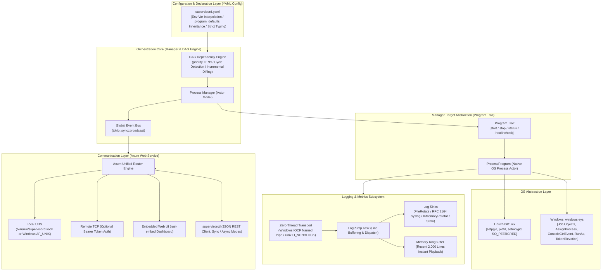

# rsupervisord: Modern Cross-Platform Process Orchestration and Monitoring Daemon Engine (PRD)

| Document Version | Status | Target Language | Runtime Targets |
| :--- | :--- | :--- | :--- |
| Document Version | Status | Target Language | Runtime Targets |
| :--- | :--- | :--- | :--- |
| **v1.3.0** | Approved / Baseline | Rust (Edition 2024) | Linux / Windows 10/11 / BSD / macOS |

---

## 1. Project Vision & Background

### 1.1 Background & Pain Points

In containerized environments, microservices architectures, edge devices, and Windows host deployments, process supervisors (such as Python-based Supervisor and Go-based `ochinchina/supervisord`) are widely utilized. However, existing tools suffer from noticeable technical debt and severe performance bottlenecks:

1. **High CPU Overhead & Busy-Polling**: In silent monitoring states, tools like `ochinchina/supervisord` consume significant CPU resources—sometimes rivaling active online services like Caddy—due to continuous timer ticks, non-zero-copy pipeline polling, and runtime GC sweeps.
2. **Fragile Windows Process Tree Management**: Windows lacks POSIX signal abstractions. Existing tools fail to cleanly terminate descendant process trees, resulting in leaked orphan processes, or rely on spawning external `taskkill.exe` processes that cause system churn and latency.
3. **Outdated Protocols & Configurations**: Relying on Python 2-era XML-RPC protocols and legacy INI configuration files complicates automation, bloats communication, and lacks modern observability.

### 1.2 Project Positioning

`rsupervisord` is a next-generation, cross-platform process supervisor and orchestration daemon built on a **modern Rust stack (Tokio + Axum + OS-Native Async)**:

- **Zero Process Polling in Minimal Feature Set (0% CPU Overhead)**: Purely event-driven via OS kernel notifications (Linux `pidfd`/`epoll`/signals, Windows kernel handle events via `RegisterWaitForSingleObject` and `Job Objects`). Zero background polling timers when health checks are omitted.
- **First-Class Cross-Platform Architecture**: Strict separation between core business orchestration and platform-specific implementations. The business layer contains zero `#[cfg]` branches, relying on uniform platform traits and Windows native Job Objects for 100% reliable descendant tree reclamation.
- **High-Compatibility Windows Named Pipe & AF_UNIX Dual Transports**: Listens concurrently on Windows Named Pipes (`\\.\pipe\<cmd_name>`) and AF_UNIX sockets. Named pipe is enabled by default on Windows for superior OS version compatibility without administrator elevation issues.
- **Hierarchical Process Groups**: Support for `group` classifications and batch operations across CLI (`<group>:*`), Web UI, and REST APIs.
- **High-Precision Zero-Polling Cron Scheduling**: Native Cron expressions (`cron` for start, `cron_stop` for stop) supporting standard 5-part POSIX crontabs and 6-part second extensions, waking up reactively via earliest-deadline calculation without periodic polling.
- **Lifecycle Hooks with Failure Degradation**: Supports `pre_start` and `pre_stop` execution. `pre_start` blocks start unless `pre_start_ignore_failure: true`, while `pre_stop` always degrades gracefully to guarantee processes are never unkillable.
- **Activity-Aware Adaptive Metrics & Disableable Logging**: Automatically pauses CPU/memory sampling during idle periods when no CLI or Web clients are connected. Supports completely disabling process and daemon logging (`Stdio::null()`), eliminating pipeline overhead.
- **Star-Topology Dual-Track Event Hub & SSE**: Unified system lifecycle event broadcasting (`SystemEvent`) and aggregated log bus (`LogEntry`) with dual-track isolation, zero-subscriber no-op optimization, real-time Web UI EventSource synchronization, and CLI streaming (`supervisorctl events` & `supervisorctl tail -f all`).
- **Data-Plane Process Stdin Injection with Backpressure & Circuit Breaking**: Direct standard input (`stdin`) injection via `Stdio::piped()`, driven by an independent non-blocking writer Actor with an internal memory buffer (64KB), `tokio::select!` if-guard backpressure propagation, and 10s timeout circuit breaking.
- **Resilient Scope-Guarded Lifecycle & Task Governance**: Integrates `scopeguard` to guard newly spawned child processes before platform tree attachment, eliminating orphan process leaks on initialization failures. Replaces handwritten `Drop` boilerplate with `tokio_util::sync::DropGuard` and `scopeguard::ScopeGuard`. Core subordinate tasks (Manager, Process, StdinWriter, HealthProbe, LogPump) retain `JoinHandle` for deterministic draining; tasks without a direct subordinate relationship (IPC connection streams, async API dispatchers, external cancel bridges) may spawn without retaining `JoinHandle`, but **MUST be strictly governed by the parent object's `CancellationToken`** and bound to that object's lifecycle.
- **Flexible Threading Models & Single-Thread CurrentThread Mode**: Configurable Tokio worker threads (`worker_threads`), including a single-threaded `current_thread` event loop optimized for edge nodes and low-memory environments (2~4MB footprint).
- **Modern Configuration & APIs**: Native **YAML** configuration with global `program_defaults` inheritance and multi-scheme auth (Bearer token & Basic Auth with plaintext or SHA-1); replaces XML-RPC with unified **IPC (UDS / Named Pipe) / TCP + JSON REST API**.
- **Unified Parse-Boundary Path Translation & Cross-Platform Execution**: Virtual `chdir(config_dir)` simulated at the parse boundary via `server.path_translation` (default: `true`), projecting relative paths to absolute paths anchored at `config_dir` without global process mutation, while providing zero-diffusion decoupling to downstream modules. `PlatformBackend` abstracts Windows command line splitting and `.bat`/`.cmd` script dispatch. Paths never resolve symbolic links: parse uses lexical `norm_path`; config-file and other absolute paths use free `abs_path`.
- **Production-Grade System Service Architecture & Zero-CFG Isolation**: Full support for native service managers (Windows SCM via single-binary self-hosting with the `service install/uninstall/start/stop/restart` subcommand on both `supervisord` and `supervisorctl` plus internal `--service`, and Linux systemd unit generation). The entire service management capability is abstracted behind the `PlatformService` trait in `src/platform/traits.rs`. Core orchestration, CLI, daemon, and service facade contain zero `#[cfg]` branches. Windows SCM operation is hardened against abnormal exits with FFI panic catching (`catch_unwind`), SCM status checkpoints and wait hints, active stop heartbeats, automatic working directory correction, and `SC_ACTION_RESTART` crash recovery.
- **Single-Binary Self-Contained Deployment**: Built-in modern Web Dashboard via `rust-embed` (powered by a zero-NPM production Vue 3 single file) and CLI client, providing out-of-the-box operation with zero external runtime dependencies.

---

## 2. Core Architecture Design



---

## 3. Functional Specifications

### 3.1 Process & Lifecycle Management

#### 3.1.1 Finite State Machine (FSM)

Each managed program transitions across deterministic states:

- `STOPPED`: Initial state or explicitly stopped.
- `STARTING`: Process spawned; within the `start_secs` observation window.
- `RUNNING`: Process remained alive past `start_secs`; confirmed healthy and stable.
- `BACKOFF`: Crashed within `start_secs`; executing delay before restarting. Default is exponential backoff `2^min(retry, BACKOFF_MAX_EXPONENT)` seconds (cap 32s); when `restart_pause_secs > 0` (go `restartpause`) a flat pause replaces the exponential delay for start-failure retries only.
- `STOPPING`: Graceful stop signal delivered; awaiting exit before `stop_wait_secs` timeout.
- `EXITED`: Clean exit matching configured `exit_codes`; will not be automatically restarted.
- `FATAL`: Crash count exceeded `start_retries`, or unrecoverable initialization error encountered.

#### 3.1.2 Priority & Dependencies DAG

- **Priority Range**: `priority` is strictly bounded to **`[0, 99]`** (`u8` type, default `50`).
  - **Lower values denote higher priority**.
  - **Startup Order**: Lower numerical values start first (`0` before `10`, `10` before `99`).
  - **Shutdown Order**: Higher numerical values shut down first (`99` before `10`, `0` last).
- **Dependency Declarations**: Configured via `depends_on: ["mysql", "redis"]`. Dependent programs are only started after all prerequisites reach the `RUNNING` state.
- **Topological Validation**: The Manager constructs a directed graph upon loading configuration, validating against cycles. If a cycle is detected, daemon initialization fails with an actionable cycle trace.
- **Layered Concurrent Startup**: Programs situated on the same topological layer without mutual dependencies are spawned concurrently in batches grouped by priority.

#### 3.1.3 Parameter Inheritance (`program_defaults`)

To eliminate boilerplate across multiple programs, the engine provides a `program_defaults` inheritance mechanism:

- Inherited fields include: `autostart`, `autorestart`, `start_secs`, `start_retries`, `restart_pause_secs`, `stop_signal`, `stop_wait_secs`, and `logs`.
- **Three-Tier Precedence**:
  $$\text{Program Private Config} > \text{program\_defaults Global Defaults} > \text{Engine Hardcoded Defaults}$$

#### 3.1.4 Privilege & Isolation (User / UID / GID & CWD)

- **Unix / BSD**: Supports `user: "1001"`, `user: "www-data"`, or `user: "1001:1001"`. Calls `nix::unistd::setgid` and `setuid` in the pre-exec hook for secure de-escalation, alongside configurable `umask`.
- **Windows**: Supports service account context execution and RunAs configuration.
- **Working Directory**: Explicitly configured via `directory`, validated for existence before launch.

#### 3.1.5 Process Tree Cleanup & Leak Prevention

- **Scope-Guarded Pre-Attachment Orphan Prevention**:
  - Immediately upon `cmd.spawn()`, the child process is wrapped in a `scopeguard::guard` configured to invoke `child.start_kill()`. If subsequent steps (process group assignment, Job Object attachment, stdio pipe hooking, or health probe instantiation) fail, the child is reliably killed, completely preventing orphan process leaks during early startup failures.
- **Windows Job Object Sandbox**:
  - Each program creates a dedicated Job Object configured with `JOB_OBJECT_LIMIT_KILL_ON_JOB_CLOSE`.
  - Child processes are assigned to the Job immediately upon creation. Regardless of how many sub-processes are spawned, the Windows NT kernel guarantees 100% reclamation when stopped or if the daemon terminates.
- **Linux / BSD Process Groups & Group Signaling**:
  - Child processes call `setpgid(0, 0)` in `pre_exec` to establish an isolated process group.
  - Termination signals are broadcast to the entire group via `kill(-pgid, signal)`.
  - Subreaper is intentionally disabled so Tokio retains exclusive child exit ownership without `ECHILD` race conditions, while detached grandchildren are reclaimed by system init (PID 1).

#### 3.1.6 Hot Reload & Incremental Diff Engine

Executing `supervisorctl reload` or sending `SIGHUP` triggers an incremental diff comparison between running and new configurations:

1. **Unchanged**: Identical configurations **remain untouched, keeping their original PID and uninterrupted network connections**.
2. **Added**: Registered into the DAG and started according to their `autostart` policy.
3. **Removed**: Gracefully terminated, then deregistered and cleaned up.
4. **Modified**: Gracefully terminated and relaunched with the updated configuration.

#### 3.1.7 Minimal Feature Set Zero-Poll & Event Exit Monitoring

- **Zero-Poll Minimal Feature Set**: When `health_check` is omitted, the program actor omits health check receiver channels from `tokio::select!`. Uptime is computed dynamically on-demand from `started_at` when queried via `status()`, eliminating the legacy 2-second background timer tick. In this state, the actor runs with **0 timers, 0 wakeups, and 0% CPU overhead**.
- **OS-Optimal Event-Driven Exit Monitoring**: Abstracted via `PlatformProcessGuard::wait_exit`:
  - Windows: Uses kernel-notified wait callbacks via `RegisterWaitForSingleObject` on process `HANDLE`, achieving zero polling.
  - Unix: Uses Tokio's native async signal and `pidfd` drivers, with fallback polling abstracted inside platform layers.

#### 3.1.8 Process Groups & Hierarchical Operations

`supervisord` provides comprehensive support for logical grouping of related processes:

- **Group Declaration**: Programs can specify a `group: <group_name>` in their configuration, or top-level `groups:` can map group names to arrays of program names (`groups: { web: ["nginx", "api"] }`).
- **DAG Group Ordering**: Batch start and stop operations across a group strictly honor the topological dependencies and `priority` values among members of that group.
- **Unified Control**: Supports group operations across CLI (`supervisorctl start <group>:*`, `stop <group>:*`, `restart <group>:*`, `status <group>:*`), REST API endpoints (`/api/v1/groups/:group/...`), and Web Dashboard filtering.

#### 3.1.9 Cron Expression Scheduling (`cron` & `cron_stop`)

Supports time-based automated process lifecycle scheduling:

- **Expression Formats**: Supports standard 5-field POSIX crontab (`minute hour day month weekday`, e.g. `0 2 * * *`) and extended 6-field formats, powered by `croner`.
- **Dual Trigger Schedules**:
  - `cron`: Schedules process startup at specified cron intervals. When configured without explicit `autostart`, `autostart` automatically defaults to `false`.
  - `cron_stop` (alias `stop_cron`): Schedules process graceful shutdown at specified cron intervals.
- **Zero-Polling Reactor**: The Manager calculates the earliest upcoming deadline across all registered cron jobs and registers it directly into the `tokio::select!` event loop timer branch. The daemon sleeps until the exact trigger moment without periodic polling overhead.
- **Event Notification**: Emits `SystemEvent::CronTriggered` to the `EventHub` upon execution.

#### 3.1.10 Lifecycle Hooks (`pre_start` / `pre_stop`) & Failure Degradation Semantics

Supports executing pre-flight preparation and pre-stop cleanup hooks:

- **Hook Configuration**:
  - `pre_start` (alias `pre_start_hook`): Shell command executed prior to spawning the child process.
  - `pre_stop` (alias `pre_stop_hook`): Shell command executed prior to sending termination signals to the child process.
  - `hook_timeout_secs`: Execution timeout for hook commands (default: 15s).
- **Failure & Degradation Semantics**:
  - **`pre_start`**: By default, hook non-zero exit or timeout aborts startup, entering `Fatal` state and emitting `ProcessPreStartFailed`. When `pre_start_ignore_failure: true` is configured, errors are logged and emitted as events, but startup **gracefully degrades to continue spawning the child process**.
  - **`pre_stop`**: Emits `ProcessPreStop` before execution and `ProcessPreStopFailed` on failure/timeout, but **always degrades gracefully to proceed with child process termination**. This guarantees that malfunctioning hooks can never block process termination or create unkillable zombie processes.
- **Shell Execution Compatibility**: Unix executes via `sh -c`; Windows executes via `cmd.exe /C` using `raw_arg` to ensure nested quoting and redirection (`>`) execute transparently.

#### 3.1.11 Data-Plane Standard Input (`sendProcessStdin`) & Backpressure Management

Provides direct character/byte stream injection into the standard input (`stdin`) of any running supervised process:

- **Piped Stdin Architecture**:
  - Replaces traditional detached/null standard input (`Stdio::null()`) with asynchronous Tokio pipes (`Stdio::piped()`).
  - Child stdin handle is driven by an independent, non-blocking `StdinWriterTask` Actor.
- **Zero-Drop Bounded Backpressure Transmission**:
  - Unlike naive supervisor implementations that drop bytes on buffer overflow (which corrupts command/binary streams for slow programs), `supervisord` employs an internal memory buffer (`BytesMut`, up to 64KB) paired with a bounded MPSC channel (`capacity: 16`).
  - **`tokio::select!` If-Guard Backpressure**: When the child process reads slowly or the OS pipe buffer is saturated and the memory buffer reaches 64KB, the writer task's channel receiver branch is disabled via `if buffer.len() < MAX_STDIN_BUFFER_BYTES`. This naturally stalls upstream channel sends (`tx.send(data).await`), propagating backpressure directly to the caller (API / CLI).
- **Timeout Circuit Breaker**:
  - Upstream senders bound their transmission with a 10-second timeout. If a child process is completely deadlocked or permanently ceases reading stdin, the sender gracefully terminates with `StdinWriteTimeout` (HTTP 504 Gateway Timeout), ensuring the supervisor daemon and actor event loop remain 100% responsive without blocking.
- **Pipe Lifecycle & Generation Safety**:
  - **Immediate Rejection on Stopped Processes**: Sending stdin to a non-running or stopped process immediately returns `ProgramError::NotRunning` (HTTP 400 Bad Request) without channel allocation.
  - **Graceful EOF on Exit**: Upon child exit or graceful stop, the writer task is cancelled and the write end of the OS pipe is dropped, properly signaling `EOF` to the child process.
  - **Generation Isolation on Restart**: Restarting a process allocates a fresh stdin pipe and spawns a new writer task, cleanly isolating pipe lifecycles across process generations.

#### 3.1.12 Asynchronous Task Lifecycle Governance & Cancellation Constraints

To prevent background task leaks while maintaining pragmatic concurrency:

- **Core Subordinate Tasks (Mandatory JoinHandle Tracking)**:
  - Tasks with direct subordinate or dependency relationships (`ManagerActor`, `ProcessActor`, `StdinWriterTask`, `HealthProbeRunner`, and `LogPumpTask`) **MUST have their `JoinHandle` explicitly retained** by the parent supervisor.
  - Shutdown routines (`drain_pumps`, `shutdown()`, or `RunningChild::drop`) enforce deterministic waiting within a bounded timeout (2s), with `JoinHandle::abort()` as an ultimate fallback to prevent stalled grandchild descriptor inheritance.
- **Non-Subordinate Tasks (Permitted Detached Spawns with Mandatory Cancellation Token)**:
  - Objects without direct subordinate or dependency relationships (such as individual IPC client connection streams in `run_ipc_listener`, fire-and-forget asynchronous API operation dispatchers in `api.rs`, and external cancellation signal bridges) **are permitted to spawn background tasks without retaining `JoinHandle`**.
  - **Hard Constraint**: Every such task **MUST be strictly governed by the parent object's `CancellationToken`** and constrained by the object's lifecycle. Tasks must monitor `cancel_token.cancelled()` in their event loop (e.g. via `tokio::select!`), guaranteeing that they terminate immediately upon parent object destruction or daemon cancellation.

---

### 3.2 Log Streaming, Transport & Rotation Subsystem

Built with zero-thread async transports, extensible backends, and the production-proven `file-rotate` crate:

1. **Zero-Thread Asynchronous Subprocess Transport**:
   - **Windows**: Uses isolated Overlapped Named Pipes (`\\.\pipe\rsupervisord-...`) registered directly with Tokio's IOCP reactor. Eliminates the legacy anonymous pipe thread-pool pinning, reducing background worker threads from **2 pinned OS threads per child to exactly 0**.
   - **Unix**: Uses atomic `O_CLOEXEC` pipes with read/write decoupling: the supervisor read end is marked `O_NONBLOCK` via `tokio::io::unix::AsyncFd`, while the child write end remains **standard blocking** to ensure full binary compatibility (preventing `EAGAIN` crashes in Python/Node.js/C runtimes upon buffer saturation).
2. **Unified Destination Grammar & Multi-Sink Fan-Out**:
   - Both daemon and program streams share a unified destination grammar: file path, `AUTO` (in-memory generational buffer), `NONE`/`/dev/null`/`off` (discard), `/dev/stdout`, `/dev/stderr`, `syslog`, and `syslog@[udp|tcp:]host[:port]`.
   - **Composite Multi-Sink Sinks**: Supports comma-separated destinations (e.g. `stdout_logfile = test.log, /dev/stdout`) with write fan-out and **primary-reader semantics** (XML-RPC tail/read and clear operations query only the primary destination).
   - **Python Syslog Interop**: Configurable `stdout_syslog: true` / `stderr_syslog: true` creates an implicit composite fan-out sink (`[File, Syslog]`).
3. **Stream-Independent Rotation & Modes (OI-10)**:
   - **Decoupled Stream Quotas**: `stdout_max_bytes` and `stderr_max_bytes`, as well as `stdout_backups` and `stderr_backups`, are independently configurable, falling back to shared `logs.max_bytes` / `backups`.
   - **Numeric Mode (`timestamp_suffix: false`)**: Rotates files as `app.log.1` .. `app.log.N` for Python Supervisor compatibility.
   - **Timestamp Mode (`timestamp_suffix: true`)**: Rotates files as `app.log.YYYY-MM-DDTHH-MM-SS` for Go supervisord parity, automatically pruning archives beyond the configured backup count.
   - **Append-Only Mode (`max_bytes: 0`)**: Rotation is completely disabled, continuously appending to disk (useful for shared log sinks or special character devices).
   - **Collision Detection**: Emits a `tracing::warn!` at startup if multiple streams target the same rotating file with `max_bytes > 0`.
4. **In-Memory Generational Buffer (`AUTO` / `in_memory_only` Mode & Fast Playback)**:
   - **Tri-State Logging Modes (`on` / `off` / `in_memory_only`)**: Supports `enabled: on` (default, full memory + disk/syslog), `enabled: off` (stdio redirected to `Stdio::null()`, zero pump/buffer overhead), and `enabled: in_memory_only` (stdio captured and pumped exclusively to in-memory buffers; zero disk I/O).
   - **Configurable Sizing**: In-memory capacity is configurable via `buffer_size` (e.g. `4MB`, `512KB`) or `max_bytes` / `backups`.
   - **Startup Cold-Start Pre-Reading & Rotation (Seeding)**: When starting in `in_memory_only` mode with an existing disk log file, the engine pre-reads the tail chunk (up to buffer capacity) into memory, trims partial lines, anchors the logical byte offset to the disk `file_size`, and rotates the disk file to archive (e.g. `.1`). All subsequent logging remains purely in memory with zero disk writes.
   - **Monotonic Logical Offset Continuity**: The in-memory buffer tracks a monotonic 64-bit cumulative byte counter (`global_bytes_written`). When circular buffer overwrites occur, the offset continues to increment monotonically. Clients tailing logs (`maintail`, `supervisorctl tail -f`, XML-RPC `tailProcessStdoutLog`) maintain seamless offset progression; when a client falls behind overwritten memory, the server cleanly returns `overflow = true` with the latest offset per supervisor wire semantics.
5. **RFC 3164 Syslog Integration**:
   - Generates compliant `<PRI>TIMESTAMP HOST TAG: MESSAGE` with 1024-byte truncation.
   - Unix: Local domain socket auto-probing (`/dev/log`, `/var/run/syslog`, `/var/run/log`), remote UDP (port 514), and remote TCP (port 6514 with non-blocking channel and auto-reconnect worker).
   - Windows: Fail-loud configuration error (`ProgramError::ConfigError`) rejecting syslog destinations.
6. **Disableable Logging & Channel Optimizations**:
   - **Program-Level Disabling**: When `logs: { enabled: off }` or destination is `NONE`/`/dev/null`, the child is spawned with `Stdio::null()`, avoiding pipe allocations and pump tasks.
   - **Daemon-Level Disabling & Memory Mode**: `logging.enabled: false` or `level: "off"` completely mutes daemon tracing; `logging.enabled: in_memory_only` or `logfile = memory` retains the main daemon log in an in-memory buffer.
   - **Broadcast Optimization**: Log lines are only cloned into broadcast channels when active subscribers exist (`receiver_count() > 0`).
   - **Legacy INI Compatibility**: INI settings `stdout_logfile = memory`, `stderr_logfile = memory`, `logfile = memory`, and `logging = in_memory_only` automatically map to the `in_memory_only` tri-state mode with full parameter translation.

---

### 3.3 Control, IPC & Security Design

#### 3.3.1 Transport Endpoints & Dual Transports

- **Windows Named Pipe (Default IPC on Windows)**:
  - Listens on `\\.\pipe\<cmd_name>` (e.g. `\\.\pipe\supervisord`).
  - Enabled by default on Windows (unless explicitly disabled via `pipe_path: ""`). Provides superior OS compatibility and zero file-permission/socket-path issues across Windows 10/11 and Server editions.
  - Windows daemon binds **both Named Pipe and AF_UNIX UDS concurrently**, allowing clients to connect via either mechanism.
  - CLI automatically selects the Named Pipe transport on Windows when available.
- **Unix Domain Socket (UDS)**:
  - Linux / BSD / macOS: Listens on `/var/run/<cmd_name>.sock` (or `~/.<cmd_name>/<cmd_name>.sock`).
  - Windows: Listens on AF_UNIX socket at `<config_dir>/<cmd_name>.sock` for zero-port Caddy / Nginx reverse proxying.
- **TCP Socket (Optional)**:
  - Example: `http_bind: "127.0.0.1:9001"`.
  - Supports multi-scheme authentication: Bearer token (`auth_token`) and HTTP Basic Auth (`user`, `password` or `password_sha1`).

#### 3.3.2 Caller Security & Multi-Scheme Authentication

Local IPC access is the composition of two independent layers:

1. **Authorization (OS-layer DACL/mode)**: who may establish a TCP/pipe/socket connection at all.
2. **Authentication (App-layer peer credential / HTTP schemes)**: who may invoke control operations once connected.

Both layers must pass; connection success = OS authorization ∧ app authentication (app layer only active when the daemon is elevated).

- **OS Authorization (File/Socket Permissions)**:
  - Configuration `server.uds_chmod` (alias `chmod`) maps an octal mode onto the IPC endpoint:
    - Unix socket: applied via `set_permissions` after bind, before any accept; bind runs under a temporary umask `0077` so the socket is never group/world-accessible before the mode is applied (closes the bind→chmod race).
    - Windows named pipe: baked into the first-instance `SECURITY_ATTRIBUTES` at create time (no race window).
    - Windows file-based AF_UNIX socket: applied via `SetNamedSecurityInfoW` with a protected DACL (owner/group/other + SYSTEM).
  - Mode mapping: owner → process user SID, group → Administrators, other → Everyone; SYSTEM always retains an ACE.
  - Defaults when `server.uds_chmod` is unset: `0o777` if `allow_unelevated=true`; otherwise `0o700` on Unix (owner only) or `0o770` on Windows (owner + Administrators, so an elevated admin CLI can pass the OS layer when the daemon is a SYSTEM service). An explicit configuration always wins.
  - Parsed fail-fast at config load: accepts `0700` / `0o700` / `700`, masked to `& 0o7777`; empty or invalid strings are rejected.
- **App Authentication (Peer Credentials & Elevation)**:
  - Security checks are strictly enforced by the `supervisord` daemon during IPC connection handshake (not on the client).
  - Can be relaxed via configuration `server.allow_unelevated: true` or daemon CLI flag `supervisord --allow-unelevated` (default: `false`).
- **Unix / BSD (Peer Credentials Compatibility)**:
  - Extracts peer credentials via socket options (Linux `SO_PEERCRED`, BSD/macOS `getpeereid`).
  - **Rules**:
    1. If `supervisord` runs as `root` (UID 0), only `root` callers can execute control operations unless `allow_unelevated` is enabled.
    2. If `supervisord` runs under non-root UID X, UID X or `root` callers are authorized.
    3. Unauthorized callers are rejected at the connection boundary.
- **Windows (Token Elevation Checks)**:
  - If `supervisord` runs as an elevated administrator or under `NT AUTHORITY\SYSTEM`:
    - On Named Pipes: verifies caller token via `ImpersonateNamedPipeClient` and `TokenElevation`.
    - On Windows AF_UNIX sockets: verifies peer process token via `SIO_AF_UNIX_GETPEERPID` and `TokenElevation`.
    - Unelevated callers are rejected unless `server.allow_unelevated` is enabled.
- **HTTP Authentication (Bearer Token, Basic Auth, Session Cookie)**:
  - **Unified OR rule** on every listener (TCP + IPC) for REST, SSE, and `/RPC2`: pass if either basic or token matches; if neither is configured, access is open.
  - Bearer Token: Validated against `server.auth_token` (`Authorization: Bearer`, raw value, or `?token=` query).
  - Basic Authentication: Validates `Authorization: Basic <base64>` against `server.username`/`server.uds_username` and either plaintext password or SHA-1 hashed password (supporting `{SHA}...`).
  - **Path tiers**: static Web UI shell and `/api/v1/auth/{config,login,logout}` are public; all other `/api/v1/*` and `/RPC2` are protected. API 401s are bare JSON (no `WWW-Authenticate`); only `/RPC2` carries the Basic challenge.
  - **Web UI session**: `POST /api/v1/auth/login` issues an HttpOnly `SameSite=Strict` session cookie (7-day sliding TTL). Credentials are never stored in the browser.
  - CLI Standalone Connectivity: `supervisorctl` can connect to a remote or local daemon without a local configuration file if `--key <token>` or `--user <user>` / `--password <pwd>` is provided.
- **CLI Endpoint Candidate Chain (Windows, no `-s`)**: pipe → config `uds_path` (if different) → TCP, each candidate carrying its own basic credentials (`uds_*` for IPC, `username/password` for TCP, shared token). Authorization errors are **fail-closed** (do not fall through); only NotFound/refused advance to the next candidate.

#### 3.3.3 Core RESTful JSON API Specification

| Method | Route | Description |
| :--- | :--- | :--- |
| `GET` | `/api/v1/status` | List aggregated status, cron info, and metrics for all programs |
| `GET` | `/api/v1/programs/:name` | Get detailed configuration, status, hooks, cron schedule, and metrics |
| `POST` | `/api/v1/programs/:name/start` | Start program (accepts `sync: bool`, `timeout: u64`) |
| `POST` | `/api/v1/programs/:name/stop` | Stop program (accepts `sync: bool`, `timeout: u64`) |
| `POST` | `/api/v1/programs/:name/restart` | Restart program (supports sync/async waiting) |
| `POST` | `/api/v1/all/start` | Concurrently start all programs based on DAG topological order |
| `POST` | `/api/v1/all/stop` | Gracefully stop all programs in reverse topological order |
| `POST` | `/api/v1/groups/:group/start` | Start all programs in the specified group according to group DAG priority |
| `POST` | `/api/v1/groups/:group/stop` | Gracefully stop all programs in the group in reverse priority order |
| `POST` | `/api/v1/groups/:group/restart` | Restart all programs belonging to the specified group |
| `GET` | `/api/v1/groups/:group/status` | Retrieve status of all programs belonging to the specified group |
| `POST` | `/api/v1/reload` | **Incremental Hot Reload**: updates changed programs without interrupting unchanged ones |
| `GET` | `/api/v1/programs/:name/logs` | Fetch buffered historical logs (`lines=100`) |
| `POST` | `/api/v1/programs/:name/stdin` | Send input characters/bytes to program standard input (JSON `{"chars": "..."}` or raw body; 504 on timeout) |
| `GET` | `/api/v1/programs/:name/logs/stream` | **SSE (Server-Sent Events)** real-time live log stream for a specific program |
| `GET` | `/api/v1/events` | **SSE System Events Stream**: Real-time lifecycle events (`StateChanged`, `HealthChanged`, `ConfigReloaded`, `CronTriggered`, `ProcessPreStart`, `ProcessPreStartFailed`, `ProcessPreStop`, `ProcessPreStopFailed`, `DaemonLifecycle`) |
| `GET` | `/api/v1/logs/stream` | **SSE Aggregated Log Stream**: Real-time global log stream across all managed programs |
| `GET` | `/api/v1/auth/config` | **Public**: reports `{basic, token, session}` so the Web UI knows which login fields to show |
| `POST` | `/api/v1/auth/login` | **Public**: exchange username/password and/or token for an HttpOnly session cookie |
| `POST` | `/api/v1/auth/logout` | **Public**: invalidate the current session and clear the cookie |

#### 3.3.4 Activity-Aware Adaptive Metrics Sampling

- **Idle Timeout & Auto-Pause**: An `ActivityTracker` tracks the timestamp of incoming client interactions. After 30 seconds (`idle_timeout_secs: 30`) of inactivity, CPU and RSS memory metrics sampling across all child processes automatically pauses, eliminating unnecessary `/proc` and kernel queries.
- **On-Demand Resumption**: Any incoming CLI command (e.g., `supervisorctl status`) or Web UI request immediately awakens metrics sampling. Setting `idle_timeout_secs: 0` disables pause mode for continuous monitoring.

---

### 3.4 Command-Line Interface (CLI) & Web Dashboard

#### 3.4.1 CLI Interaction: Sync & Async Modes

Following the operational model of Windows `net start/stop` (synchronous confirmation) versus `sc start/stop` (asynchronous fire-and-return), `supervisorctl` supports dual modes:

- **Synchronous Mode (Sync - Default)**:
  - Blocks and monitors state transitions until the program is confirmed `RUNNING`, `STOPPED`, or failed.
  - Outputs clear durations and PIDs:

    ```text
    $ supervisorctl start core-api
    Starting core-api... [OK] (started in 2.1s, PID: 18492)
    ```

- **Asynchronous Mode (Async - via `--async` / `-a` or `--no-wait`)**:
  - Submits the command and returns immediately (< 5ms):

    ```text
    $ supervisorctl start core-api --async
    Command accepted: core-api status changed to STARTING.
    ```

- **CLI Commands & Group Syntax**:
  - `supervisorctl status [name | group:*]`: Formatted table with status, PID, Uptime, Priority, Health, and Cron schedule.
  - `supervisorctl start <name | group:*> [--async] [--timeout 30]`: Start individual program or entire group.
  - `supervisorctl stop <name | group:*> [--async] [--timeout 30]`: Stop individual program or entire group.
  - `supervisorctl restart <name | group:*> [--async]`: Restart individual program or entire group.
  - `supervisorctl reload`: Incrementally reload configuration, reporting added/removed/modified/unchanged counts.
  - `supervisorctl stdin <name> <chars>` (alias: `send-stdin`): Send input characters or commands directly into the process's standard input.
  - `supervisorctl events`: Real-time streaming of system lifecycle and hook events.
  - `supervisorctl tail -f <name> [--lines=100]`: Live tail console output.
  - Flags: `--key <TOKEN>`, `--user <USER>`, `--password <PWD>`, `-s / --server <URL>` (enables connecting directly without local config).

#### 3.4.2 Embedded Web Dashboard

- Embedded via `rust-embed` with a single-file Vue 3 production runtime (`vue.global.prod.js`) and zero NPM dependencies.
- Modern dark-mode responsive dashboard:
  - Aggregated stats (Total Programs, Running, Stopped, Degraded, Total CPU %, Total RSS Memory).
  - Group filtering tabs and group-based status organization.
  - Program table with luminous status badges, PID, Uptime, Priority, Cron schedule badge (`⏰ <cron>`), CPU %, and Memory.
  - Program details modal displaying Cron Schedule, Next Trigger time, Pre-Start Hook, and Pre-Stop Hook commands.
  - Batch operations with multi-select checkboxes (Batch Start/Stop/Restart, Start All, Stop All).
  - Zero-downtime hot reload trigger with modal diff breakdown.
  - SSE real-time terminal log drawer with scroll locking and buffer clearing.
  - Config-driven sign-in modal (username/password and/or bearer token) exchanging credentials for an HttpOnly session cookie; secrets are never persisted in the browser.

---

### 3.5 Configuration Path Translation & Cross-Platform Execution Hardening

#### 3.5.1 Virtual `chdir` at Parse Boundary (`server.path_translation`)

- **Modern Default (`path_translation: true`)**: Relative paths in path fields (`uds_path`, `logging.file`, `directory`, `stdout`/`stderr`, `restart_directory_monitor`) and relative `command` executables (`argv[0]` containing `/` or `\`) are automatically anchored against `config_dir` at the parse boundary. Simulates running inside `config_dir` without mutating global process state (`chdir`).
- **Python Compatibility Mode (`path_translation: false`)**: Preserves relative paths verbatim; paths resolve relative to the daemon's runtime working directory, reproducing Python Supervisor behavior.
- **INI Frontend Baseline Alignment**: The INI (Python-compat) frontend (`src/compat/ini/adapter.rs`) forces `path_translation = false`, `allow_unelevated = true`, and `ctl_defaults = false` before `translate_paths` + `validate`, so a stock Python `supervisord.conf` loads with path resolution, IPC access, and client connection semantics equivalent to Python supervisor / go-supervisord (bare relative paths resolve against daemon CWD; no app-layer elevation gate on IPC; no server→ctl backfill — missing `[supervisorctl]` hard-errors in `supervisorctl`). YAML native configs keep the rsupervisord defaults (`path_translation: true`, `allow_unelevated: false`, `ctl_defaults: true`).
- **Zero Diffusion**: The feature switch and path modifications are strictly isolated within the transformation boundary (`src/config/transform.rs`). Downstream orchestration (`Manager`, `ProgramActor`, `WatchService`) contains zero conditional logic.

#### 3.5.2 Platform Abstraction & OS Execution Parity (`PlatformBackend`)

- **Windows Command Line Splitting (`split_command_line`)**: Standard Windows `CommandLineToArgvW` tokenizer preserving `\` directory separators while supporting quoted arguments containing whitespace. Eliminates fragile file-existence heuristics (`is_file()`) during configuration parsing.
- **Path Standardization Without Symlink Resolution**: Config file paths and other absolute-path needs use free `abs_path` (`std::path::absolute` + lexical `norm_path`); parse/transform uses lexical `norm_path` only. Symbolic links are never resolved (no `fs::canonicalize` / `realpath`).
- **Batch Script Dispatch (`build_command`)**: Transparently wraps `.bat` and `.cmd` files with `cmd.exe /C "<script>" <args>` on Windows, eliminating execution failures and CVE-2024-24576 security rejections.
- **Child Working Directory Decoupling**: Child process CWD (`directory`) is decoupled from executable location. When `directory` is omitted, the child process inherits the daemon's CWD while relative commands remain reliably located via their absolutized path.

---

## 4. Configuration Specification (`supervisord.yaml`)

```yaml
# ==========================================
# supervisord Global Configuration
# ==========================================
# Tokio runtime worker threads. Defaults to hardware CPU cores when omitted or null.
# Set to 1 to activate `current_thread` single-threaded event loop mode for minimal memory overhead.
# Can be overridden via CLI (--worker-threads <N>) or env var TOKIO_WORKER_THREADS.
worker_threads: 2

server:
  # Native local UDS socket path (Supported on Linux, macOS, BSD, and Windows 10/11)
  uds_path: "/var/run/supervisord.sock"
  # Windows Named Pipe path (Defaults to \\.\pipe\<cmd_name> on Windows; set to "" to disable)
  pipe_path: "\\\\.\\pipe\\supervisord"
  # Optional: Remote TCP listener
  http_bind: "127.0.0.1:9001"
  auth_token: ""
  # Optional: HTTP Basic Authentication credentials
  user: "admin"
  # Plaintext password or SHA-1 hash (supports {SHA}... or 40-char hex)
  password_sha1: "{SHA}d033e22ae348aeb5660fc2140aec35850c4da997" # "admin"
  # Path translation boundary: when true (default), relative paths are absolutized against config_dir
  path_translation: true

# Daemon logging configuration
logging:
  # Set to false or level: "off" to completely silence daemon internal logs
  enabled: true
  file: "/var/log/supervisord.log"
  level: "info"
  max_bytes: "20MB"
  backups: 3

# Adaptive metrics collection configuration
metrics:
  enabled: true
  idle_timeout_secs: 30 # Pauses polling after 30s of client inactivity; 0 keeps continuous polling
  interval_secs: 2      # Sampling interval when active

# ==========================================
# Logical Process Groups (Optional)
# ==========================================
groups:
  backend:
    programs:
      - "mysql"
      - "core-api"
  frontend:
    programs:
      - "web-frontend"

# ==========================================
# Common Parameter Inheritance (program_defaults)
# ==========================================
program_defaults:
  autostart: true
  autorestart: unexpected
  start_secs: 1
  start_retries: 3
  stop_signal: "SIGTERM"
  stop_wait_secs: 10
  priority: 50 # Default priority: range [0, 99]
  hook_timeout_secs: 15 # Default timeout for lifecycle hooks
  logs:
    enabled: true
    max_bytes: "20MB"
    backups: 3
    redirect_stderr: false

# ==========================================
# Managed Programs
# ==========================================
programs:
  # Foundation service: Database (high priority, inherits defaults)
  mysql:
    command: "/usr/bin/mysqld_safe"
    directory: "/var/lib/mysql"
    user: "mysql"
    priority: 10 # Explicit priority [0, 99], lower values start first
    stop_wait_secs: 20 # Overrides default 10s
    logs:
      stdout: "/var/log/supervisord/mysql.log"
      max_bytes: "50MB"
      backups: 5

  # Core API service: Depends on mysql
  core-api:
    command: "./server --port 8080"
    directory: "/opt/app"
    user: "1001:1001" # UID:GID
    environment:
      APP_ENV: "production"
      DATABASE_URL: "${DB_URI:-mysql://localhost/test}"
    priority: 20 # Range [0, 99]
    depends_on: ["mysql"] # Topological orchestration
    autorestart: always
    health_check:
      type: "http"
      url: "http://127.0.0.1:8080/health"
      interval_secs: 10
      timeout_secs: 2
      failure_threshold: 3
    logs:
      stdout: "/var/log/supervisord/core-api.log"
      stderr: "/var/log/supervisord/core-api.err"
      max_bytes: "20MB"
      backups: 3

  # Web frontend service: Windows example
  web-frontend:
    command: "node.exe server.js"
    directory: "C:\\inetpub\\wwwroot"
    priority: 60 # Range [0, 99]
    depends_on: ["core-api"]
    stop_signal: "CTRL_BREAK" # Windows console event
    stop_wait_secs: 5
    logs:
      stdout: "C:\\logs\\frontend.log"
      max_bytes: "10MB"
      backups: 2

  # Scheduled Cron Job with Lifecycle Hooks
  nightly-backup:
    command: "python3 backup.py --all"
    # When cron is configured, autostart defaults to false
    autostart: false
    cron: "0 2 * * *"       # Standard 5-field POSIX crontab: start at 02:00
    cron_stop: "0 4 * * *"  # Optional: stop at 04:00 if still running
    # Pre-start hook: exit != 0 blocks start unless pre_start_ignore_failure: true
    pre_start: "sh -c 'echo Preparing backup storage...'"
    pre_start_ignore_failure: false
    # Pre-stop hook: failures emit warnings/events but always degrade to proceed with stop
    pre_stop: "sh -c 'echo Flushing backup locks...'"
    hook_timeout_secs: 15
    logs:
      stdout: "/var/log/supervisord/backup.log"
      redirect_stderr: true
```

---

## 5. Technical Stack & Dependencies

### 5.1 Crate Selection

| Module | Crate | Rationale |
| :--- | :--- | :--- |
| **Async Runtime** | `tokio = { version = "1", features = ["full"] }` | Production async foundation with customizable worker threads and single-threaded mode |
| **Trait Async** | `async-trait` | Async interface definitions for `Program` and `PlatformProcessGuard` |
| **Cron Scheduling** | `croner = "4.0"`, `chrono = "0.4"` | Robust POSIX 5-field & extended cron expression parsing and next occurrence calculations |
| **Web & Networking** | `axum = "0.8"`, `hyper-util`, `serde_json` | High-performance streaming HTTP engine natively binding UDS, Named Pipe, and TCP |
| **Static Embedding** | `rust-embed`, `mime_guess` | Single-binary delivery of Vue 3 Web UI assets |
| **Configuration** | `serde_yaml`, `shellexpand` | Strict YAML serialization and environment variable substitution |
| **CLI & Output** | `clap = { version = "4", features = ["derive"] }`, `tabled` | Strongly typed argument parsing and ANSI terminal table formatting |
| **Logging & Tracing** | `tracing`, `tracing-subscriber`, `file-rotate = "0.8"` | Structured logging and industrial-grade file rotation |
| **Graph Algorithms** | `petgraph = "0.8"` | Directed acyclic graph verification and topological sorting |
| **POSIX Bindings** | `nix = { version = "0.31", features = ["process", "signal", "user", "socket", "fs"] }` | Safe Linux / BSD system calls and peer credential extraction |
| **Windows Bindings** | `windows-sys = { version = "0.59", features = ["Win32_System_JobObjects", "Win32_System_Threading", "Win32_Security", "Win32_Foundation"] }`, `uds_windows = "1"`, `tokio = { features = ["net"] }` | Lightweight Win32 bindings, native Windows UDS listeners, and Named Pipe support |

---

## 6. Directory Structure

```text
rsupervisord/
├── Cargo.toml                       # Dependencies and compiler optimization metadata
├── config-example.yaml              # Fully commented production reference configuration
├── docs/
│   ├── PRD.md                       # Product Requirements Document (English/Chinese)
│   └── DESIGN.md                    # System Architecture & Design Specification (English/Chinese)
├── web/                             # Embedded Web UI static assets
│   ├── index.html                   # Modern dark-mode dashboard SPA HTML (Vue 3 + Cron/Group/Hook)
│   └── vue.global.prod.js           # Production single-file Vue 3 runtime (Zero NPM dependencies)
├── src/
│   ├── main.rs                      # Daemon entry point and Tokio runtime builder
│   ├── lib.rs                       # Core library exports and lifecycle builder
│   ├── bin/
│   │   └── supervisorctl.rs        # Standalone supervisorctl CLI binary
│   ├── cli/                         # CLI client implementation
│   │   ├── mod.rs
│   │   ├── args.rs                  # Clap command-line argument definitions
│   │   ├── client.rs                # HTTP / REST API client implementation
│   │   ├── commands.rs              # status, start, stop, tail, events, group commands
│   │   └── transport.rs             # UDS / Named Pipe / HTTP client stream transport
│   ├── config/                      # YAML configuration parsing and validation
│   │   ├── mod.rs
│   │   ├── schema.rs                # Serde schema, group resolution, and program_defaults
│   │   ├── diff.rs                  # 3-Way diff engine for hot reload
│   │   └── validator.rs             # Priority [0, 99], Cron expressions, and semantic validation
│   ├── logging/                     # Logging pipeline and file rotation
│   │   ├── mod.rs
│   │   ├── rotator.rs               # file-rotate integration
│   │   └── ring_buffer.rs           # In-memory sliding log buffer with subscriber detection
│   ├── manager/                     # Process orchestration manager
│   │   ├── mod.rs
│   │   ├── activity.rs              # Client activity tracking and idle sampling pause
│   │   ├── cron.rs                  # Cron table scheduler and deadline resolution
│   │   ├── dag.rs                   # petgraph DAG dependency algorithms
│   │   ├── event.rs                 # EventHub dual-track system event and log broadcast
│   │   ├── supervisor.rs            # Core Manager Actor, hot reload, and event broadcast
│   │   └── health.rs                # HTTP/TCP/Exec health check probes
│   ├── platform/                    # Cross-platform isolation abstractions
│   │   ├── mod.rs                   # Uniform platform traits and privilege checks
│   │   ├── traits.rs                # PlatformProcessGuard trait definition
│   │   ├── unix.rs                  # Linux/BSD: setpgid, pidfd, wait_exit, SO_PEERCRED
│   │   └── windows.rs               # Windows: Job Objects, wait_exit, RunAs, is_admin check
│   ├── program/                     # Program Trait and lifecycle execution
│   │   ├── mod.rs                   # Program Trait abstraction
│   │   ├── config.rs                # Resolved program configuration
│   │   ├── process.rs               # ProcessProgram implementation (Zero-poll event driven)
│   │   └── state.rs                 # Program status, metrics, and state definitions
│   └── server/                      # Communication server layer
│       ├── mod.rs
│       ├── api.rs                   # Axum REST JSON routing, group APIs, activity middleware
│       ├── auth.rs                  # Unified authorize (basic/token/session), path-tier middleware, SessionStore
│       ├── uds.rs                   # Cross-platform native UDS listener
│       └── embedded_ui.rs           # rust-embed static asset handler and SPA routing
└── tests/                           # Integration and unit test suite
    ├── cli_tests.rs
    ├── cron_tests.rs
    ├── event_tests.rs
    ├── health_tests.rs
    ├── logging_tests.rs
    ├── manager_tests.rs
    ├── metrics_tests.rs
    ├── platform_tests.rs
    ├── program_tests.rs
    ├── server_tests.rs
    ├── service_tests.rs
    └── web_tests.rs
```

---

## 7. Roadmap & Milestones

### Milestone 1: Core Process Monitoring & DAG Orchestration Engine (Core MVP)

- [x] Establish `Cargo.toml` dependencies and project modular structure.
- [x] Implement `supervisord.yaml` strict parsing, `program_defaults` parameter inheritance, and environment variable substitution.
- [x] Enforce `priority` within `[0, 99]`; build DAG cycle detection and topological sorting.
- [x] Define `Program` Trait; implement `ProcessProgram` spawn, stop, and exit detection.
- [x] Encapsulate Linux (`nix`) process group/de-escalation and Windows (`windows-sys`) **Job Objects**.
- [x] Implement incremental Diff engine for zero-downtime hot reloading (`reload`).

### Milestone 2: Logging Subsystem & Memory Buffering

- [x] Integrate `file-rotate` for non-blocking asynchronous stdout/stderr logging and size/time rotation.
- [x] Implement in-memory `RingBuffer` supporting instant history replay and demand-driven broadcast (`receiver_count() > 0`).
- [x] Provide complete log silencing (`enabled: false` spawns with `Stdio::null()` without pipes).

### Milestone 3: Axum Control Service, Security & CLI Interface

- [x] Launch Axum HTTP engine hosting full RESTful JSON APIs.
- [x] Implement native cross-platform UDS (`AF_UNIX`) bindings (Windows 10/11 & Linux).
- [x] Implement strict caller privilege checks (Unix UID/GID compatibility, Windows `is_admin` token matching).
- [x] Build `supervisorctl` CLI supporting both synchronous (blocking confirmation) and asynchronous (`--async`) modes.

### Milestone 4: Embedded Web Dashboard & Health Probes

- [x] Implement HTTP / TCP / Exec active health probe state machines.
- [x] Bundle modern single-page Web Dashboard via `rust-embed` (Zero NPM dependencies, single-file Vue 3).
- [x] Implement activity awareness to automatically pause CPU and RSS metrics sampling during idle periods.

### Milestone 5: Windows Named Pipe, Process Groups, Cron Scheduler & Lifecycle Hooks

- [x] Implement native Windows Named Pipe (`\\.\pipe\<cmd_name>`) IPC transport with dual-listener support.
- [x] Add hierarchical process groups with group DAG batch operations across CLI, REST API, and Web UI.
- [x] Integrate zero-polling Cron expressions (`cron` / `cron_stop`) with dynamic deadline scheduling.
- [x] Implement `pre_start` and `pre_stop` lifecycle hooks with failure degradation semantics.
- [x] Add multi-scheme authentication (HTTP Basic Auth with plaintext or SHA-1 hashes, Bearer tokens).

### Future Milestone: Legacy Compatibility Layer (Optional Adaptor)

- [ ] INI to YAML converter and XML-RPC to REST proxy adaptor layer for legacy supervisor compatibility.
