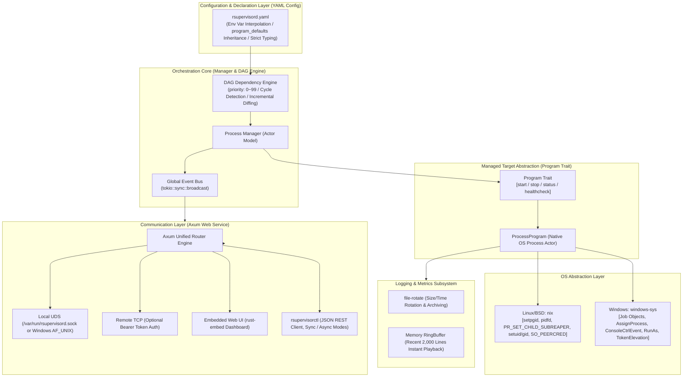

# rsupervisord: Modern Cross-Platform Process Orchestration and Monitoring Daemon Engine (PRD)

| Document Version | Status | Target Language | Runtime Targets |
| :--- | :--- | :--- | :--- |
| **v1.1.0** | Approved / Baseline | Rust (Edition 2024) | Linux / Windows 10/11 / BSD / macOS |

---

## 1. Project Vision & Background

### 1.1 Background & Pain Points

In containerized environments, microservices architectures, edge devices, and Windows host deployments, process supervisors (such as Python-based Supervisor and Go-based `ochinchina/supervisord`) are widely utilized. However, existing tools suffer from noticeable technical debt and severe performance bottlenecks:

1. **High CPU Overhead & Busy-Polling**: In silent monitoring states, tools like `ochinchina/supervisord` consume significant CPU resources—sometimes rivaling active online services like Caddy—due to continuous timer ticks, non-zero-copy pipeline polling, and runtime GC sweeps.
2. **Fragile Windows Process Tree Management**: Windows lacks POSIX signal abstractions. Existing tools fail to cleanly terminate descendant process trees, resulting in leaked orphan processes, or rely on spawning external `taskkill.exe` processes that cause system churn and latency.
3. **Outdated Protocols & Configurations**: Relying on Python 2-era XML-RPC protocols and legacy INI configuration files complicates automation, bloats communication, and lacks modern observability.

### 1.2 Project Positioning

`rsupervisord` is a next-generation, cross-platform process supervisor and orchestration daemon built on a **modern Rust stack (Tokio + Axum + OS-Native Async)**:

- **Zero Process Polling in Minimal Feature Set (0% CPU Overhead)**: Purely event-driven via OS kernel notifications (Linux `pidfd`/`epoll`/signals, Windows kernel handle events via `RegisterWaitForSingleObject` and `Job Objects`). Zero background polling timers when health checks are omitted.
- **First-Class Cross-Platform Architecture**: Strict separation between core business orchestration and platform-specific implementations. The business layer contains zero `#[cfg]` branches, relying on uniform platform traits and Windows native Job Objects for 100% reliable descendant tree reclamation.
- **Activity-Aware Adaptive Metrics & Disableable Logging**: Automatically pauses CPU/memory sampling during idle periods when no CLI or Web clients are connected. Supports completely disabling process and daemon logging (`Stdio::null()`), eliminating pipeline overhead.
- **Star-Topology Dual-Track Event Hub & SSE**: Unified system lifecycle event broadcasting (`SystemEvent`) and aggregated log bus (`LogEntry`) with dual-track isolation, zero-subscriber no-op optimization, real-time Web UI EventSource synchronization, and CLI streaming (`rsupervisorctl events` & `rsupervisorctl tail -f all`).
- **Flexible Threading Models & Single-Thread CurrentThread Mode**: Configurable Tokio worker threads (`worker_threads`), including a single-threaded `current_thread` event loop optimized for edge nodes and low-memory environments (2~4MB footprint).
- **Modern Configuration & APIs**: Native **YAML** configuration with global `program_defaults` inheritance; replaces XML-RPC with unified **UDS (Unix Domain Socket) / TCP + JSON REST API**.
- **Single-Binary Self-Contained Deployment**: Built-in modern Web Dashboard via `rust-embed` (powered by a zero-NPM production Vue 3 single file) and CLI client, providing out-of-the-box operation with zero external runtime dependencies.

---

## 2. Core Architecture Design



---

## 3. Functional Specifications

### 3.1 Process & Lifecycle Management

#### 3.1.1 Finite State Machine (FSM)

Each managed program transitions across deterministic states:

- `STOPPED`: Initial state or explicitly stopped.
- `STARTING`: Process spawned; within the `start_secs` observation window.
- `RUNNING`: Process remained alive past `start_secs`; confirmed healthy and stable.
- `BACKOFF`: Crashed within `start_secs`; executing exponential backoff delay before restarting.
- `STOPPING`: Graceful stop signal delivered; awaiting exit before `stop_wait_secs` timeout.
- `EXITED`: Clean exit matching configured `exit_codes`; will not be automatically restarted.
- `FATAL`: Crash count exceeded `start_retries`, or unrecoverable initialization error encountered.

#### 3.1.2 Priority & Dependencies DAG

- **Priority Range**: `priority` is strictly bounded to **`[0, 99]`** (`u8` type, default `50`).
  - **Lower values denote higher priority**.
  - **Startup Order**: Lower numerical values start first (`0` before `10`, `10` before `99`).
  - **Shutdown Order**: Higher numerical values shut down first (`99` before `10`, `0` last).
- **Dependency Declarations**: Configured via `depends_on: ["mysql", "redis"]`. Dependent programs are only started after all prerequisites reach the `RUNNING` state.
- **Topological Validation**: The Manager constructs a directed graph upon loading configuration, validating against cycles. If a cycle is detected, daemon initialization fails with an actionable cycle trace.
- **Layered Concurrent Startup**: Programs situated on the same topological layer without mutual dependencies are spawned concurrently in batches grouped by priority.

#### 3.1.3 Parameter Inheritance (`program_defaults`)

To eliminate boilerplate across multiple programs, the engine provides a `program_defaults` inheritance mechanism:

- Inherited fields include: `autostart`, `autorestart`, `start_secs`, `start_retries`, `stop_signal`, `stop_wait_secs`, and `logs`.
- **Three-Tier Precedence**:
  $$\text{Program Private Config} > \text{program\_defaults Global Defaults} > \text{Engine Hardcoded Defaults}$$

#### 3.1.4 Privilege & Isolation (User / UID / GID & CWD)

- **Unix / BSD**: Supports `user: "1001"`, `user: "www-data"`, or `user: "1001:1001"`. Calls `nix::unistd::setgid` and `setuid` in the pre-exec hook for secure de-escalation, alongside configurable `umask`.
- **Windows**: Supports service account context execution and RunAs configuration.
- **Working Directory**: Explicitly configured via `directory`, validated for existence before launch.

#### 3.1.5 Process Tree Cleanup & Leak Prevention

- **Windows Job Object Sandbox**:
  - Each program creates a dedicated Job Object configured with `JOB_OBJECT_LIMIT_KILL_ON_JOB_CLOSE`.
  - Child processes are assigned to the Job immediately upon creation. Regardless of how many sub-processes are spawned, the Windows NT kernel guarantees 100% reclamation when stopped or if the daemon terminates.
- **Linux / BSD Subreaper & Process Groups**:
  - Child processes call `setpgid(0, 0)` in `pre_exec` to establish an isolated process group.
  - Termination signals are broadcast to the group via `kill(-pgid, signal)`.
  - The daemon activates `PR_SET_CHILD_SUBREAPER` on Linux to adopt and reap orphan grandchildren.

#### 3.1.6 Hot Reload & Incremental Diff Engine

Executing `rsupervisorctl reload` or sending `SIGHUP` triggers an incremental diff comparison between running and new configurations:

1. **Unchanged**: Identical configurations **remain untouched, keeping their original PID and uninterrupted network connections**.
2. **Added**: Registered into the DAG and started according to their `autostart` policy.
3. **Removed**: Gracefully terminated, then deregistered and cleaned up.
4. **Modified**: Gracefully terminated and relaunched with the updated configuration.

#### 3.1.7 Minimal Feature Set Zero-Poll & Event Exit Monitoring

- **Zero-Poll Minimal Feature Set**: When `health_check` is omitted, the program actor omits health check receiver channels from `tokio::select!`. Uptime is computed dynamically on-demand from `started_at` when queried via `status()`, eliminating the legacy 2-second background timer tick. In this state, the actor runs with **0 timers, 0 wakeups, and 0% CPU overhead**.
- **OS-Optimal Event-Driven Exit Monitoring**: Abstracted via `PlatformProcessGuard::wait_exit`:
  - Windows: Uses kernel-notified wait callbacks via `RegisterWaitForSingleObject` on process `HANDLE`, achieving zero polling.
  - Unix: Uses Tokio's native async signal and `pidfd` drivers, with fallback polling abstracted inside platform layers.

---

### 3.2 Log Streaming & Rotation Subsystem

Built with the production-proven `file-rotate` crate:

1. **Asynchronous Non-Blocking Pipe Capture**:
   - Captures `stdout` and `stderr` asynchronously via Tokio pipes.
   - Workers remain idle when no log data is written, incurring zero polling I/O.
2. **Log Rotation**:
   - **Size-Based**: `max_bytes: "20MB"` (supports `KB`, `MB`, `GB`).
   - **Time-Based**: `rotate: daily` or `hourly`.
   - **Retention**: `backups: 5` (retains recent archives, pruning older files).
   - **Stream Merging**: Supports redirecting `stderr` into `stdout`.
3. **In-Memory RingBuffer**:
   - Maintains a bounded circular buffer (e.g., 2,000 lines) per program.
   - **CLI**: Supports `rsupervisorctl tail -f <program>`, instantly replaying recent history before streaming.
   - **Web UI**: Streams logs in real time via Server-Sent Events (SSE).
4. **Disableable Logging & Channel Optimizations**:
   - **Program-Level Disabling**: When `logs: { enabled: false }` or paths point to `/dev/null`, `none`, or `off`, the process is spawned with `Stdio::null()`, avoiding pipe allocations and background pump tasks.
   - **Daemon-Level Disabling**: `logging.enabled: false` or `level: "off"` completely mutes daemon tracing.
   - **Broadcast Optimization**: Log lines are only cloned into broadcast channels when active subscribers exist (`receiver_count() > 0`).

---

### 3.3 Control, IPC & Security Design

#### 3.3.1 Transport Endpoints

- **Unix Domain Socket (UDS)**:
  - Linux / BSD / macOS: Listens on `/var/run/rsupervisord.sock` (or `~/.rsupervisord/rsupervisord.sock`).
  - Windows 10 (17063+) / 11: Listens natively on AF_UNIX sockets (e.g., `C:\ProgramData\rsupervisord\rsupervisord.sock`), enabling zero-port integration with Caddy / Nginx reverse proxies.
- **TCP Socket (Optional)**:
  - Example: `http_bind: "127.0.0.1:9001"`.
  - Supports optional Bearer token authentication via `auth_token`.

#### 3.3.2 Strict Caller Security & Compatibility Checks

`rsupervisorctl` and API endpoints enforce strict privilege validation:

- **Unix / BSD (Peer Credentials Compatibility)**:
  - Extracts peer credentials via socket options (Linux `SO_PEERCRED`, BSD/macOS `getpeereid`).
  - **Rules**:
    1. If `rsupervisord` runs as `root` (UID 0), only `root` or authorized callers can execute control operations.
    2. If `rsupervisord` runs under non-root UID X, only UID X or `root` callers are authorized.
    3. Unauthorized callers receive immediate `403 Forbidden` responses.
- **Windows (Token Elevation Checks)**:
  - If `rsupervisord` runs as an elevated administrator (`is_admin = true`) or under `NT AUTHORITY\SYSTEM`;
  - The calling `rsupervisorctl` process must also hold elevated privileges (`TokenElevation`).
  - Unelevated callers are intercepted with clear actionable guidance: `"Error: rsupervisord is running with elevated administrator privileges. Please run rsupervisorctl in an elevated (Run as Administrator) terminal."`

#### 3.3.3 Core RESTful JSON API Specification

| Method | Route | Description |
| :--- | :--- | :--- |
| `GET` | `/api/v1/status` | List aggregated status and metrics for all programs |
| `GET` | `/api/v1/programs/:name` | Get detailed configuration, status, and metrics (PID, CPU %, RSS) |
| `POST` | `/api/v1/programs/:name/start` | Start program (accepts `sync: bool`, `timeout: u64`) |
| `POST` | `/api/v1/programs/:name/stop` | Stop program (accepts `sync: bool`, `timeout: u64`) |
| `POST` | `/api/v1/programs/:name/restart` | Restart program (supports sync/async waiting) |
| `POST` | `/api/v1/all/start` | Concurrently start all programs based on DAG topological order |
| `POST` | `/api/v1/all/stop` | Gracefully stop all programs in reverse topological order |
| `POST` | `/api/v1/reload` | **Incremental Hot Reload**: updates changed programs without interrupting unchanged ones |
| `GET` | `/api/v1/programs/:name/logs` | Fetch buffered historical logs (`lines=100`) |
| `GET` | `/api/v1/programs/:name/logs/stream` | **SSE (Server-Sent Events)** real-time live log stream for a specific program |
| `GET` | `/api/v1/events` | **SSE System Events Stream**: Real-time lifecycle events (`StateChanged`, `HealthChanged`, `ConfigReloaded`, `DaemonLifecycle`) |
| `GET` | `/api/v1/logs/stream` | **SSE Aggregated Log Stream**: Real-time global log stream across all managed programs |

#### 3.3.4 Activity-Aware Adaptive Metrics Sampling

- **Idle Timeout & Auto-Pause**: An `ActivityTracker` tracks the timestamp of incoming client interactions. After 30 seconds (`idle_timeout_secs: 30`) of inactivity, CPU and RSS memory metrics sampling across all child processes automatically pauses, eliminating unnecessary `/proc` and kernel queries.
- **On-Demand Resumption**: Any incoming CLI command (e.g., `rsupervisorctl status`) or Web UI request immediately awakens metrics sampling. Setting `idle_timeout_secs: 0` disables pause mode for continuous monitoring.

---

### 3.4 Command-Line Interface (CLI) & Web Dashboard

#### 3.4.1 CLI Interaction: Sync & Async Modes

Following the operational model of Windows `net start/stop` (synchronous confirmation) versus `sc start/stop` (asynchronous fire-and-return), `rsupervisorctl` supports dual modes:

- **Synchronous Mode (Sync - Default)**:
  - Blocks and monitors state transitions until the program is confirmed `RUNNING`, `STOPPED`, or failed.
  - Outputs clear durations and PIDs:

    ```text
    $ rsupervisorctl start core-api
    Starting core-api... [OK] (started in 2.1s, PID: 18492)
    ```

- **Asynchronous Mode (Async - via `--async` / `-a` or `--no-wait`)**:
  - Submits the command and returns immediately (< 5ms):

    ```text
    $ rsupervisorctl start core-api --async
    Command accepted: core-api status changed to STARTING.
    ```

- **CLI Commands**:
  - `rsupervisorctl status`: Formatted colored table with status, PID, Uptime, Priority, and Health.
  - `rsupervisorctl start <name> [--async] [--timeout 30]`: Start a program.
  - `rsupervisorctl stop <name> [--async] [--timeout 30]`: Stop a program.
  - `rsupervisorctl restart <name> [--async]`: Restart a program.
  - `rsupervisorctl reload`: Incrementally reload configuration, reporting added/removed/modified/unchanged counts.
  - `rsupervisorctl tail -f <name> [--lines=100]`: Live tail console output.

#### 3.4.2 Embedded Web Dashboard

- Embedded via `rust-embed` with a single-file Vue 3 production runtime (`vue.global.prod.js`) and zero NPM dependencies.
- Modern dark-mode responsive dashboard:
  - Aggregated stats (Total Programs, Running, Stopped, Degraded, Total CPU %, Total RSS Memory).
  - Program table with luminous status badges, PID, Uptime, Priority, CPU %, and Memory.
  - Batch operations with multi-select checkboxes (Batch Start/Stop/Restart, Start All, Stop All).
  - Zero-downtime hot reload trigger with modal diff breakdown.
  - SSE real-time terminal log drawer with scroll locking and buffer clearing.
  - Bearer token authentication with local storage persistence.

---

## 4. Configuration Specification (`rsupervisord.yaml`)

```yaml
# ==========================================
# rsupervisord Global Configuration
# ==========================================
# Tokio runtime worker threads. Defaults to hardware CPU cores when omitted or null.
# Set to 1 to activate `current_thread` single-threaded event loop mode for minimal memory overhead.
# Can be overridden via CLI (--worker-threads <N>) or env var TOKIO_WORKER_THREADS.
worker_threads: 2

server:
  # Native local UDS socket path (Supported on Linux, macOS, BSD, and Windows 10/11)
  uds_path: "/var/run/rsupervisord.sock"
  # Optional: Remote TCP listener
  http_bind: "127.0.0.1:9001"
  auth_token: ""

# Daemon logging configuration
logging:
  # Set to false or level: "off" to completely silence daemon internal logs
  enabled: true
  file: "/var/log/rsupervisord.log"
  level: "info"
  max_bytes: "20MB"
  backups: 3

# Adaptive metrics collection configuration
metrics:
  enabled: true
  idle_timeout_secs: 30 # Pauses polling after 30s of client inactivity; 0 keeps continuous polling
  interval_secs: 2      # Sampling interval when active

# ==========================================
# Common Parameter Inheritance (program_defaults)
# ==========================================
program_defaults:
  autostart: true
  autorestart: unexpected
  start_secs: 3
  start_retries: 3
  stop_signal: "SIGTERM"
  stop_wait_secs: 10
  priority: 50 # Default priority: range [0, 99]
  logs:
    enabled: true
    max_bytes: "20MB"
    backups: 3
    redirect_stderr: false

# ==========================================
# Managed Programs
# ==========================================
programs:
  # Foundation service: Database (high priority, inherits defaults)
  mysql:
    command: "/usr/bin/mysqld_safe"
    directory: "/var/lib/mysql"
    user: "mysql"
    priority: 10 # Explicit priority [0, 99], lower values start first
    stop_wait_secs: 20 # Overrides default 10s
    logs:
      stdout: "/var/log/rsupervisord/mysql.log"
      max_bytes: "50MB"
      backups: 5

  # Core API service: Depends on mysql
  core-api:
    command: "./server --port 8080"
    directory: "/opt/app"
    user: "1001:1001" # UID:GID
    environment:
      APP_ENV: "production"
      DATABASE_URL: "${DB_URI:-mysql://localhost/test}"
    priority: 20 # Range [0, 99]
    depends_on: ["mysql"] # Topological orchestration
    autorestart: always
    health_check:
      type: "http"
      url: "http://127.0.0.1:8080/health"
      interval_secs: 10
      timeout_secs: 2
      failure_threshold: 3
    logs:
      stdout: "/var/log/rsupervisord/core-api.log"
      stderr: "/var/log/rsupervisord/core-api.err"
      max_bytes: "20MB"
      backups: 3

  # Web frontend service: Windows example
  web-frontend:
    command: "node.exe server.js"
    directory: "C:\\inetpub\\wwwroot"
    priority: 60 # Range [0, 99]
    depends_on: ["core-api"]
    stop_signal: "CTRL_BREAK" # Windows console event
    stop_wait_secs: 5
    logs:
      stdout: "C:\\logs\\frontend.log"
      max_bytes: "10MB"
      backups: 2
```

---

## 5. Technical Stack & Dependencies

### 5.1 Crate Selection

| Module | Crate | Rationale |
| :--- | :--- | :--- |
| **Async Runtime** | `tokio = { version = "1", features = ["full"] }` | Production async foundation with customizable worker threads and single-threaded mode |
| **Trait Async** | `async-trait` | Async interface definitions for `Program` and `PlatformProcessGuard` |
| **Web & Networking** | `axum = "0.8"`, `hyper-util`, `serde_json` | High-performance streaming HTTP engine natively binding both UDS and TCP |
| **Static Embedding** | `rust-embed`, `mime_guess` | Single-binary delivery of Vue 3 Web UI assets |
| **Configuration** | `serde_yaml`, `shellexpand` | Strict YAML serialization and environment variable substitution |
| **CLI & Output** | `clap = { version = "4", features = ["derive"] }`, `tabled` | Strongly typed argument parsing and ANSI terminal table formatting |
| **Logging & Tracing** | `tracing`, `tracing-subscriber`, `file-rotate = "0.8"` | Structured logging and industrial-grade file rotation |
| **Graph Algorithms** | `petgraph = "0.8"` | Directed acyclic graph verification and topological sorting |
| **POSIX Bindings** | `nix = { version = "0.31", features = ["process", "signal", "user", "socket", "fs"] }` | Safe Linux / BSD system calls and peer credential extraction |
| **Windows Bindings** | `windows-sys = { version = "0.59", features = ["Win32_System_JobObjects", "Win32_System_Threading", "Win32_Security", "Win32_Foundation"] }`, `uds_windows = "1"` | Ultra-lightweight Win32 bindings and native Windows UDS listeners |

---

## 6. Directory Structure

```text
rsupervisord/
├── Cargo.toml                       # Dependencies and compiler optimization metadata
├── config-example.yaml              # Fully commented production reference configuration
├── docs/
│   ├── PRD.md                       # Product Requirements Document (Chinese)
│   ├── PRD_EN.md                    # Product Requirements Document (English)
│   ├── DESIGN.md                    # System Architecture & Design Specification (Chinese)
│   └── DESIGN_EN.md                 # System Architecture & Design Specification (English)
├── web/                             # Embedded Web UI static assets
│   ├── index.html                   # Modern dark-mode dashboard SPA HTML
│   └── vue.global.prod.js           # Production single-file Vue 3 runtime (Zero NPM dependencies)
├── src/
│   ├── main.rs                      # Daemon entry point and Tokio runtime builder
│   ├── lib.rs                       # Core library exports and lifecycle builder
│   ├── bin/
│   │   └── rsupervisorctl.rs        # Standalone rsupervisorctl CLI binary
│   ├── cli/                         # CLI client implementation
│   │   ├── mod.rs
│   │   ├── client.rs                # UDS / HTTP client transport
│   │   ├── security.rs              # Client privilege self-checks (Windows is_admin check)
│   │   └── commands.rs              # status, start, stop, tail commands
│   ├── config/                      # YAML configuration parsing and validation
│   │   ├── mod.rs
│   │   ├── schema.rs                # Serde schema and program_defaults inheritance
│   │   ├── diff.rs                  # 3-Way diff engine for hot reload
│   │   └── validator.rs             # Priority [0, 99] and semantic validation
│   ├── logging/                     # Logging pipeline and file rotation
│   │   ├── mod.rs
│   │   ├── rotator.rs               # file-rotate integration
│   │   └── ring_buffer.rs           # In-memory sliding log buffer with subscriber detection
│   ├── manager/                     # Process orchestration manager
│   │   ├── mod.rs
│   │   ├── activity.rs              # Client activity tracking and idle sampling pause
│   │   ├── dag.rs                   # petgraph DAG dependency algorithms
│   │   ├── supervisor.rs            # Core Manager Actor, hot reload, and event broadcast
│   │   └── health.rs                # HTTP/TCP/Exec health check probes
│   ├── platform/                    # Cross-platform isolation abstractions
│   │   ├── mod.rs                   # Uniform platform traits and privilege checks
│   │   ├── traits.rs                # PlatformProcessGuard trait definition
│   │   ├── unix.rs                  # Linux/BSD: setpgid, pidfd, wait_exit, SO_PEERCRED
│   │   └── windows.rs               # Windows: Job Objects, wait_exit, RunAs, is_admin check
│   ├── program/                     # Program Trait and lifecycle execution
│   │   ├── mod.rs                   # Program Trait abstraction
│   │   └── process.rs               # ProcessProgram implementation (Zero-poll event driven)
│   └── server/                      # Communication server layer
│       ├── mod.rs
│       ├── api.rs                   # Axum REST JSON routing and activity middleware
│       ├── uds.rs                   # Cross-platform native UDS listener and authentication
│       └── embedded_ui.rs           # rust-embed static asset handler and SPA routing
└── tests/                           # Integration and unit test suite
```

---

## 7. Roadmap & Milestones

### Milestone 1: Core Process Monitoring & DAG Orchestration Engine (Core MVP)

- [x] Establish `Cargo.toml` dependencies and project modular structure.
- [x] Implement `rsupervisord.yaml` strict parsing, `program_defaults` parameter inheritance, and environment variable substitution.
- [x] Enforce `priority` within `[0, 99]`; build DAG cycle detection and topological sorting.
- [x] Define `Program` Trait; implement `ProcessProgram` spawn, stop, and exit detection.
- [x] Encapsulate Linux (`nix`) process group/de-escalation and Windows (`windows-sys`) **Job Objects**.
- [x] Implement incremental Diff engine for zero-downtime hot reloading (`reload`).

### Milestone 2: Logging Subsystem & Memory Buffering

- [x] Integrate `file-rotate` for non-blocking asynchronous stdout/stderr logging and size/time rotation.
- [x] Implement in-memory `RingBuffer` supporting instant history replay and demand-driven broadcast (`receiver_count() > 0`).
- [x] Provide complete log silencing (`enabled: false` spawns with `Stdio::null()` without pipes).

### Milestone 3: Axum Control Service, Security & CLI Interface

- [x] Launch Axum HTTP engine hosting full RESTful JSON APIs.
- [x] Implement native cross-platform UDS (`AF_UNIX`) bindings (Windows 10/11 & Linux).
- [x] Implement strict caller privilege checks (Unix UID/GID compatibility, Windows `is_admin` token matching).
- [x] Build `rsupervisorctl` CLI supporting both synchronous (blocking confirmation) and asynchronous (`--async`) modes.

### Milestone 4: Embedded Web Dashboard & Health Probes

- [x] Implement HTTP / TCP / Exec active health probe state machines.
- [x] Bundle modern single-page Web Dashboard via `rust-embed` (Zero NPM dependencies, single-file Vue 3).
- [x] Implement activity awareness to automatically pause CPU and RSS metrics sampling during idle periods.

### Future Milestone: Legacy Compatibility Layer (Optional Adaptor)

- [ ] INI to YAML converter and XML-RPC to REST proxy adaptor layer for legacy supervisor compatibility.
